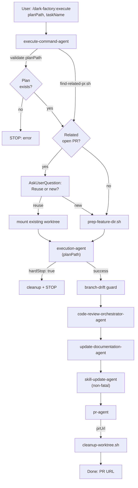

# execute-command-agent

## Metadata

- System type: `flow`

## System Intent

- What this is: The `execute-command-agent` backs the `/dark-factory:execute` slash command. It takes an approved plan file, checks for related open PRs, creates or reuses a git worktree, runs `execution-agent` to implement all flows from the plan, then runs the full post-execution pipeline (code review → docs → skills → PR → cleanup). State is passed directly between steps as local variables — no `brain.json` is created.

## Mermaid Diagram



## Flows

### Flow: `executeCommand`

- Test files: `N/A`
- Core files: `commands/execute.md`, `agents/dark-factory/agents/execute-command-agent.md`, `agents/featurework/execution/agents/execution-agent.md`

#### Types

```txt
ExecuteCommandInput {
  planPath: string (required — absolute path to approved plan file)
  taskName: string (optional — derived from plan file name if absent)
}

ExecuteCommandOutput {
  prUrl:   string
  workDir: string
}

StandardError {
  message: string (human-readable description of what went wrong)
}
```

#### Paths

| path | input | output | path-type | notes |
| --- | --- | --- | --- | --- |
| `executeCommand.success` | `ExecuteCommandInput` | `ExecuteCommandOutput` | happy path | all flows implemented, PR opened |
| `executeCommand.hard-stop` | `ExecuteCommandInput` | `StandardError` | error | execution-agent hard-stop that user chose Abort for |
| `executeCommand.prep-failure` | `ExecuteCommandInput` | `StandardError` | error | worktree prep failed |
| `executeCommand.drift-guard-failure` | `ExecuteCommandInput` | `StandardError` | error | branch has no commits after execution |

#### Pseudocode

```
execute-command-agent(planPath, taskName):

  # Step 1 — validate plan file exists
  if planPath not found: report error and STOP

  # Step 2 — derive taskName from plan file name if not provided
  if taskName is empty:
    taskName = basename(planPath) without .md extension and date prefix

  # Step 3 — PR reuse check + worktree prep
  PROJECT_DIR = bash("git rev-parse --show-toplevel")
  relatedPrOutput = bash("find-related-pr.sh taskName") || ""
  EXISTING_BRANCH = extract BRANCH= from relatedPrOutput
  ... (PR reuse + worktree prep, same pattern as plan-command-agent) ...
  branchRef = USE_EXISTING ? EXISTING_BRANCH : "feature/" + taskName

  # Step 4 — invoke execution-agent
  invoke execution-agent({ planPath })

  if execution-agent returns hardStop: true:
    run cleanup(WORK_DIR, taskName)
    report "Execution aborted by user."
    STOP

  # Step 5 — branch drift guard
  if no commits ahead of main: cleanup + STOP

  # Steps 6-9 — post-execution pipeline
  invoke code-review-orchestrator-agent({ planFilePath: planPath, codePath: WORK_DIR })
  invoke update-documentation-agent({ planFilePath: planPath, workDir: WORK_DIR })
  try: invoke skill-update-agent({ planFilePath: planPath, workDir: WORK_DIR, taskSummary: "Execute: " + planPath })
  prResult = invoke pr-agent({ planPath })

  bash("cleanup-worktree.sh WORK_DIR taskName")
  Report: "Execution complete. PR: " + prResult.prUrl
  STOP
```

## Logs

| Source | Location |
|--------|----------|
| command agent stdout | PR URL reported directly on completion |

## Deployment

- Mechanism: `local only`
- Deploy command:
  ```bash
  /dark-factory:execute
  ```
- Notes: Invoked as a Claude Code slash command. Requires the dark-factory plugin installed. The plan file must already exist (created by `/dark-factory:plan` or manually). The worktree is cleaned up after the PR is opened.
