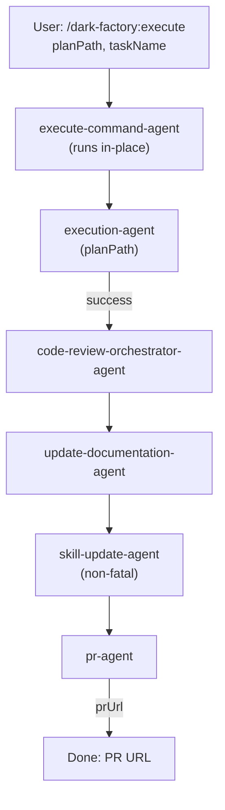

# /dark-factory:execute

Implements an approved plan — runs the full execution pipeline (code, tests, review) and opens a PR.

## Flow

## See also

- execution-agent — implements flows from plan
- [code-review-orchestrator-agent](code-review-orchestrator-agent.md) — reviews code changes
- pr-agent — opens/updates PR
