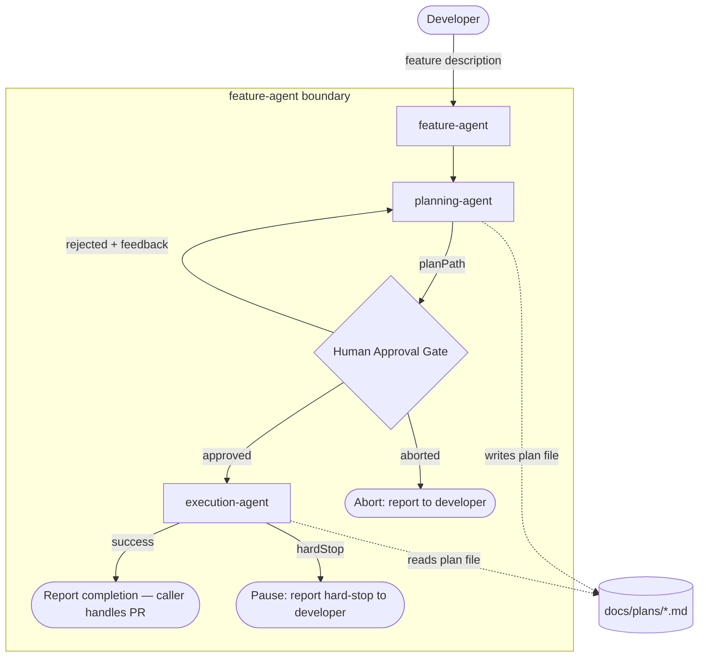

# feature-agent

## Metadata

- System type: `flow`

## System Intent

- What this is: `feature-agent` is an orchestrator agent that sequences `planning-agent` → human approval gate → `execution-agent` for end-to-end feature work. It owns the approval gate (with feedback-and-retry) but does not write code, modify plans, or open PRs. After successful execution it stops and reports completion — the caller (`dark-factory-agent`) is responsible for running documentation agents and opening the PR.

## Mermaid Diagram



## Flows

### Flow: `orchestrateFeature`

- Test files: N/A
- Core files: `agents/featurework/agents/feature-agent.md`

#### Types

```txt
OrchestrateFeatureInput {
  description: string (natural-language feature description, required)
}

OrchestrateFeatureOutput (success) {
  status: "complete"
  planPath: string (absolute path to the plan file)
}

OrchestrateFeatureOutput (aborted) {
  status: "aborted"
  reason: string
}

OrchestrateFeatureOutput (hard-stop) {
  status: "hard-stop"
  planPath: string
  reason: string
}

StandardError {
  message: string (human-readable description of what went wrong)
}
```

#### Paths

| path | input | output | path-type | notes |
| --- | --- | --- | --- | --- |
| `orchestrateFeature.success` | `OrchestrateFeatureInput` | `status=complete; plan file exists, all flows green` | happy path | developer approves on first presentation; feature-agent stops after execution, caller opens PR |
| `orchestrateFeature.approve-after-retry` | `OrchestrateFeatureInput` | `status=complete; revised plan file exists` | subpath | developer rejects with feedback one or more times before approving |
| `orchestrateFeature.aborted` | `OrchestrateFeatureInput` | `status=aborted` | error | developer explicitly cancels |
| `orchestrateFeature.hard-stop` | `OrchestrateFeatureInput` | `status=hard-stop; execution paused` | error | execution-agent returns hardStop=true; feature-agent surfaces the pause and stops |
| `orchestrateFeature.planningFailure` | `OrchestrateFeatureInput` | `StandardError` | error | planning-agent errors or returns no planPath |

#### Pseudocode

```
feature-agent(description):

  feedback = null
  attemptNumber = 1

  LOOP:
    # Step 1: invoke planning-agent
    If feedback is null:
      invoke planning-agent with: description
    Else:
      invoke planning-agent with: "Revise the plan based on this developer feedback: <feedback>\n\nOriginal description: <description>"

    If planning-agent errors or returns no planPath:
      report error; STOP

    planPath = result from planning-agent

    # Step 2: present plan and request approval
    Read planPath; display contents to developer

    Ask: "Approve? Reply 'yes'/'approve' to proceed, 'abort' to cancel, or provide feedback."
    response = developer reply

    If response == "abort": report aborted; STOP
    If response == "yes" OR "approve": BREAK LOOP
    Else: feedback = response; attemptNumber += 1; CONTINUE LOOP

  # Step 3: invoke execution-agent
  invoke execution-agent with: planPath

  If execution-agent returns hardStop == true:
    report hard-stop reason; STOP

  # Step 4: done — do NOT invoke pr-agent
  # The caller (dark-factory-agent) runs documentation agents then opens the PR.
  report "Feature complete. Plan: <planPath>."
  STOP
```

---

### Flow: `invokePlanningAgent`

- Test files: N/A
- Core files: `agents/featurework/agents/feature-agent.md`

#### Types

```txt
InvokePlanningAgentInput {
  description: string (required)
  feedback: string | null (null on first invocation; revision feedback on retry)
}

InvokePlanningAgentOutput {
  planPath: string (path to the written plan file)
}
```

#### Paths

| path | input | output | path-type | notes |
| --- | --- | --- | --- | --- |
| `invokePlanningAgent.success` | `InvokePlanningAgentInput` | `InvokePlanningAgentOutput; plan file written to docs/plans/` | happy path | |
| `invokePlanningAgent.retry-with-feedback` | `InvokePlanningAgentInput feedback!=null` | `InvokePlanningAgentOutput; revised plan file written` | subpath | feature-agent prepends revision instructions to the prompt |
| `invokePlanningAgent.failure` | `InvokePlanningAgentInput` | `StandardError` | error | planning-agent errors or returns no planPath |

---

### Flow: `humanApprovalGate`

- Test files: N/A
- Core files: `agents/featurework/agents/feature-agent.md`

#### Types

```txt
HumanApprovalGateInput {
  planPath: string
  attemptNumber: number (1-based)
}

HumanApprovalGateOutput {
  approved: boolean
  feedback: string | null
}
```

#### Paths

| path | input | output | path-type | notes |
| --- | --- | --- | --- | --- |
| `humanApprovalGate.approved` | `HumanApprovalGateInput` | `approved=true` | happy path | developer replies "yes" or "approve" |
| `humanApprovalGate.rejected-with-feedback` | `HumanApprovalGateInput` | `approved=false; feedback=<text>` | subpath | loop back to planning-agent with feedback |
| `humanApprovalGate.aborted` | `HumanApprovalGateInput` | `approved=false; feedback=null` | error | developer replies "abort"; feature-agent stops |

---

### Flow: `invokeExecutionAgent`

- Test files: N/A
- Core files: `agents/featurework/agents/feature-agent.md`

#### Types

```txt
InvokeExecutionAgentInput {
  planPath: string (must point to a plan with status=approved)
}

InvokeExecutionAgentOutput {
  allFlowsGreen: true  (on success)
  hardStop: true       (on deviation; mutually exclusive with allFlowsGreen)
  reason: string       (populated when hardStop=true)
}
```

#### Paths

| path | input | output | path-type | notes |
| --- | --- | --- | --- | --- |
| `invokeExecutionAgent.success` | `InvokeExecutionAgentInput` | `allFlowsGreen=true` | happy path | all flows implemented and tests pass; feature-agent reports completion and stops |
| `invokeExecutionAgent.hard-stop` | `InvokeExecutionAgentInput` | `hardStop=true` | error | execution-agent hit a deviation; feature-agent surfaces the pause, does NOT re-invoke execution-agent |

## Logs

| Source | Location |
|--------|----------|
| planning-agent output | terminal / caller stdout |
| execution-agent output | terminal / caller stdout |
| human approval gate | interactive terminal prompt |

## Deployment

- Mechanism: `local only`
- Deploy command:
  ```bash
  # No deployment step — agent is a markdown file checked into the repo.
  # Invoked by dark-factory-agent (not directly by developers).
  ```
- Notes: `feature-agent` must never invoke `pr-agent`. The caller (`dark-factory-agent`) opens the PR after all documentation agents (Steps 4a/4b) have fully completed, so that `git add --all` in `pr-agent` picks up any docs written during that step.
