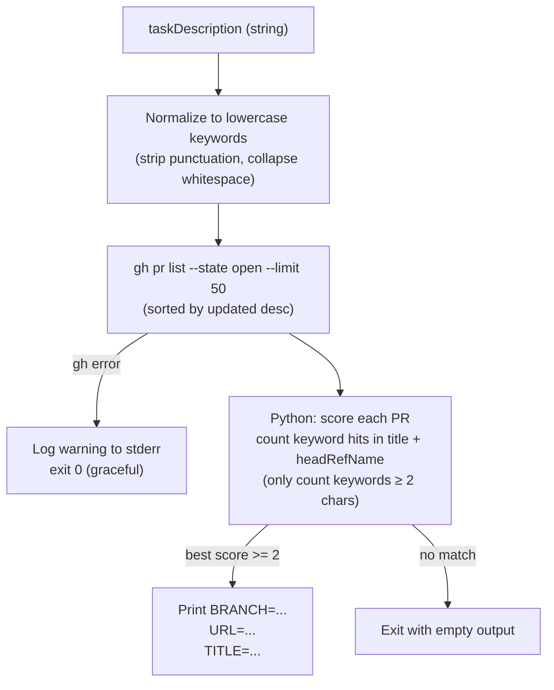

# find-related-pr

## Metadata

- System type: `library`

## System Intent

- What this is: A bash script that fuzzy-matches a task description against open GitHub PR titles and branch names to find a related PR that may already exist for the same work.

## Mermaid Diagram



## Flows

### Flow: `fuzzyMatchPR`
- Core files: `agents/dark-factory/scripts/find-related-pr.sh`

#### Types

```txt
Input:
  taskDescription: string  — verbatim user task description

Output (printed to stdout, one key=value per line):
  BRANCH=<headRefName>   — branch name of the matched PR
  URL=<url>              — GitHub URL of the matched PR
  TITLE=<title>          — title of the matched PR

  OR empty stdout if no match found or on gh CLI error
```

#### Paths

| path | input | output | path-type | notes |
| --- | --- | --- | --- | --- |
| `fuzzyMatchPR.match` | taskDescription | BRANCH, URL, TITLE lines | happy path | score >= 2 keyword hits |
| `fuzzyMatchPR.no-match` | taskDescription | empty stdout | no match | fewer than 2 keyword hits |
| `fuzzyMatchPR.gh-error` | taskDescription | empty stdout + stderr warning | error | gh CLI unavailable or auth failure; exits 0 so caller continues |

#### Pseudocode

```
keywords = normalize(taskDescription)   # lowercase, strip punctuation, collapse spaces

prs = gh pr list --state open --limit 50 --json title,headRefName,url,number --order updated --sort desc

for each pr in prs:
  candidate = pr.title + " " + pr.headRefName  (lowercased)
  score = count of keywords (len >= 2) found in candidate

best = pr with highest score >= 2 (ties broken by most recently updated — first in list)

if best:
  print BRANCH=<best.headRefName>
  print URL=<best.url>
  print TITLE=<best.title>
```

**Scoring detail**: only keywords with 2 or more characters are counted; common single-character tokens are silently ignored. Ties in score are resolved by PR update order (most recently updated wins, since `gh pr list` is sorted `--order updated --sort desc`).

## Logs

| Source | Location |
|--------|----------|
| gh CLI error | stderr (script continues with exit 0) |

## Deployment

- Mechanism: `local only`
- Deploy command:
  ```bash
  bash agents/dark-factory/scripts/find-related-pr.sh "<taskDescription>"
  ```
- Notes: Requires `gh` CLI to be authenticated. Script is invoked by `dark-factory-agent` at Step 2, before any worktree is created. On any gh failure the script exits 0 with empty output so the caller falls through to creating a fresh branch.
