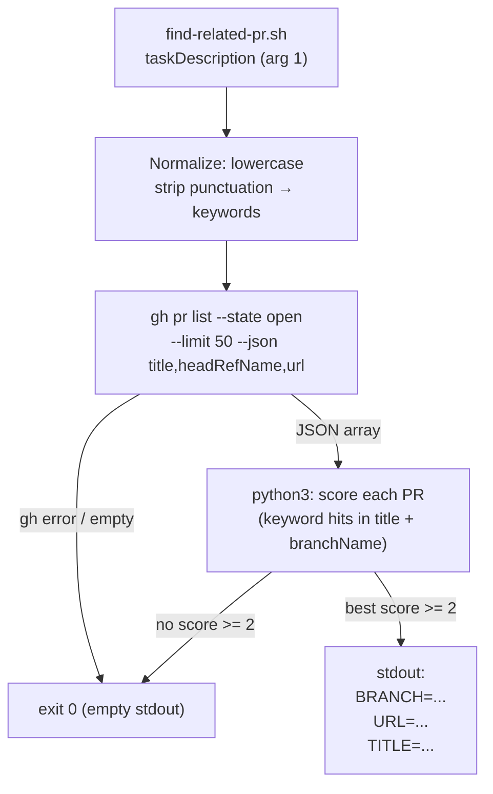

# find-related-pr

## Metadata

- System type: `library`

## System Intent

- What this is: A bash script that fuzzy-matches a task description against all open GitHub PRs (title + branch name) and emits structured key=value output identifying the best match. Consumed by `dark-factory-agent` Step 2 to offer PR reuse before creating a new branch.

## Mermaid Diagram



## Flows

### Flow: `findRelatedPr.match`

- Test files: `N/A`
- Core files: `agents/dark-factory/scripts/find-related-pr.sh`

#### Types

```txt
FindRelatedPrInput {
  taskDescription: string (required — verbatim user task request, passed as $1)
}

PRMatch {
  branchName: string   (e.g. "feature/add-oauth")
  prUrl: string        (e.g. "https://github.com/org/repo/pull/42")
  prTitle: string      (human-readable title of the matched PR)
}

FindRelatedPrOutput {
  stdout: "BRANCH=<branchName>\nURL=<prUrl>\nTITLE=<prTitle>"  (on match)
       | ""                                                      (on no match)
}
```

#### Paths

| path | input | output | path-type | notes |
| --- | --- | --- | --- | --- |
| `findRelatedPr.match.found` | `FindRelatedPrInput` | stdout with BRANCH/URL/TITLE lines | happy path | best score >= 2 keyword hits (each keyword length > 2) |
| `findRelatedPr.match.none` | `FindRelatedPrInput` | empty stdout | alternate | no PR reached threshold; caller treats as no-match |
| `findRelatedPr.match.gh-error` | `FindRelatedPrInput` | empty stdout, exit 0 | alternate | gh CLI unavailable or auth failure; `2>/dev/null \|\| exit 0` silences error |
| `findRelatedPr.match.empty-list` | `FindRelatedPrInput` | empty stdout, exit 0 | alternate | repo has no open PRs; early exit guards against JSON parse error |
| `findRelatedPr.match.json-error` | `FindRelatedPrInput` | empty stdout, exit 0 | alternate | malformed JSON from gh; python3 catches JSONDecodeError and exits 0 |

#### Pseudocode

```
# find-related-pr.sh <taskDescription>

taskDescription="$1"

# Normalize: lowercase, strip non-alphanumeric (except spaces), collapse spaces
keywords=$(echo "$taskDescription" | tr '[:upper:]' '[:lower:]' | tr -cs 'a-z0-9 ' ' ' | tr -s ' ')

# Fetch up to 50 open PRs; bail silently on gh error
prs=$(gh pr list --state open --limit 50 --json title,headRefName,url 2>/dev/null) || exit 0

# Guard against empty or null response before handing to python3
if [ -z "$prs" ] || [ "$prs" = "null" ]; then exit 0; fi

# Pass keywords via env var (not inline string) to avoid shell injection
export _DF_KEYWORDS="$keywords"

# Score each PR: count keyword hits in (title + headRefName), lowercase
# Select the PR with the highest score if score >= 2 and each matching keyword is > 2 chars
best=$(echo "$prs" | python3 -c "
import sys, json, os
raw = sys.stdin.read().strip()
if not raw:
    sys.exit(0)
try:
    data = json.loads(raw)
except json.JSONDecodeError:
    sys.exit(0)
keywords = set(os.environ.get('_DF_KEYWORDS', '').split())
best = None
best_score = 0
for pr in data:
    candidate = (pr['title'] + ' ' + pr['headRefName']).lower()
    score = sum(1 for kw in keywords if kw in candidate and len(kw) > 2)
    if score >= 2 and score > best_score:
        best_score = score
        best = pr
if best:
    print(f\"BRANCH={best['headRefName']}\")
    print(f\"URL={best['url']}\")
    print(f\"TITLE={best['title']}\")
")

echo "$best"
```

## Logs

| Source | Location |
|--------|----------|
| find-related-pr.sh | stderr only (suppressed via `2>/dev/null`); stdout is machine-parseable key=value pairs |

## Deployment

- Mechanism: `local only`
- Deploy command:
  ```bash
  /dark-factory:install
  ```
- Notes: Requires `gh` CLI authenticated to the target repository. The script is invoked by `dark-factory-agent` Step 2 with the raw `taskDescription` as argument 1. The fuzzy-match threshold (score >= 2, keyword length > 2) can be tuned in the script without touching `commands/manufacture.md`. The script always exits 0 — errors are treated as no-match to keep the manufacture pipeline non-blocking.
