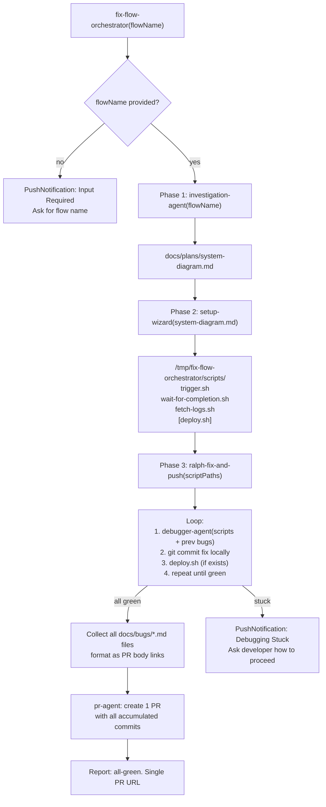

# fix-broken-flow

## Metadata

- System type: `flow`

## System Intent

- What this is: The integration-flow repair flow. Given a failing integration flow name, investigates the system, generates trigger/monitor/log scripts, then loops: trigger flow → debug failure → open PR → deploy fix → repeat until the flow passes green.

## Mermaid Diagram



## Flows

### Flow: `fixBrokenFlow`

- Core files: `agents/fix-flow/agents/fix-flow-orchestrator.md`, `agents/fix-flow/agents/setup-wizard.md`, `agents/fix-flow/agents/ralph-fix-and-push.md`, `agents/fix-flow/agents/debug-flow-agent.md`

#### Types

```txt
FixBrokenFlowInput {
  flowName: string (required — name of the failing integration flow)
}

FixBrokenFlowOutput {
  all_green: true
  pr_url: string (single PR containing all accumulated fixes)
  bugFiles: string[] (all docs/bugs/*.md files created during the fix loop)
}

StandardError {
  message: string (human-readable description of what went wrong)
}
```

#### Paths

| path | input | output | path-type | notes |
| --- | --- | --- | --- | --- |
| `fixBrokenFlow.success` | `FixBrokenFlowInput` | `FixBrokenFlowOutput` | happy path | flow passes green after one or more fix iterations |
| `fixBrokenFlow.no-flow-name` | `FixBrokenFlowInput` | paused | clarification | orchestrator asks developer for flow name before proceeding |
| `fixBrokenFlow.stuck` | `FixBrokenFlowInput` | paused | clarification | debugger-agent returns same root cause twice with no progress; developer guidance required |

#### Pseudocode

```
fix-flow-orchestrator(flowName):

  # Phase 1 — understand system
  investigation-agent(flowName)
  → writes docs/plans/system-diagram.md
  assert file exists before proceeding

  # Phase 2 — generate scripts
  setup-wizard(docs/plans/system-diagram.md)
  → writes /tmp/fix-flow-orchestrator/scripts/{trigger,wait-for-completion,fetch-logs,[deploy]}.sh
  assert all required scripts exist and are executable before proceeding

  # Phase 3 — fix loop (accumulate fixes on single branch)
  ralph-fix-and-push(scriptPaths):
    bugDocPaths = []
    loop:
      debugger-agent(scriptPaths, previousBugFiles)
      → writes docs/bugs/bug-explanation-<N>.md
      bugDocPath = result.bugDocPath
      bugDocPaths.append(bugDocPath)

      if resolved (fixed == true):
        git add -A
        git commit -m "fix: resolve bug from docs/bugs/$(basename $bugDocPath)"
        break loop
      else:
        git add -A
        git commit -m "fix: attempt fix from docs/bugs/$(basename $bugDocPath)"
        previousBugFiles.append(bugDocPath)

      if deploy.sh exists: run deploy.sh

    # All bugs fixed — create single PR with all accumulated commits
    bugFileLinks = format_pr_body(bugDocPaths)
    pr-agent(
      taskDescription = "Fix integration flow: accumulated fixes from: " + bugFileLinks,
      prBody = "## Fixes\n\nThis PR accumulates all bug fixes for the integration flow:\n" + bugFileLinks
    )
    → { pr_url, merged }

    return { all_green: true, pr_url, bugFiles: bugDocPaths }

  report success with single PR URL
```

### Flow: `setupScripts`

- Core files: `agents/fix-flow/agents/setup-wizard.md`, `agents/fix-flow/skills/generate-trigger/SKILL.md`, `agents/fix-flow/skills/generate-wait-for-completion/SKILL.md`, `agents/fix-flow/skills/generate-fetch-logs/SKILL.md`, `agents/fix-flow/skills/generate-deploy/SKILL.md`

#### Types

```txt
SetupScriptsInput {
  systemDiagramPath: string (path to docs/plans/system-diagram.md)
}

SetupScriptsOutput {
  scriptPaths: ScriptPaths
}

ScriptPaths {
  trigger: string
  waitForCompletion: string
  fetchLogs: string
  deploy: string | null
}
```

#### Paths

| path | input | output | path-type | notes |
| --- | --- | --- | --- | --- |
| `setupScripts.success` | `SetupScriptsInput` | `SetupScriptsOutput` | happy path | all required scripts generated, verified executable |
| `setupScripts.no-deploy` | `SetupScriptsInput` | `SetupScriptsOutput { deploy: null }` | happy path | flow does not require remote deployment; deploy.sh omitted |

## Logs

| Source | Location |
|--------|----------|
| system investigation | `docs/plans/system-diagram.md` |
| bug iteration files | `docs/bugs/bug-explanation-<N>.md` |
| generated scripts | `/tmp/fix-flow-orchestrator/scripts/` |

## Deployment

- Mechanism: `local only` — invoked as a sub-agent by dark-factory-agent
- Notes: fix-flow-orchestrator is not user-invocable directly. Scripts are generated into `/tmp/` and are ephemeral. `docs/plans/system-diagram.md` and `docs/bugs/` files are kept as persistent project documentation after the flow completes.
