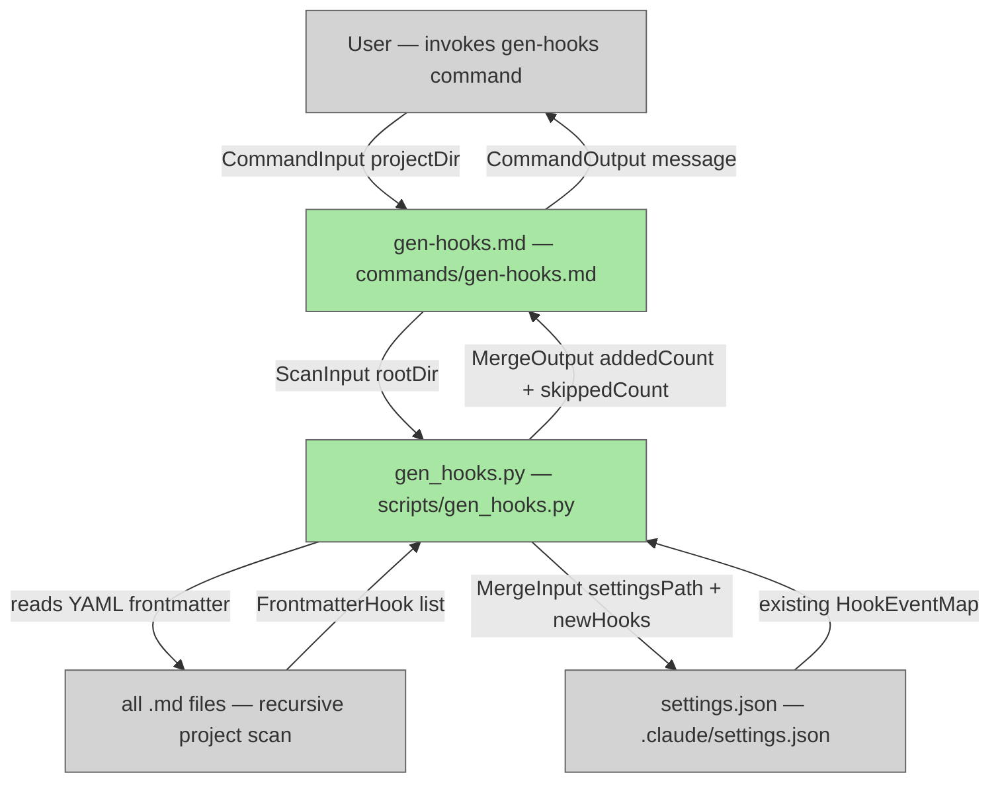

# gen-hooks

## Metadata

- System type: `flow`

## System Intent

- What this is: The `gen-hooks` system consists of the `/dark-factory:gen-hooks` slash command (`commands/gen-hooks.md`) and its backing Python script (`scripts/gen_hooks.py`). It recursively scans all `.md` files in the project directory for hook declarations in YAML frontmatter (e.g., `PreToolUse: ./hooks/pre-use.sh`) and merges them into `.claude/settings.json` additively — never deleting existing entries, and deduplicating by exact command string.
- Primary consumer(s): Plugin users who want to attach custom shell scripts to Claude Code hook events by declaring them in the YAML frontmatter of any `.md` file, then running `/dark-factory:gen-hooks` to activate them.
- Boundary: `gen-hooks` reads `.md` frontmatter and writes `.claude/settings.json`. It does not modify `hooks/hooks.json`, does not delete existing hook entries from `settings.json`, and does not execute the declared scripts.

### Supported hook event types

- `PreToolUse`
- `PostToolUse`
- `Stop`
- `SubagentStop`
- `PreCompact`

### YAML frontmatter syntax

Declare hooks inside the `---` frontmatter block of any `.md` file in the project tree:

```yaml
---
name: my-skill
PreToolUse: ./hooks/pre-use.sh
PostToolUse: ./hooks/post-use.sh
---
```

Multiple declarations of the same hook key are allowed; each produces a separate hook entry in `settings.json`. The `matcher` field defaults to `""` (matches everything).

### Output target structure

```json
{
  "hooks": {
    "PreToolUse": [
      { "matcher": "", "hooks": [{ "type": "command", "command": "bash ./hooks/pre-use.sh" }] }
    ]
  }
}
```

## Mermaid Diagram



## Flows

### Global Types

```txt
StandardError {
  message: string (human-readable description of what went wrong)
}

FrontmatterHook {
  eventType: string (e.g. "PreToolUse")
  command: string (raw value from the YAML key)
  matcher: string (defaults to "")
  sourceFile: string (path to the .md file declaring the hook)
}

HookEntry {
  type: "command"
  command: string (the shell command string to execute, e.g. "bash ./hooks/pre-use.sh")
}

HookMatcher {
  matcher: string (glob/regex matcher; defaults to "" for match-all)
  hooks: HookEntry[]
}

HookEventMap {
  PreToolUse?: HookMatcher[]
  PostToolUse?: HookMatcher[]
  Stop?: HookMatcher[]
  SubagentStop?: HookMatcher[]
  PreCompact?: HookMatcher[]
}
```

---

### Flow: `scanFrontmatter`

- Test files: `tests/test_gen_hooks.py`
- Core files: `scripts/gen_hooks.py`

#### Types

```txt
ScanInput {
  rootDir: string (absolute path to the project root being scanned)
}

ScanOutput {
  hooks: FrontmatterHook[]
}
```

#### Paths

| path | input | output | path-type | notes |
| --- | --- | --- | --- | --- |
| `scanFrontmatter.success` | `ScanInput` | `ScanOutput` | `happy path` | Found 0 or more hook declarations |
| `scanFrontmatter.no-md-files` | `ScanInput` | `ScanOutput{hooks:[]}` | `happy path` | No .md files with hook keys found |
| `scanFrontmatter.invalid-yaml` | `ScanInput` | `StandardError` | `error` | A .md file has malformed YAML frontmatter |

#### Pseudocode

```
scanFrontmatter(rootDir):
  results = []
  for each .md file found recursively under rootDir:
    frontmatter = parse_yaml_frontmatter(file)
    if frontmatter is None: continue
    for each key in frontmatter:
      if key in HOOK_TYPES:
        values = ensure_list(frontmatter[key])
        for value in values:
          results.append(FrontmatterHook(eventType=key, command=value, matcher="", sourceFile=file))
  return ScanOutput(hooks=results)
```

---

### Flow: `mergeIntoSettings`

- Test files: `tests/test_gen_hooks.py`
- Core files: `scripts/gen_hooks.py`

#### Types

```txt
MergeInput {
  settingsPath: string (absolute path to .claude/settings.json)
  newHooks: FrontmatterHook[]
}

MergeOutput {
  addedCount: int
  skippedCount: int (duplicates already present)
  settingsPath: string
}
```

#### Paths

| path | input | output | path-type | notes |
| --- | --- | --- | --- | --- |
| `mergeIntoSettings.success` | `MergeInput` | `MergeOutput` | `happy path` | Hooks merged without deleting existing entries |
| `mergeIntoSettings.settings-missing` | `MergeInput` | `MergeOutput` | `happy path` | settings.json does not exist — created with just the hooks key; parent dirs created via mkdir -p |
| `mergeIntoSettings.all-duplicates` | `MergeInput` | `MergeOutput{addedCount:0}` | `happy path` | All declared hooks already present; file not modified |
| `mergeIntoSettings.write-error` | `MergeInput` | `StandardError` | `error` | File system write fails (e.g. permission denied) |

#### Pseudocode

```
mergeIntoSettings(settingsPath, newHooks):
  settings = read_json(settingsPath) if exists else {}
  existing = settings.get("hooks", {})
  added = 0; skipped = 0
  for hook in newHooks:
    event_list = existing.setdefault(hook.eventType, [])
    command_str = "bash " + hook.command
    already_present = any(
      entry["command"] == command_str
      for matcher_obj in event_list
      for entry in matcher_obj.get("hooks", [])
    )
    if already_present: skipped += 1; continue
    event_list.append({"matcher": hook.matcher, "hooks": [{"type": "command", "command": command_str}]})
    added += 1
  settings["hooks"] = existing
  mkdir_p(settingsPath.parent)
  write_json(settingsPath, settings)
  return MergeOutput(addedCount=added, skippedCount=skipped, settingsPath=settingsPath)
```

---

### Flow: `genHooksCommand`

- Test files: `tests/test_gen_hooks.py`
- Core files: `commands/gen-hooks.md`, `scripts/gen_hooks.py`

#### Types

```txt
CommandInput {
  projectDir: string (CWD when the command is invoked — the user's project root)
}

CommandOutput {
  addedCount: int
  skippedCount: int
  settingsPath: string
  message: string (human-readable summary, e.g. "Added 2 hook(s), skipped 1 duplicate(s).")
}
```

#### Paths

| path | input | output | path-type | notes |
| --- | --- | --- | --- | --- |
| `genHooksCommand.success` | `CommandInput` | `CommandOutput` | `happy path` | Scanned + merged; prints summary to user |
| `genHooksCommand.nothing-to-add` | `CommandInput` | `CommandOutput{addedCount:0}` | `happy path` | No YAML hook declarations found in any .md file |
| `genHooksCommand.error` | `CommandInput` | `StandardError` | `error` | Scan or merge step failed |

#### Pseudocode

```
genHooksCommand(projectDir):
  scanResult = scanFrontmatter(projectDir)
  if error: return StandardError

  settingsPath = projectDir + "/.claude/settings.json"
  mergeResult = mergeIntoSettings(settingsPath, scanResult.hooks)
  if error: return StandardError

  return CommandOutput(
    addedCount=mergeResult.addedCount,
    skippedCount=mergeResult.skippedCount,
    settingsPath=mergeResult.settingsPath,
    message="Added " + mergeResult.addedCount + " hook(s), skipped " + mergeResult.skippedCount + " duplicate(s)."
  )
```

## Logs

| Source | Location |
|--------|----------|
| gen-hooks script | stdout (printed to user terminal) |

## Deployment

- Mechanism: `local only`
- Deploy command:
  ```bash
  # No deployment — ships as a plugin command + Python script.
  # After implementing, run /dark-factory:install to pick up the new command.
  ```
- Notes: The command becomes available as `/dark-factory:gen-hooks` after the plugin is installed. The script can also be run directly: `python3 scripts/gen_hooks.py [project-dir]` (defaults to CWD if no argument given).
