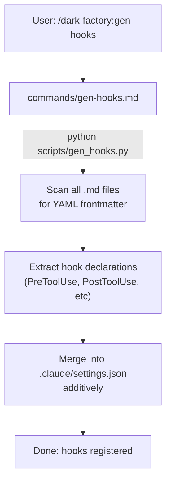

# /dark-factory:gen-hooks

Scans YAML frontmatter of skill/agent/command files for hook declarations and writes them to `.claude/settings.json` additively.

## Flow

## See also

- scripts/gen_hooks.py — hook discovery and settings.json update
- [hooks documentation](hooks.md) — hook types and usage
