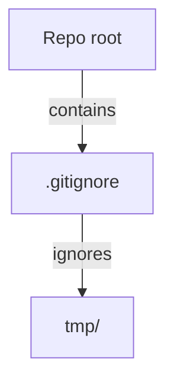

# gitignore

## Metadata

- System type: `flow`

## System Intent

- What this is: A root-level `.gitignore` file that prevents the `tmp/` directory from being committed to the repository. `tmp/` holds ephemeral agent scratch files produced during automated runs and must not appear in version control.

## Mermaid Diagram



## Flows

### Flow: `addGitignore`

- Test files: N/A
- Core files: `.gitignore`

#### Types

```txt
N/A — pure file creation, no runtime types.
```

#### Paths

| path | input | output | path-type | notes |
| --- | --- | --- | --- | --- |
| `addGitignore.create` | repo root (no .gitignore) | `.gitignore` containing `tmp/` | happy path | file created fresh at repo root |

#### Pseudocode

```
Create /.gitignore at repo root with the single entry:
  tmp/
```

## Logs

| Source | Location |
|--------|----------|
| N/A | — |

## Deployment

- Mechanism: `local only`
- Deploy command:
  ```bash
  # No deploy step — committing the file is sufficient.
  ```
- Notes: Change takes effect for all contributors once merged to main. The `tmp/` exclusion prevents ephemeral agent scratch files from appearing in `git status` or being accidentally staged.
