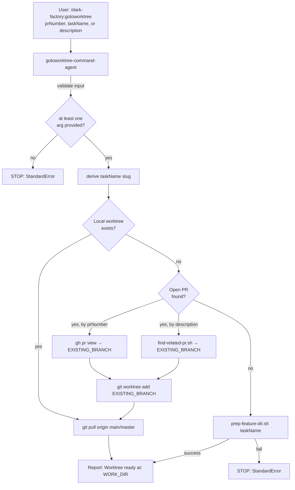

# gotoworktree-command-agent

## Metadata

- System type: `flow`

## System Intent

- What this is: The `gotoworktree-command-agent` backs the `/dark-factory:gotoworktree` slash command. It finds or creates a git worktree for a PR, branch, or new task, pulls main/master into the worktree, and reports the path. It is the single place where worktree setup lives — all command agents (plan, execute, debug, repair) delegate worktree creation to this agent or expect the user to call it first.

## Mermaid Diagram



## Flows

### Flow: `gotoworktreeCommand`

- Test files: `N/A`
- Core files: `commands/gotoworktree.md`, `agents/dark-factory/agents/gotoworktree-command-agent.md`

#### Types

```txt
GotoWorktreeInput {
  prNumber:    string (optional — PR number to find branch for)
  taskName:    string (optional — explicit slug)
  description: string (optional — used to derive slug or search for related PR)
}

GotoWorktreeOutput {
  message: string  ("Worktree ready at: <path>")
}

StandardError {
  message: string
}
```

#### Paths

| path | input | output | path-type | notes |
| --- | --- | --- | --- | --- |
| `gotoworktreeCommand.reuse-local` | any input | `GotoWorktreeOutput` | happy path | matching local worktree already exists; pulls and reports path |
| `gotoworktreeCommand.reuse-pr` | prNumber or description | `GotoWorktreeOutput` | happy path | open PR branch found; creates worktree if absent, pulls, reports path |
| `gotoworktreeCommand.create-new` | taskName or description | `GotoWorktreeOutput` | happy path | no existing worktree/PR; creates fresh via prep-feature-dir.sh |
| `gotoworktreeCommand.no-input` | all null | `StandardError` | error | no input provided |
| `gotoworktreeCommand.prep-failure` | any | `StandardError` | error | prep-feature-dir.sh failed |

#### Pseudocode

```
gotoworktree-command-agent(prNumber, taskName, description):

  # Step 1 — validate input
  if prNumber is empty AND taskName is empty AND description is empty:
    report error: StandardError { message: "Must provide prNumber, taskName, or description" }
    STOP

  PROJECT_DIR = bash("git rev-parse --show-toplevel")
  PROJECT_NAME = basename(PROJECT_DIR)

  # Step 2 — derive taskName if not yet provided
  if taskName is empty:
    if prNumber is not empty:
      branchName = bash("gh pr view \"$prNumber\" --json headRefName --jq .headRefName")
      taskName = branchName after stripping leading "<prefix>/" (e.g. "feature/add-oauth" → "add-oauth")
    elif description is not empty:
      taskName = slugify(description)   # lowercase, hyphens, ≤30 chars

  # Step 3 — search for existing local worktree by taskName
  WORKTREE_NAME = PROJECT_NAME + "-" + taskName
  WORK_DIR = PROJECT_DIR + "/../" + WORKTREE_NAME
  if WORK_DIR exists and is a git worktree:
    bash("git -C \"$WORK_DIR\" fetch origin")
    bash("git -C \"$WORK_DIR\" pull origin main 2>/dev/null || git -C \"$WORK_DIR\" pull origin master || true")
    Report: "Worktree ready at: " + WORK_DIR
    STOP

  # Step 4 — search for open PR (by prNumber or description)
  if prNumber is not empty:
    prJson = bash("gh pr view \"$prNumber\" --json headRefName,url --jq '[.headRefName,.url]|@tsv'")
    EXISTING_BRANCH = first field of prJson
  else:
    relatedPrOutput = bash("bash \"${CLAUDE_PLUGIN_ROOT}/agents/dark-factory/scripts/find-related-pr.sh\" \"$description\"") || ""
    EXISTING_BRANCH = extract BRANCH= from relatedPrOutput

  if EXISTING_BRANCH is not empty:
    existingTaskName = EXISTING_BRANCH after stripping leading "<prefix>/" prefix
    WORK_DIR = PROJECT_DIR + "/../" + PROJECT_NAME + "-" + existingTaskName
    if WORK_DIR does not exist:
      bash("git -C \"$PROJECT_DIR\" pull origin main || true")
      bash("git -C \"$PROJECT_DIR\" worktree add \"$WORK_DIR\" \"$EXISTING_BRANCH\"")
    bash("git -C \"$WORK_DIR\" pull origin main 2>/dev/null || git -C \"$WORK_DIR\" pull origin master || true")
    Report: "Worktree ready at: " + WORK_DIR
    STOP

  # Step 5 — create new worktree via prep-feature-dir.sh
  prepOutput = bash("bash \"${CLAUDE_PLUGIN_ROOT}/agents/dark-factory/scripts/prep-feature-dir.sh\" \"$taskName\"")
  if script fails:
    report error: StandardError { message: "Failed to create worktree: " + prepOutput }
    STOP
  WORK_DIR = extract WORK_DIR=<value> from prepOutput
  Report: "Worktree ready at: " + WORK_DIR
  STOP
```

## Logs

| Source | Location |
|--------|----------|
| command agent stdout | Worktree path reported directly on completion |

## Deployment

- Mechanism: `local only`
- Deploy command:
  ```bash
  /dark-factory:gotoworktree
  ```
- Notes: Invoked as a Claude Code slash command. Requires the dark-factory plugin installed. Reuses `prep-feature-dir.sh` and `find-related-pr.sh` scripts. Does not delegate to other agents — stops after reporting the worktree path. All four command agents (plan, execute, debug, repair) assume the user has already run this command to enter the correct worktree before invoking them.
