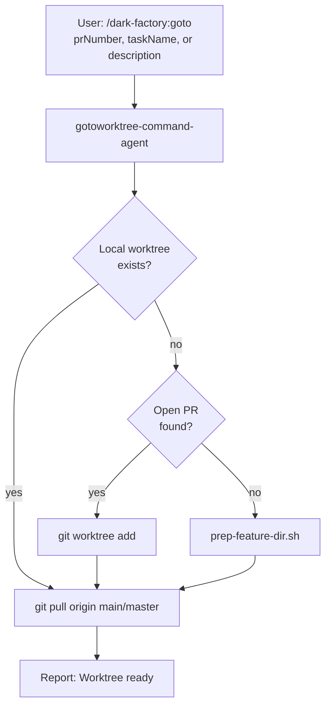

# /dark-factory:goto

Finds or creates a git worktree for a PR, branch, or new task — pulls main/master and reports the path.

## Flow

## See also

- [find-related-pr](find-related-pr.md) — searches for matching open PRs
- prep-feature-dir.sh — creates new worktree
