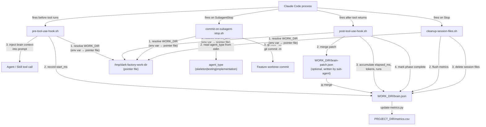

# hooks

## Metadata

- System type: `flow`

## System Intent

- What this is: Four Claude Code hooks — `pre-tool-use-hook.sh`, `post-tool-use-hook.sh`, `commit-on-subagent-stop.sh`, and `cleanup-session-files.sh` — manage brain state, metrics persistence, and ordered git commits during a manufacture run. The pre-hook injects brain.json context into the agent prompt and records a start timestamp for metrics. The post-hook merges any `brain-patch.json` written by the sub-agent back into `brain.json`, accumulates elapsed time and token counts, and marks the current phase complete. The SubagentStop hook commits staged changes to the feature worktree when any file-generating agent finishes (skeleton-agent, testing-agent, implementation-agent, sub-planning-agent, update-documentation-agent, skill-update-agent, debugger-agent, repair-agent, detect-drift-agent, setup-wizard), producing an ordered proof-of-execution commit sequence. A separate `commit-investigation-docs.sh` hook commits verified documentation when investigation-agent or investigation-orchestrator finishes. The Stop hook flushes accumulated metrics from brain.json to metrics.csv before deleting all transient session files.

## Mermaid Diagram



## Flows

### Flow: `hooks.resolve-work-dir`

- Core files: `agents/dark-factory/scripts/pre-tool-use-hook.sh`, `agents/dark-factory/scripts/post-tool-use-hook.sh`

Both hooks must locate `brain.json` before they can do anything useful. Because `export DARK_FACTORY_WORK_DIR=...` inside a Bash tool call runs in an isolated subprocess and cannot propagate to the Claude Code parent process, hooks cannot rely on the env var being set.

Resolution order:

1. If `DARK_FACTORY_WORK_DIR` is set in the environment, use it.
2. Else if `/tmp/dark-factory-work-dir` exists, read its contents and use that as the work directory.
3. If neither yields a value, take the `no-brain` path (pass through silently).

`dark-factory-agent` writes the pointer file immediately after `brain-state-manager` creates `brain.json`, and removes it in both the happy-path and every error-path cleanup:

```bash
# written after brain.json creation
printf '%s' "$WORK_DIR" > /tmp/dark-factory-work-dir

# removed at cleanup
rm -f /tmp/dark-factory-work-dir
```

#### Paths

| path | input | output | path-type | notes |
| --- | --- | --- | --- | --- |
| `hooks.resolve-work-dir.env` | env var set | `DARK_FACTORY_WORK_DIR` resolved | happy path | only possible when Claude Code was launched with the var already in its environment |
| `hooks.resolve-work-dir.pointer-file` | env var unset, pointer file present | `DARK_FACTORY_WORK_DIR` read from `/tmp/dark-factory-work-dir` | happy path | normal case during a manufacture run |
| `hooks.resolve-work-dir.no-brain` | env var unset, pointer file absent | hook exits silently | no-op | not a dark-factory session, or cleanup already ran |

---

### Flow: `hooks.pre-tool-use`

- Core files: `agents/dark-factory/scripts/pre-tool-use-hook.sh`

Fires before every Agent or Skill tool call. Steps (all skipped on `no-brain` path):

1. Resolve `DARK_FACTORY_WORK_DIR` (see `hooks.resolve-work-dir`).
2. For Agent or Skill tool calls: write `start_ms = now_ms` into `brain.json` under `.metrics[<key>]` (flock-protected).
3. For top-level phase agents: set the first incomplete phase's `*-running = true` in `brain.json`.
4. Read `brain.json` and prepend its contents to the agent prompt as `BRAIN STATE (read-only context ...)`.
5. Write the modified tool input to stdout so Claude Code substitutes it before the tool runs.

#### Types

```txt
MetricsKey: string
  — for Agent tool calls: subagent_type field, or agent name extracted from prompt path
  — for Skill tool calls: skill field

PhaseAgents: feature-agent | debugger-agent | fix-flow-orchestrator | repair-agent |
             code-review-orchestrator-agent | update-documentation-agent |
             skill-update-agent | pr-agent
```

#### Paths

| path | input | output | path-type | notes |
| --- | --- | --- | --- | --- |
| `hooks.pre-tool-use.no-brain` | `WORK_DIR` unresolvable or brain.json absent | stdin passed through unchanged | no-op | |
| `hooks.pre-tool-use.metrics-capture` | Agent or Skill tool call | `brain.json` `.metrics[key].start_ms` set | side-effect | |
| `hooks.pre-tool-use.set-phase-running` | Agent tool call, agent is a phase agent | `brain.json` first incomplete phase `*-running = true` | side-effect | |
| `hooks.pre-tool-use.inject` | any tool call (with brain) | modified tool input with brain context prepended | happy path | Claude Code reads hook stdout to override tool input |

---

### Flow: `hooks.post-tool-use`

- Core files: `agents/dark-factory/scripts/post-tool-use-hook.sh`

Fires after every Agent or Skill tool call returns. Steps (all skipped on `no-brain` path):

1. Resolve `DARK_FACTORY_WORK_DIR` (see `hooks.resolve-work-dir`).
2. If `brain-patch.json` exists in `WORK_DIR`: merge it into `brain.json` with `jq -s '.[0] * .[1]'`, then delete the patch file (flock-protected).
3. For Agent or Skill tool calls: read `start_ms` from `brain.json`, compute `elapsed_ms = now_ms - start_ms`, accumulate `elapsed_ms`, `tokens`, and `runs` into `.metrics[<key>]`, and remove `start_ms` (flock-protected).
4. For top-level phase agents: find the currently-running phase (key ending in `-running` with value `true`), set it to `false`, and set the corresponding `*-complete = true` (flock-protected).

#### Paths

| path | input | output | path-type | notes |
| --- | --- | --- | --- | --- |
| `hooks.post-tool-use.no-brain` | `WORK_DIR` unresolvable or brain.json absent | exits 0 silently | no-op | |
| `hooks.post-tool-use.merge-patch` | `brain-patch.json` present | patch merged into `brain.json`, patch file deleted | happy path | |
| `hooks.post-tool-use.no-patch` | `brain-patch.json` absent | no merge | no-op | logged to stderr |
| `hooks.post-tool-use.metrics-accumulate` | Agent or Skill tool call | `brain.json` `.metrics[key]` updated with elapsed_ms, tokens, runs | side-effect | `start_ms` removed after accumulation |
| `hooks.post-tool-use.set-phase-complete` | phase agent tool call | `brain.json` running phase set to complete | side-effect | |

---

### Flow: `hooks.subagent-stop`

- Core files: `agents/dark-factory/scripts/commit-on-subagent-stop.sh`
- Test files: `tests/test_commit_on_subagent_stop.py`

Fires on every `SubagentStop` event. Reads `agent_type` from stdin (first line), maps it to a commit message, and commits all staged changes in the feature worktree. Always exits 0 — failures are non-blocking.

Work-dir resolution uses the same two-step fallback as the other hooks: `DARK_FACTORY_WORK_DIR` env var first, then `/tmp/dark-factory-work-dir` pointer file. The env var is not reliably propagated to SubagentStop hook processes (they run as children of the Claude Code process after a subagent finishes, outside the bash subprocess where `export` was called), so the pointer file is the normal resolution path in production.

#### Types

```txt
CommitMessage {
  skeleton-agent:             "skeleton"
  testing-agent:              "tests"
  implementation-agent:       "implementation"
  sub-planning-agent:         "plan"
  detect-drift-agent:         "docs: fix drift"
  update-documentation-agent: "docs: update documentation"
  skill-update-agent:         "chore: update skills"
  setup-wizard:               "chore: add setup scripts"
  debugger-agent:             "docs: add bug audit log"
  repair-agent:               "fix: repair"
}
```

#### Paths

| path | input | output | path-type | notes |
| --- | --- | --- | --- | --- |
| `hooks.subagent-stop.skeleton-agent` | agent_type="skeleton-agent", staged changes exist | git commit "skeleton" in WORK_DIR | happy path | |
| `hooks.subagent-stop.testing-agent` | agent_type="testing-agent", staged changes exist | git commit "tests" in WORK_DIR | happy path | |
| `hooks.subagent-stop.implementation-agent` | agent_type="implementation-agent", staged changes exist | git commit "implementation" in WORK_DIR | happy path | |
| `hooks.subagent-stop.sub-planning-agent` | agent_type="sub-planning-agent", staged changes exist | git commit "plan" in WORK_DIR | happy path | |
| `hooks.subagent-stop.detect-drift-agent` | agent_type="detect-drift-agent", staged changes exist | git commit "docs: fix drift" in WORK_DIR | happy path | |
| `hooks.subagent-stop.update-documentation-agent` | agent_type="update-documentation-agent", staged changes exist | git commit "docs: update documentation" in WORK_DIR | happy path | |
| `hooks.subagent-stop.skill-update-agent` | agent_type="skill-update-agent", staged changes exist | git commit "chore: update skills" in WORK_DIR | happy path | |
| `hooks.subagent-stop.setup-wizard` | agent_type="setup-wizard", staged changes exist | git commit "chore: add setup scripts" in WORK_DIR | happy path | |
| `hooks.subagent-stop.debugger-agent` | agent_type="debugger-agent", staged changes exist | git commit "docs: add bug audit log" in WORK_DIR | happy path | |
| `hooks.subagent-stop.repair-agent` | agent_type="repair-agent", staged changes exist | git commit "fix: repair" in WORK_DIR | happy path | |
| `hooks.subagent-stop.no-staged-changes` | recognized agent_type, no staged changes | exits 0, logs to stderr | edge case | git diff --cached shows nothing |
| `hooks.subagent-stop.unknown-agent-type` | agent_type not in recognized set | exits 0, logs to stderr | no-op | script handles gracefully even if matcher allows it |
| `hooks.subagent-stop.no-work-dir` | DARK_FACTORY_WORK_DIR unset and pointer file absent | exits 0, logs "DARK_FACTORY_WORK_DIR not set, skipping commit" | no-op | not a dark-factory session or cleanup already ran |
| `hooks.subagent-stop.git-failure` | git add or git commit fails | exits 0, logs error to stderr | error | non-blocking |

---

### Flow: `hooks.investigation-subagent-stop`

- Core files: `agents/dark-factory/scripts/commit-investigation-docs.sh`

Fires on every `SubagentStop` event for investigation-agent and investigation-orchestrator. Reads `agent_type` from stdin (first line). If the agent type is `investigation-orchestrator` or `investigation-agent`, stages all files under `docs/docs/` and commits them with the message "docs: add verified system documentation". Exits 0 for all other agent types without action. Always exits 0 — failures are non-blocking.

Work-dir resolution uses the same two-step fallback as `commit-on-subagent-stop.sh`: `DARK_FACTORY_WORK_DIR` env var first, then `/tmp/dark-factory-work-dir` pointer file.

#### Paths

| path | input | output | path-type | notes |
| --- | --- | --- | --- | --- |
| `hooks.investigation-subagent-stop.investigation-orchestrator` | agent_type="investigation-orchestrator", docs/docs/ has staged changes | git commit "docs: add verified system documentation" in WORK_DIR | happy path | |
| `hooks.investigation-subagent-stop.investigation-agent` | agent_type="investigation-agent", docs/docs/ has staged changes | git commit "docs: add verified system documentation" in WORK_DIR | happy path | |
| `hooks.investigation-subagent-stop.no-staged-changes` | recognized agent_type, no staged changes in docs/docs/ | exits 0, logs to stderr | edge case | |
| `hooks.investigation-subagent-stop.unknown-agent-type` | agent_type not in recognized set | exits 0 silently | no-op | |
| `hooks.investigation-subagent-stop.no-work-dir` | DARK_FACTORY_WORK_DIR unset and pointer file absent | exits 0, logs "DARK_FACTORY_WORK_DIR not set, skipping commit" | no-op | |
| `hooks.investigation-subagent-stop.git-failure` | git add or git commit fails | exits 0, logs error to stderr | error | non-blocking |

---

### Flow: `hooks.session-cleanup`

- Core files: `agents/dark-factory/scripts/cleanup-session-files.sh`
- Test files: `tests/test_cleanup_session_files.py`

Fires on the Claude Code `Stop` event (registered in `hooks/hooks.json`). Runs after every session ends — whether or not a manufacture task was in progress. Always exits 0.

Steps:

1. Resolve `DARK_FACTORY_WORK_DIR` using the same two-step fallback as other hooks (env var → pointer file). If neither is set, exit immediately with no-op.
2. If `brain.json` exists and contains a `projectDir` field, and `CLAUDE_PLUGIN_ROOT` is set and `scripts/update-metrics.py` exists: call `python3 update-metrics.py --csv <projectDir>/metrics.csv --brain brain.json` to flush accumulated session metrics to the CSV. Errors from this step are non-fatal (`|| true`).
3. Delete all transient session files: `brain.json`, `brain.json.lock`, `brain-patch.json`, `flows-state.json`, and `/tmp/dark-factory-work-dir`.

This step is the only place where metrics stored in `brain.json` during a session are written durably to `metrics.csv`. Without this flush, all per-agent elapsed time, token counts, and run counts accumulated by the post-hook would be lost when `brain.json` is deleted.

#### Paths

| path | input | output | path-type | notes |
| --- | --- | --- | --- | --- |
| `hooks.session-cleanup.no-work-dir` | env var unset, pointer file absent | exits 0, logs to stderr | no-op | not a dark-factory session |
| `hooks.session-cleanup.metrics-flush` | brain.json present with projectDir, update-metrics.py accessible | metrics written to `<projectDir>/metrics.csv`, logs `metrics-flushed` to stderr | happy path | |
| `hooks.session-cleanup.no-metrics-script` | CLAUDE_PLUGIN_ROOT unset or update-metrics.py missing | metrics flush skipped silently | degraded | session files still deleted |
| `hooks.session-cleanup.no-project-dir` | brain.json present but projectDir empty or missing | metrics flush skipped silently | degraded | session files still deleted |
| `hooks.session-cleanup.delete-files` | session files exist | each file deleted; per-file success/failure logged to stderr | happy path | failures are warnings; exit is always 0 |

## Logs

| Source | Location |
|--------|----------|
| hook stderr | Claude Code stderr / terminal running the manufacture session |
| brain metrics | `$WORK_DIR/brain.json` `.metrics` key (flushed to `metrics.csv` at cleanup) |
| pointer file | `/tmp/dark-factory-work-dir` (written by dark-factory-agent, removed at cleanup) |

## Deployment

- Mechanism: `local only`
- Deploy command:
  ```bash
  /dark-factory:install
  ```
- Notes: Hooks are registered in two distinct ways depending on hook type. `PreToolUse`, `PostToolUse`, and `Stop` hooks are registered globally in `hooks/hooks.json` (merged into `.claude/settings.json` at install time) and match the Agent tool globally. `SubagentStop` hooks are declared ONLY in each agent's YAML frontmatter — never in `hooks/hooks.json` or `.claude/settings.json`. This is critical: a global `SubagentStop` entry in `settings.json` fires for ALL sub-agents regardless of type; if `pr-agent-cleanup-hook.sh` is registered globally, it will destroy the feature worktree when ANY agent (including repair-agent or debugger-agent) finishes, breaking the orchestration flow. All hooks resolve the work directory using the same two-step fallback: `DARK_FACTORY_WORK_DIR` env var first, then the `/tmp/dark-factory-work-dir` pointer file. The pointer file is necessary because env vars exported inside a Bash tool call do not propagate to the Claude Code parent process or to hook subprocesses. Two SubagentStop scripts exist: `commit-on-subagent-stop.sh` handles all execution, planning, documentation, and utility agents; `commit-investigation-docs.sh` handles investigation agents and stages only `docs/docs/`. The `Stop` hook (`cleanup-session-files.sh`) is the authoritative flush point for metrics — it writes brain.json metrics to `metrics.csv` before deleting all session files. See `docs/bugs/2026-05-07-repair-debugger-stuck-global-subagent-stop.md` for a documented failure mode caused by global SubagentStop registration.
