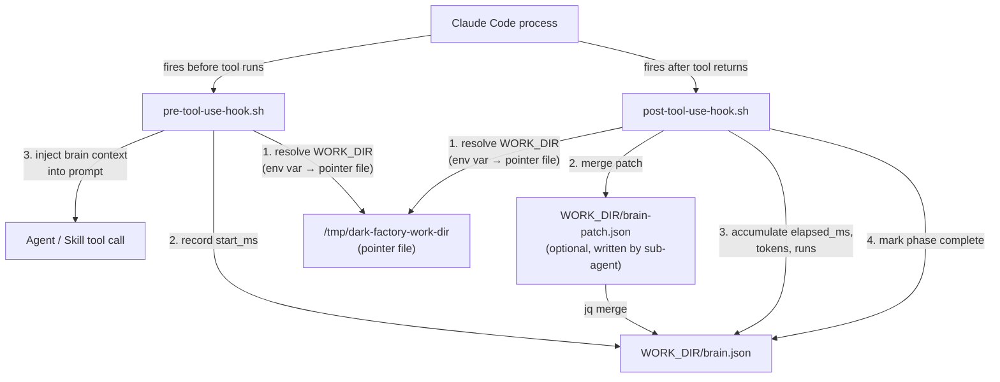

# hooks

## Metadata

- System type: `flow`

## System Intent

- What this is: Two Claude Code hooks — `pre-tool-use-hook.sh` and `post-tool-use-hook.sh` — intercept every Agent and Skill tool call during a manufacture run. The pre-hook injects brain.json context into the agent prompt and records a start timestamp for metrics. The post-hook merges any `brain-patch.json` written by the sub-agent back into `brain.json`, accumulates elapsed time and token counts, and marks the current phase complete.

## Mermaid Diagram



## Flows

### Flow: `hooks.resolve-work-dir`

- Core files: `agents/dark-factory/scripts/pre-tool-use-hook.sh`, `agents/dark-factory/scripts/post-tool-use-hook.sh`

Both hooks must locate `brain.json` before they can do anything useful. Because `export DARK_FACTORY_WORK_DIR=...` inside a Bash tool call runs in an isolated subprocess and cannot propagate to the Claude Code parent process, hooks cannot rely on the env var being set.

Resolution order:

1. If `DARK_FACTORY_WORK_DIR` is set in the environment, use it.
2. Else if `/tmp/dark-factory-work-dir` exists, read its contents and use that as the work directory.
3. If neither yields a value, take the `no-brain` path (pass through silently).

The pointer file is written by whichever agent sets up the worktree, and removed at cleanup:

```bash
# written after brain.json creation
printf '%s' "$WORK_DIR" > /tmp/dark-factory-work-dir

# removed at cleanup
rm -f /tmp/dark-factory-work-dir
```

#### Paths

| path | input | output | path-type | notes |
| --- | --- | --- | --- | --- |
| `hooks.resolve-work-dir.env` | env var set | `DARK_FACTORY_WORK_DIR` resolved | happy path | only possible when Claude Code was launched with the var already in its environment |
| `hooks.resolve-work-dir.pointer-file` | env var unset, pointer file present | `DARK_FACTORY_WORK_DIR` read from `/tmp/dark-factory-work-dir` | happy path | normal case during a manufacture run |
| `hooks.resolve-work-dir.no-brain` | env var unset, pointer file absent | hook exits silently | no-op | not a dark-factory session, or cleanup already ran |

---

### Flow: `hooks.pre-tool-use`

- Core files: `agents/dark-factory/scripts/pre-tool-use-hook.sh`

Fires before every Agent or Skill tool call. Steps (all skipped on `no-brain` path):

1. Resolve `DARK_FACTORY_WORK_DIR` (see `hooks.resolve-work-dir`).
2. For Agent or Skill tool calls: write `start_ms = now_ms` into `brain.json` under `.metrics[<key>]` (flock-protected).
3. For top-level phase agents: set the first incomplete phase's `*-running = true` in `brain.json`.
4. Read `brain.json` and prepend its contents to the agent prompt as `BRAIN STATE (read-only context ...)`.
5. Write the modified tool input to stdout so Claude Code substitutes it before the tool runs.

#### Types

```txt
MetricsKey: string
  — for Agent tool calls: subagent_type field, or agent name extracted from prompt path
  — for Skill tool calls: skill field

PhaseAgents: feature-agent | debugger-agent | fix-flow-orchestrator | repair-agent |
             code-review-orchestrator-agent | update-documentation-agent |
             skill-update-agent | pr-agent
```

#### Paths

| path | input | output | path-type | notes |
| --- | --- | --- | --- | --- |
| `hooks.pre-tool-use.no-brain` | `WORK_DIR` unresolvable or brain.json absent | stdin passed through unchanged | no-op | |
| `hooks.pre-tool-use.metrics-capture` | Agent or Skill tool call | `brain.json` `.metrics[key].start_ms` set | side-effect | |
| `hooks.pre-tool-use.set-phase-running` | Agent tool call, agent is a phase agent | `brain.json` first incomplete phase `*-running = true` | side-effect | |
| `hooks.pre-tool-use.inject` | any tool call (with brain) | modified tool input with brain context prepended | happy path | Claude Code reads hook stdout to override tool input |

---

### Flow: `hooks.post-tool-use`

- Core files: `agents/dark-factory/scripts/post-tool-use-hook.sh`

Fires after every Agent or Skill tool call returns. Steps (all skipped on `no-brain` path):

1. Resolve `DARK_FACTORY_WORK_DIR` (see `hooks.resolve-work-dir`).
2. If `brain-patch.json` exists in `WORK_DIR`: merge it into `brain.json` with `jq -s '.[0] * .[1]'`, then delete the patch file (flock-protected).
3. For Agent or Skill tool calls: read `start_ms` from `brain.json`, compute `elapsed_ms = now_ms - start_ms`, accumulate `elapsed_ms`, `tokens`, and `runs` into `.metrics[<key>]`, and remove `start_ms` (flock-protected).
4. For top-level phase agents: find the currently-running phase (key ending in `-running` with value `true`), set it to `false`, and set the corresponding `*-complete = true` (flock-protected).

#### Paths

| path | input | output | path-type | notes |
| --- | --- | --- | --- | --- |
| `hooks.post-tool-use.no-brain` | `WORK_DIR` unresolvable or brain.json absent | exits 0 silently | no-op | |
| `hooks.post-tool-use.merge-patch` | `brain-patch.json` present | patch merged into `brain.json`, patch file deleted | happy path | |
| `hooks.post-tool-use.no-patch` | `brain-patch.json` absent | no merge | no-op | logged to stderr |
| `hooks.post-tool-use.metrics-accumulate` | Agent or Skill tool call | `brain.json` `.metrics[key]` updated with elapsed_ms, tokens, runs | side-effect | `start_ms` removed after accumulation |
| `hooks.post-tool-use.set-phase-complete` | phase agent tool call | `brain.json` running phase set to complete | side-effect | |

## Logs

| Source | Location |
|--------|----------|
| hook stderr | Claude Code stderr / terminal running the manufacture session |
| brain metrics | `$WORK_DIR/brain.json` `.metrics` key (flushed to `metrics.csv` at cleanup) |
| pointer file | `/tmp/dark-factory-work-dir` (written by worktree setup flow, removed at cleanup) |

## Deployment

- Mechanism: `local only`
- Deploy command:
  ```bash
  /dark-factory:install
  ```
- Notes: Hooks are registered in `.claude/settings.json` as `PreToolUse` and `PostToolUse` entries for the Agent tool. They run as children of the Claude Code process and inherit Claude Code's environment. The pointer file at `/tmp/dark-factory-work-dir` is the mechanism that makes the work directory visible to hooks across the subprocess isolation boundary.
