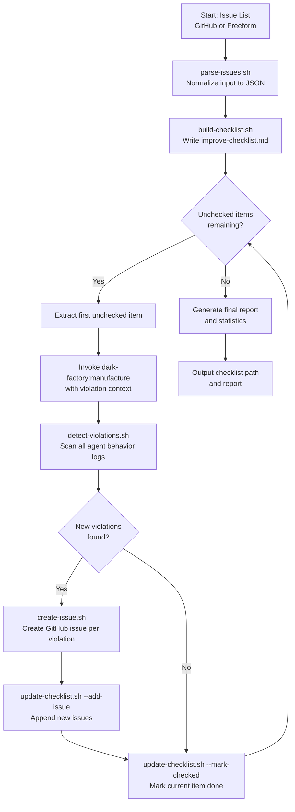

# dark-factory:improve

## Metadata

- System type: `flow`

## System Intent

- What this is: The `dark-factory:improve` command is a self-correcting orchestrator that continuously fixes pipeline instruction violations in the dark-factory agent system. It accepts a list of issues (GitHub issue numbers or freeform descriptions), builds a markdown checklist, iteratively invokes `/dark-factory:manufacture` to fix each violation, scans the full agent execution chain for newly introduced violations after each fix, creates GitHub issues for new violations, and reports final statistics with a per-agent violation breakdown.
- Primary consumer(s): Developers and automated pipelines that need to systematically resolve pipeline compliance issues.
- Boundary: Accepts issue input, manages a checklist, delegates all fixing to manufacture, and delegates violation detection to `detect-violations.sh`. Does not merge PRs or apply fixes directly.

## Mermaid Diagram



## Flows

### Flow: `improve.initialization`

- Core files: `commands/improve.md`, `agents/improve/agents/improve-orchestrator.md`, `agents/improve/scripts/parse-issues.sh`, `agents/improve/scripts/build-checklist.sh`

#### Types

```txt
IssueListInput {
  issueList: string (comma-separated GitHub issue numbers (#42) and/or freeform descriptions ("missing Co-Authored-By"))
}

ParsedIssue {
  type: "github" | "freeform"
  number: integer (only when type == "github")
  title: string (only when type == "github")
  body: string (only when type == "github", first 500 chars)
  description: string (only when type == "freeform")
}

IssueData {
  issues: ParsedIssue[]
}

ChecklistPath {
  path: string (absolute path to $DARK_FACTORY_WORK_DIR/improve-checklist.md)
}
```

#### Paths

| path | input | output | path-type | notes |
| --- | --- | --- | --- | --- |
| `improve.initialization.success` | `IssueListInput` | `ChecklistPath` | `happy path` | Issues parsed, checklist written to `$DARK_FACTORY_WORK_DIR/improve-checklist.md` |
| `improve.initialization.empty-list` | `IssueListInput` | `void` | `error` | No valid issues after parsing; PushNotification sent, orchestrator exits |
| `improve.initialization.github-not-found` | `IssueListInput` | `ChecklistPath` | `degraded` | One or more GitHub issue numbers returned 404; those items are skipped with warning to stderr |

---

### Flow: `improve.loop`

- Core files: `agents/improve/agents/improve-orchestrator.md`, `agents/improve/scripts/detect-violations.sh`, `agents/improve/scripts/create-issue.sh`, `agents/improve/scripts/update-checklist.sh`

#### Types

```txt
ChecklistItem {
  raw: string (full checklist line)
  issueNumber: string | null (GitHub issue number if applicable)
  description: string (violation description)
  url: string | null (GitHub issue URL if applicable)
}

Violation {
  category: "missing-coauthored-by" | "skipped-required-step" | "commit-sequence-violation" | "askuserquestion-depth-violation" | "sub-agent-delegation-failure" | "missing-test-coverage" | "incomplete-documentation" | "execution-failure"
  agentName: "feature-agent" | "execution-agent" | "implementation-agent" | "pr-agent" | "code-review-agent" | "unknown-agent"
  quote: string (the agent text that triggered the violation)
  description: string (human-readable explanation)
}

ImprovementStatistics {
  totalIssuesFixed: integer
  totalNewViolations: integer
  iterationCount: integer
  agentViolationBreakdown: map<agentName, count>
}
```

#### Paths

| path | input | output | path-type | notes |
| --- | --- | --- | --- | --- |
| `improve.loop.success` | `ChecklistPath` | `ImprovementStatistics` | `happy path` | All items eventually checked; statistics returned |
| `improve.loop.manufacture-hard-stop` | `ChecklistItem` | `void` | `degraded` | Manufacture returns hard-stop; item marked `FAILED` in checklist, loop continues |
| `improve.loop.manufacture-error` | `ChecklistItem` | `void` | `degraded` | Manufacture throws; item marked `FAILED`, loop continues |
| `improve.loop.violation-detection-fail` | `ChecklistItem` | `void` | `degraded` | detect-violations.sh errors; violation detection skipped for this iteration, item still marked checked |
| `improve.loop.issue-creation-fail` | `Violation` | `void` | `degraded` | create-issue.sh fails to create GitHub issue; logged, loop continues without adding item to checklist |

#### Pseudocode

```
loop:
  item = first line matching "^- \[ \]" in improve-checklist.md
  if item is null: BREAK

  taskDescription = build_task_description(item)
  manufactureResult = invoke /dark-factory:manufacture taskDescription

  if manufactureResult.status == "hard-stop":
    update-checklist.sh --mark-failed checklistPath item.identifier
    CONTINUE

  violations = detect-violations.sh manufactureResult.workDir
  # violations scans: logs/, transcripts/, agent-output/, workDir root, brain.json

  for violation in violations:
    issueNumber = create-issue.sh violation  # creates GitHub issue labelled "pipeline-violation"
    update-checklist.sh --add-issue checklistPath "#issueNumber"
    update statistics.agentViolationBreakdown[violation.agentName]++

  update-checklist.sh --mark-checked checklistPath item.identifier
  statistics.totalIssuesFixed++
```

---

### Flow: `improve.violation-detection`

- Core files: `agents/improve/scripts/detect-violations.sh`

#### Types

```txt
WorkDir {
  path: string (absolute path to manufacture work directory)
}

Violation[] (see Violation type above)
```

#### Paths

| path | input | output | path-type | notes |
| --- | --- | --- | --- | --- |
| `improve.violation-detection.success` | `WorkDir` | `Violation[]` | `happy path` | Log files scanned, violations deduplicated by `{category, agentName, quote}` |
| `improve.violation-detection.no-logs` | `WorkDir` | `[]` | `happy path` | No log files found in expected directories; returns empty array |
| `improve.violation-detection.workdir-missing` | `WorkDir` | `[]` | `happy path` | Work directory does not exist; returns empty array immediately |

#### Pseudocode

```
detect-violations.sh(workDir):
  if workDir does not exist: return []

  LOG_DIRS = [workDir/logs, workDir/transcripts, workDir/agent-output, workDir]

  for each LOG_DIR:
    scan *.log, *.txt, *.md files (up to 500 lines per pattern pass):
      Pattern 1 (skipped-required-step):   "i will skip|i'm skipping|bypassing.*hook|skip.*hook.*required"
      Pattern 2 (missing-coauthored-by):   "forgot.*co-author|missing.*co-author|add.*co-author.*footer"
      Pattern 3 (commit-sequence-violation): "commit.*before|before.*commit|wrong.*order"
      Pattern 4 (askuserquestion-depth-violation): "askuserquestion.*depth|ask.*user.*question.*wrong"
      Pattern 5 (sub-agent-delegation-failure): "delegation.*fail|failed.*audit|child.*agent.*violated"
      Pattern 6 (missing-test-coverage): "skip.*test|no.*test|untested|missing.*test"
      Pattern 7 (incomplete-documentation): "skip.*doc|no.*doc|incomplete.*doc"

  if workDir/brain.json exists:
    scan for "hard-stop|hardstop|execution.*failed" → execution-failure violation

  return deduplicated violations (unique_by {category, agentName, quote})
```

---

### Flow: `improve.report`

- Core files: `agents/improve/agents/improve-orchestrator.md`

#### Types

```txt
ImprovementReport {
  status: "done"
  checklistPath: string
  report: string (human-readable summary)
  statistics: ImprovementStatistics
}
```

#### Paths

| path | input | output | path-type | notes |
| --- | --- | --- | --- | --- |
| `improve.report.success` | `ImprovementStatistics` | `ImprovementReport` | `happy path` | Final checklist contents included; PushNotification sent with summary |

## Helper Scripts

| Script | Purpose | Input | Output |
|--------|---------|-------|--------|
| `agents/improve/scripts/parse-issues.sh` | Parse comma-separated issue list to JSON | `"#42, \"description\""` string | `IssueData` JSON |
| `agents/improve/scripts/build-checklist.sh` | Write initial checklist markdown | `IssueData` JSON | Path to `improve-checklist.md` |
| `agents/improve/scripts/detect-violations.sh` | Scan agent behavior logs for violations | Work directory path | `Violation[]` JSON |
| `agents/improve/scripts/create-issue.sh` | Create GitHub issue for a violation | `Violation` JSON | GitHub issue number |
| `agents/improve/scripts/update-checklist.sh` | Mark items checked/failed or add new issues | `--mark-checked\|--mark-failed\|--add-issue`, checklist path, item spec | Status message |

## Violation Categories

| Category code | Description |
|---|---|
| `missing-coauthored-by` | Co-Authored-By footer missing or incorrect in a commit |
| `skipped-required-step` | Agent explicitly stated it is skipping a required pipeline step |
| `commit-sequence-violation` | Commits or tool calls made in the wrong order |
| `askuserquestion-depth-violation` | AskUserQuestion called at incorrect depth in the agent chain |
| `sub-agent-delegation-failure` | Parent agent failed to audit or enforce compliance in a delegated child agent |
| `missing-test-coverage` | Code created without corresponding test coverage |
| `incomplete-documentation` | Documentation updates were skipped or incomplete |
| `execution-failure` | Execution phase encountered an unhandled error (detected via brain.json) |

## Logs

| Source | Location |
|--------|----------|
| improve-checklist.md | `$DARK_FACTORY_WORK_DIR/improve-checklist.md` |
| Manufacture logs (scanned by detect-violations.sh) | `<manufacture-workdir>/logs/`, `<manufacture-workdir>/transcripts/`, `<manufacture-workdir>/agent-output/` |
| brain.json (scanned for hard-stops) | `<manufacture-workdir>/brain.json` |

## Deployment

- Mechanism: `local only`
- Deploy command:
  ```bash
  # Command available after installing the dark-factory plugin:
  claude plugin install dark-factory

  # Invoke:
  /dark-factory:improve --issues "#42, #123, \"missing Co-Authored-By in repair-agent\""

  # Or via stdin:
  echo "#42, \"violation description\"" | /dark-factory:improve
  ```
- Notes: Requires `gh` (GitHub CLI) authenticated, `jq`, `git`, and access to `/dark-factory:manufacture`. The `pipeline-violation` label must exist in the target GitHub repository for `create-issue.sh` to tag issues correctly.
