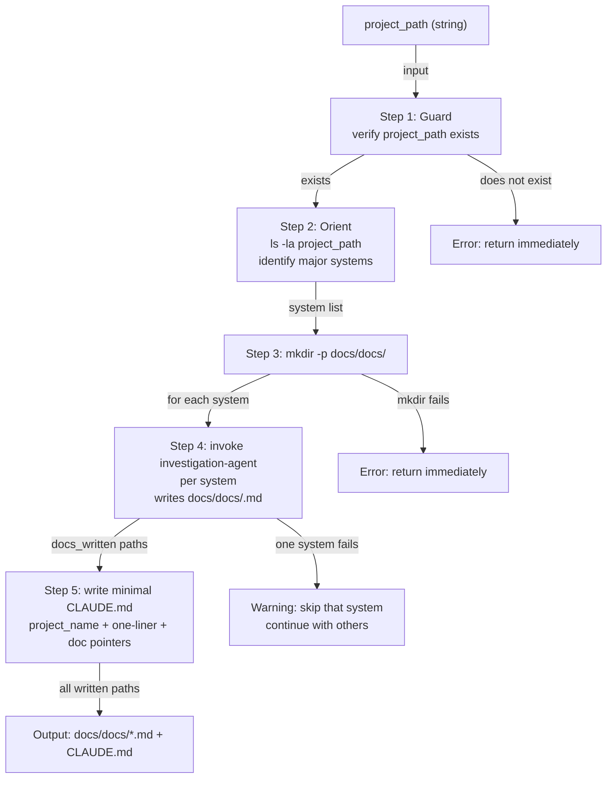

# init-docs-agent

## Metadata

- System type: `flow`

## System Intent

- What this is: A non-user-invocable sub-agent in the initialization pipeline. It receives a `project_path`, discovers major systems within that project, invokes `investigation-agent` once per system to generate `docs/docs/<system>.md` files, then writes a minimal `CLAUDE.md` pointer doc at the project root. It returns all written file paths to the caller.

## Mermaid Diagram



## Flows

### Flow: `initDocs`

- Core files: `agents/initialization/agents/init-docs-agent.md`
- Called by: `agents/initialization/agents/init-orchestrator-agent.md`
- Calls: `agents/documentation/agents/investigation-agent.md` (via Task tool, once per major system)

#### Types

```txt
Input {
  project_path: string (required) — absolute or relative path to the project directory to document
}

Output {
  written_paths: string[] — all files written: docs/docs/*.md files + CLAUDE.md
}

Error {
  message: string — human-readable error description
}
```

#### Paths

| path | input | output | path-type | notes |
| --- | --- | --- | --- | --- |
| `initDocs.success` | `Input` | `Output` | `happy path` | investigation-agent runs per system; all docs written; minimal CLAUDE.md written |
| `initDocs.no-clear-boundaries` | `Input` | `Output` | `happy path` | single investigation-agent call for the whole project using project name as system name |
| `initDocs.one-system-fails` | `Input` | `Output` | `degraded` | logs warning for failed system, skips it, continues with others; still writes CLAUDE.md |
| `initDocs.all-investigations-fail` | `Input` | `Output` | `degraded` | writes CLAUDE.md with generic "A software project." one-liner; docs_written is empty |
| `initDocs.bad-project-path` | `Input` | `Error` | `error` | project_path does not exist; returns error immediately, does not proceed |
| `initDocs.mkdir-fails` | `Input` | `Error` | `error` | docs/docs/ directory cannot be created; returns error immediately |

#### Pseudocode

```
initDocs(project_path):
  # Step 1: guard
  if not exists(project_path):
    return Error("project_path does not exist")

  # Step 2: orient
  listing = ls -la project_path
  systems = identify_major_systems(listing)
  if systems is empty:
    systems = [basename(project_path)]  # single-system fallback

  # Step 3: ensure output dir
  if mkdir -p project_path/docs/docs fails:
    return Error("could not create docs/docs/")

  # Step 4: invoke investigation-agent per system
  docs_written = []
  for system in systems:
    result = Task(investigation-agent, {
      topic: system,
      project_path: project_path,
      output_path: project_path/docs/docs/<system>.md
    })
    if result.success:
      docs_written.append(result.path)
    else:
      log Warning("investigation-agent failed for system '<system>'. Skipping.")

  # Step 5: write minimal CLAUDE.md
  project_name = basename(project_path)
  one_liner = derive_from_investigation(docs_written) or "A software project."
  write project_path/CLAUDE.md:
    # <project_name>
    <one_liner>
    This project is documented in `docs/`. See:
    - `docs/docs/` — authoritative system documentation
    - `docs/plans/` — implementation plans
    - `docs/bugs/` — debugged and solved issues (audit logs)

  return docs_written + [project_path/CLAUDE.md]
```

## Logs

| Source | Location |
|--------|----------|
| Agent output | Claude Code task output (no persistent log sink) |

## Deployment

- Mechanism: `local only` — invoked by `init-orchestrator-agent` as a Claude Code Task sub-agent
- Deploy command: N/A — agent is invoked programmatically, not directly
- Notes: Requires `investigation-agent` to be available at `agents/documentation/agents/investigation-agent.md` relative to the plugin root.
