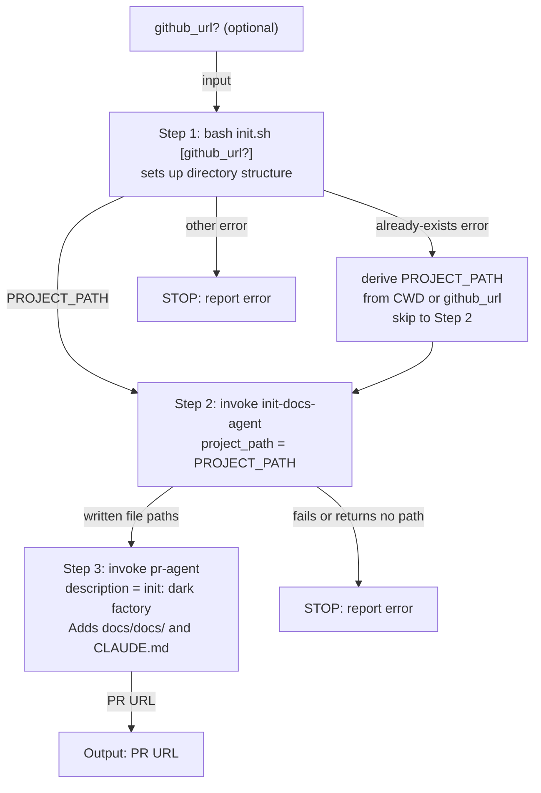

# init-orchestrator-agent

## Metadata

- System type: `flow`

## System Intent

- What this is: The top-level user-invocable agent for the initialization pipeline. It accepts an optional `github_url`, runs `init.sh` to establish the two-level directory structure, delegates to `init-docs-agent` to produce `docs/docs/` files and a minimal `CLAUDE.md`, then opens a PR via `pr-agent`. It coordinates the three steps and stops on any unrecoverable error.

## Mermaid Diagram



## Flows

### Flow: `initOrchestrator`

- Core files: `agents/initialization/agents/init-orchestrator-agent.md`
- Script: `agents/initialization/scripts/init.sh`
- Calls: `init-docs-agent`, `pr-agent`
- User-invocable: yes

#### Types

```txt
Input {
  github_url: string (optional) — if provided, clone and initialize that repo; otherwise use CWD
}

Output {
  pr_url: string — URL of the opened PR
}

Error {
  message: string — human-readable description of the failure
}
```

#### Paths

| path | input | output | path-type | notes |
| --- | --- | --- | --- | --- |
| `initOrchestrator.success-with-url` | `Input{github_url}` | `Output` | `happy path` | init.sh clones repo, PROJECT_PATH captured, docs generated, PR opened |
| `initOrchestrator.success-cwd` | `Input{}` | `Output` | `happy path` | init.sh uses CWD, PROJECT_PATH captured, docs generated, PR opened |
| `initOrchestrator.already-exists` | `Input` | `Output` | `happy path` | init.sh fails with "already exists"; PROJECT_PATH derived from CWD/github_url; proceeds to Step 2 |
| `initOrchestrator.init-sh-fails` | `Input` | `Error` | `error` | init.sh fails for reason other than "already exists"; agent stops and reports error |
| `initOrchestrator.docs-fails` | `Input` | `Error` | `error` | init-docs-agent fails or returns no path; agent stops and reports error |

#### Pseudocode

```
initOrchestrator(github_url?):
  SCRIPT = find agents/initialization/scripts/init.sh

  if github_url:
    result = bash SCRIPT github_url
    REPO_NAME = basename(github_url, ".git")
    DERIVED_PROJECT_PATH = REPO_NAME/REPO_NAME
  else:
    result = bash SCRIPT
    DIRNAME = basename(CWD)
    DERIVED_PROJECT_PATH = DIRNAME/DIRNAME

  if result.success:
    PROJECT_PATH = parse "PROJECT_PATH=<value>" from result.stdout
  else if result.stderr contains "already exists":
    log "Directory already exists — skipping init.sh, proceeding to documentation phase."
    PROJECT_PATH = DERIVED_PROJECT_PATH
  else:
    STOP with error

  docs_result = Task(init-docs-agent, { project_path: PROJECT_PATH })
  if docs_result.fails or docs_result.paths is empty:
    STOP with error

  pr_result = Task(pr-agent, {
    description: "init: dark factory\n\nAdds docs/docs/ and CLAUDE.md to <PROJECT_PATH> to bootstrap dark factory integration."
  })

  return pr_result.url
```

## Logs

| Source | Location |
|--------|----------|
| Agent output | Claude Code task output (no persistent log sink) |

## Deployment

- Mechanism: `local only` — invoked via `/dark-factory:init` slash command or directly as a Claude Code agent
- Deploy command: N/A
- Notes: Relies on `init.sh` being present at `agents/initialization/scripts/init.sh` relative to the plugin root. The PR description references "Adds docs/docs/ and CLAUDE.md" to reflect that both documentation artifacts are produced by this flow.
