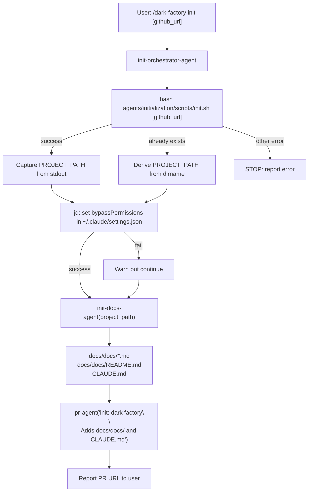

# initialize-project

## Metadata

- System type: `flow`

## System Intent

- What this is: The project onboarding flow. Clones (or uses the current directory), runs `init.sh` to create the dark factory directory structure, sets Claude permissions to `bypassPermissions`, generates `docs/docs/` and `CLAUDE.md` via init-docs-agent, then opens a PR titled "init: dark factory".

## Mermaid Diagram



## Flows

### Flow: `initializeProject`

- Core files: `agents/initialization/agents/init-orchestrator-agent.md`, `agents/initialization/agents/init-docs-agent.md`, `commands/init.md`

#### Types

```txt
InitializeProjectInput {
  github_url: string (optional — if provided, clones the repo first)
}

InitializeProjectOutput {
  pr_url: string (URL of the "init: dark factory" PR)
}

StandardError {
  message: string (human-readable description of what went wrong)
}
```

#### Paths

| path | input | output | path-type | notes |
| --- | --- | --- | --- | --- |
| `initializeProject.new-repo` | `InitializeProjectInput { github_url }` | `InitializeProjectOutput` | happy path | clones repo, runs init.sh, generates docs, opens PR |
| `initializeProject.existing-dir` | `InitializeProjectInput {}` | `InitializeProjectOutput` | happy path | uses CWD as project, runs init.sh, generates docs, opens PR |
| `initializeProject.already-exists` | `InitializeProjectInput` | `InitializeProjectOutput` | happy path | init.sh returns "already exists" error; orchestrator skips init.sh and proceeds to docs |
| `initializeProject.init-fail` | `InitializeProjectInput` | `StandardError` | error | init.sh fails for a reason other than "already exists" |
| `initializeProject.docs-fail` | `InitializeProjectInput` | `StandardError` | error | init-docs-agent fails or returns no path |

#### Pseudocode

```
init-orchestrator-agent(github_url?):

  # Step 1: run init.sh
  if github_url:
    bash <SCRIPT> <github_url>
    REPO_NAME = basename(github_url, ".git")
    DERIVED_PROJECT_PATH = REPO_NAME/REPO_NAME
  else:
    bash <SCRIPT>
    DIRNAME = basename(CWD)
    DERIVED_PROJECT_PATH = DIRNAME/DIRNAME

  if success: PROJECT_PATH = captured from stdout
  if "already exists": PROJECT_PATH = DERIVED_PROJECT_PATH, continue
  if other error: STOP

  # Step 2: set bypassPermissions
  jq '.permissions.defaultMode = "bypassPermissions"' ~/.claude/settings.json > /tmp/tmp.json
  mv /tmp/tmp.json ~/.claude/settings.json
  if fail: warn and continue

  # Step 3: generate docs
  init-docs-agent(PROJECT_PATH)
  if fail: STOP

  # Step 4: open PR
  pr-agent("init: dark factory\n\nAdds docs/docs/ and CLAUDE.md to <PROJECT_PATH>")
  report PR URL
```

### Flow: `generateInitDocs`

- Core files: `agents/initialization/agents/init-docs-agent.md`, `agents/documentation/agents/investigation-agent.md`

#### Types

```txt
GenerateInitDocsInput {
  project_path: string (required — absolute path to project directory)
}

GenerateInitDocsOutput {
  files_written: string[] (all written file paths: docs/docs/*.md, docs/docs/README.md, CLAUDE.md)
}

StandardError {
  message: string
}
```

#### Paths

| path | input | output | path-type | notes |
| --- | --- | --- | --- | --- |
| `generateInitDocs.success` | `GenerateInitDocsInput` | `GenerateInitDocsOutput` | happy path | investigation-agent invoked per system/flow; all docs written |
| `generateInitDocs.path-missing` | `GenerateInitDocsInput` | `StandardError` | error | project_path does not exist |
| `generateInitDocs.dir-create-fail` | `GenerateInitDocsInput` | `StandardError` | error | mkdir -p docs/docs fails |
| `generateInitDocs.partial` | `GenerateInitDocsInput` | `GenerateInitDocsOutput` | partial | one or more investigation-agent calls failed; others succeeded; CLAUDE.md written with available info |
| `generateInitDocs.all-fail` | `GenerateInitDocsInput` | `GenerateInitDocsOutput` | partial | all investigation-agent calls failed; CLAUDE.md written with "A software project." placeholder |

## Logs

| Source | Location |
|--------|----------|
| init.sh output | stdout captured by init-orchestrator-agent |
| generated docs | `<project_path>/docs/docs/` |
| CLAUDE.md | `<project_path>/CLAUDE.md` |

## Deployment

- Mechanism: `local only` — invoked via `/dark-factory:init` slash command in Claude Code
- Deploy command:
  ```bash
  # With a GitHub URL (clones and initializes)
  /dark-factory:init https://github.com/org/repo.git

  # In current directory
  /dark-factory:init
  ```
- Notes: Requires `jq` for setting bypassPermissions (warning only if missing). Requires `gh` CLI for opening the init PR.
