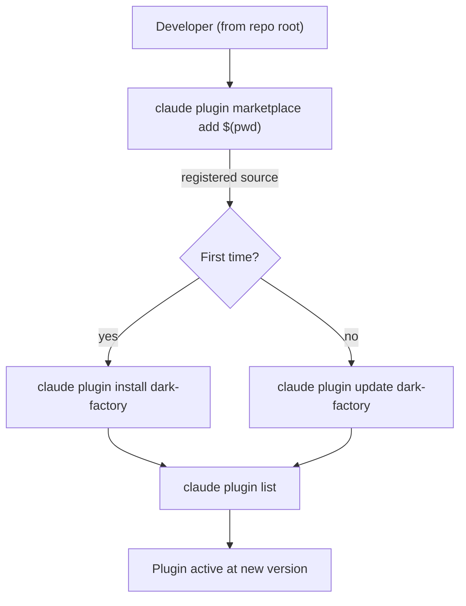

# install-plugin

## Metadata

- System type: `flow`

## System Intent

- What this is: The one-time install and update flow for the dark-factory Claude Code plugin. Registers the local repository as a marketplace source using a dynamic path (`$(pwd)`), then installs or updates the plugin. Includes error handling guidance for common failure modes.

## Mermaid Diagram



## Flows

### Flow: `install-plugin`

- Test files: N/A
- Core files: `skills/install-plugin/SKILL.md`

#### Types

```txt
InstallPluginInput {
  repoPath: string   (absolute path to the plugin source repo; resolved via $(pwd) when run from repo root)
}

InstallPluginOutput {
  installedVersion: string  (version string confirmed by `claude plugin list`)
}

StandardError {
  message: string (human-readable description of what went wrong)
}
```

#### Paths

| path | input | output | path-type | notes |
| --- | --- | --- | --- | --- |
| `install-plugin.install-success` | `InstallPluginInput` | `InstallPluginOutput` | happy path | First-time install: marketplace add then `claude plugin install dark-factory` |
| `install-plugin.update-success` | `InstallPluginInput` | `InstallPluginOutput` | happy path | Re-registers local repo as marketplace source then runs `claude plugin update dark-factory`; confirms new version via `claude plugin list` |
| `install-plugin.not-registered` | `InstallPluginInput` | `StandardError` | error | Marketplace add fails (path not found or already registered differently) — verify repo root and path validity |
| `install-plugin.update-failed` | `InstallPluginInput` | `StandardError` | error | `claude plugin update` exits non-zero — re-run `claude plugin marketplace add $(pwd)` and retry |

#### Pseudocode

```
# Install (one-time)
claude plugin marketplace add "$(pwd)"
claude plugin install dark-factory
claude plugin list   # verify version appears

# Update (after pulling new changes)
git pull
claude plugin marketplace add "$(pwd)"
claude plugin update dark-factory
claude plugin list   # verify new version appears
```

## Logs

| Source | Location |
|--------|----------|
| claude plugin CLI | stdout/stderr of terminal session |

## Deployment

- Mechanism: `local only`
- Deploy command:
  ```bash
  # One-time install (run from repo root)
  claude plugin marketplace add "$(pwd)"
  claude plugin install dark-factory

  # Update after new version (run from repo root)
  claude plugin marketplace add "$(pwd)"
  claude plugin update dark-factory
  claude plugin list
  ```
- Notes: Always run from the repo root so `$(pwd)` resolves to the correct path. If `marketplace add` fails with "already registered differently", verify you are in the correct directory. If `plugin update` exits non-zero, re-run `marketplace add` before retrying.
