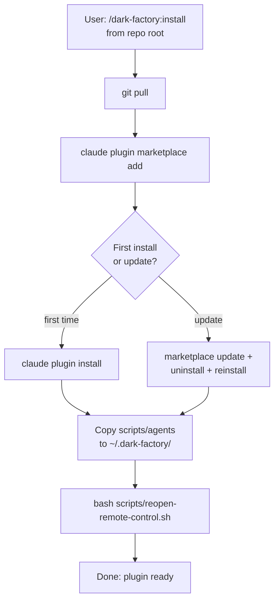

# /dark-factory:install

Installs or reinstalls the dark-factory plugin — registers with the plugin marketplace, installs the plugin, syncs agents and scripts to the local cache, and reopens the terminal.

## Flow

## See also

- scripts/reopen-remote-control.sh — opens new terminal
- Plugin docs
