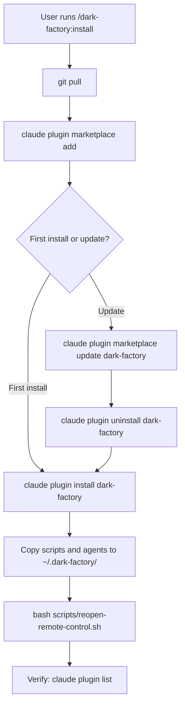

# install

## Metadata

- System type: `flow`

## System Intent

- What this is: The `/dark-factory:install` command installs or reinstalls the dark-factory plugin into a local Claude Code environment. It registers the plugin with the marketplace, reinstalls it, syncs local agent/script files, and reopens the remote-control terminal.

## Mermaid Diagram



## Flows

### Flow: `install`
- Core files: `commands/install.md`, `skills/install/SKILL.md`

#### Types

```txt
No typed input/output — this is a shell command flow.
```

#### Paths

| path | input | output | path-type | notes |
| --- | --- | --- | --- | --- |
| `install.first-time` | repo root on disk | plugin registered + terminal open | `happy path` | clone repo, add to marketplace, install, copy files, reopen terminal |
| `install.update` | existing install | updated plugin + terminal open | `happy path` | pull, marketplace add+update, uninstall, reinstall, copy files, reopen terminal |

#### Steps (install)

```
1. git pull                                           — sync latest code
2. claude plugin marketplace add "$(pwd)"             — register local repo as plugin source
3. claude plugin install dark-factory                 — install plugin into Claude Code
4. rm -rf ~/.dark-factory && mkdir -p ~/.dark-factory — reset local agent/script cache
5. cp -r scripts agents ~/.dark-factory/              — sync current files
6. bash scripts/reopen-remote-control.sh "dark factory" — open remote-control terminal
7. claude plugin list                                 — verify install
```

#### Steps (update / reinstall)

```
1. git pull
2. claude plugin marketplace add "$(pwd)"
3. claude plugin marketplace update dark-factory
4. claude plugin uninstall dark-factory
5. claude plugin install dark-factory
6. rm -rf ~/.dark-factory && mkdir -p ~/.dark-factory
7. cp -r scripts agents ~/.dark-factory/
8. bash scripts/reopen-remote-control.sh "dark factory"
```

## Logs

| Source | Location |
|--------|----------|
| Plugin list | stdout of `claude plugin list` |

## Deployment

- Mechanism: `local only`
- Deploy command:
  ```bash
  # From repo root — first install
  git clone https://github.com/lewibs/dark-factory
  cd dark-factory
  claude plugin marketplace add "$(pwd)"
  claude plugin install dark-factory
  rm -rf ~/.dark-factory && mkdir -p ~/.dark-factory && cp -r "$(pwd)/scripts" ~/.dark-factory/ && cp -r "$(pwd)/agents" ~/.dark-factory/
  bash scripts/reopen-remote-control.sh "dark factory"
  ```
- Notes: The `reopen-remote-control.sh` script opens a new GNOME terminal tab running Claude in remote-control mode. The `~/.dark-factory/` directory caches agents and scripts so they are accessible to Claude Code hooks regardless of working directory.
