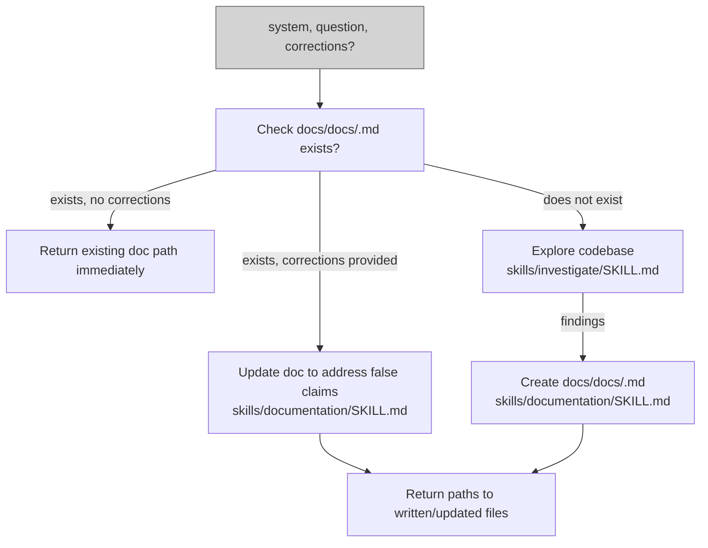

# investigation-agent

## Metadata

- System type: `microservice`

## System Intent

- What this is: A non-user-invocable agent that investigates a named system or topic and produces accurate documentation in `docs/docs/<system-name>.md`. It returns immediately if authoritative docs already exist (unless corrections are provided). When no docs exist, it explores the codebase using the investigate skill and then creates documentation using the documentation skill. When corrections are provided (a list of false claims with evidence), it updates the existing doc to address them. It is the documentation generation and correction engine for the investigation command flow.

## Mermaid Diagram



## Flows

### Flow: `investigationAgent`

- Test files: N/A
- Core files:
  - `agents/documentation/agents/investigation-agent.md`
  - `agents/documentation/skills/investigate/SKILL.md`
  - `agents/documentation/skills/documentation/SKILL.md`

#### Types

```txt
InvestigationAgentInput {
  system: string (required — name of the system or topic to investigate)
  question: string | null (optional — specific aspect to focus on)
  corrections: string | null (optional — bullet list of false claims with evidence to correct)
}

InvestigationAgentOutput {
  paths: string[] (absolute paths to every file written or updated; always includes docs/docs/<system-name>.md)
}

StandardError {
  message: string (human-readable description of what went wrong)
}
```

#### Paths

| path | input | output | path-type | notes |
| --- | --- | --- | --- | --- |
| `investigationAgent.docs-exist-no-corrections` | `InvestigationAgentInput` (no corrections) | `InvestigationAgentOutput` | `happy path` | existing docs returned immediately as authoritative; no staleness check |
| `investigationAgent.docs-exist-with-corrections` | `InvestigationAgentInput` (corrections provided) | `InvestigationAgentOutput` | `happy path` | doc updated to address false claims, then path returned |
| `investigationAgent.no-docs-create` | `InvestigationAgentInput` | `InvestigationAgentOutput` | `happy path` | codebase explored via investigate skill, new doc created via documentation skill |

#### Pseudocode

```
investigationAgent(system, question, corrections=null):
  docPath = "docs/docs/" + system + ".md"

  if file_exists(docPath):
    if corrections is null:
      # Docs treated as authoritative — return immediately
      RETURN InvestigationAgentOutput(paths=[docPath])
    else:
      # Update doc to address false claims from claim-validator-agent
      edit docPath using skills/documentation/SKILL.md to correct false claims
      RETURN InvestigationAgentOutput(paths=[docPath])

  # No docs exist — investigate then create
  findings = invoke skills/investigate/SKILL.md(system, question)
  write docPath using skills/documentation/SKILL.md(findings)
  RETURN InvestigationAgentOutput(paths=[docPath])
```

## Logs

| Source | Location |
|--------|----------|
| file paths written | returned inline in InvestigationAgentOutput (no persistent log) |

## Deployment

- Mechanism: `local only`
- Deploy command:
  ```bash
  # No separate deploy step — agent file is loaded at invocation time.
  # The agent is picked up automatically from agents/documentation/agents/investigation-agent.md.
  ```
- Notes: The agent uses two skills: `agents/documentation/skills/investigate/SKILL.md` for codebase exploration and `agents/documentation/skills/documentation/SKILL.md` for writing documentation in the required template format. Tools include `Read`, `Grep`, `Glob`, `Bash`, `Write`, and `Edit`. Allowed bash commands are restricted to `find *`, `grep -r *`, and `ls *`.
