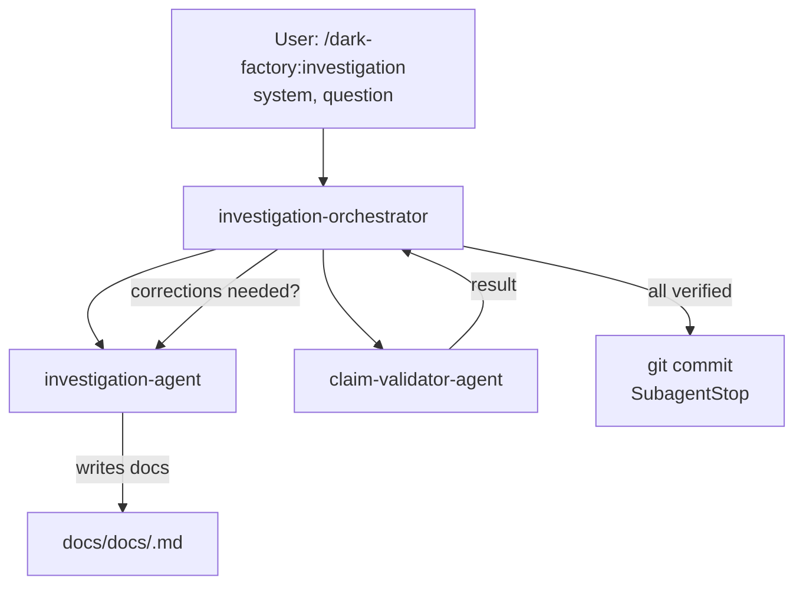

# /dark-factory:investigation

Investigates a system and writes authoritative documentation to `docs/docs/` — validates every claim against source code and commits the verified doc.

## Flow

## See also

- [investigation-agent](investigation-agent.md) — generates system documentation
- [claim-validator-agent](claim-validator-agent.md) — validates factual claims
