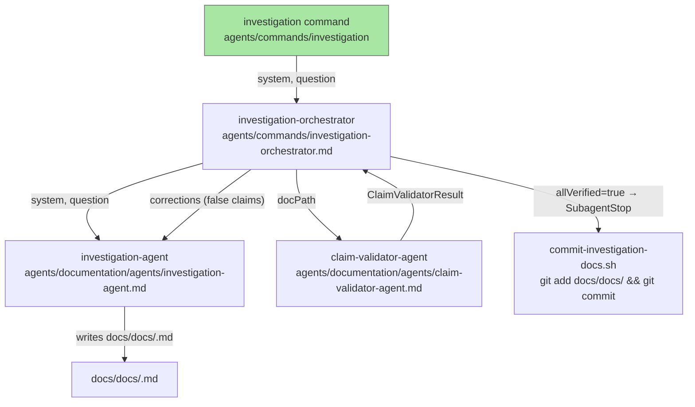

# investigation-command

## Metadata

- System type: `flow`

## System Intent

- What this is: A standalone dark-factory command (`/dark-factory:investigation`) that generates system documentation for any named system, validates every factual claim in the generated doc against actual source code through an iterative correction loop, and commits the verified documentation via a SubagentStop hook. It is self-contained and does not open a PR or interact with the manufacture pipeline.

## Mermaid Diagram



## Flows

### Flow: `investigationCommand`

- Test files: `tests/test_investigation_command.py`
- Core files:
  - `agents/commands/investigation`
  - `agents/commands/investigation-orchestrator.md`
  - `agents/documentation/agents/investigation-agent.md`
  - `agents/documentation/agents/claim-validator-agent.md`
  - `agents/dark-factory/scripts/commit-investigation-docs.sh`

#### Types

```txt
InvestigationCommandInput {
  system: string (required — name of the system to document)
  question: string | null (optional — specific aspect to focus on)
}

InvestigationCommandOutput {
  docPath: string (absolute path to the verified docs/docs/<system>.md)
  iterations: number (how many validator → investigation-agent cycles ran)
}

StandardError {
  message: string (human-readable description of what went wrong)
}
```

#### Paths

| path | input | output | path-type | notes |
| --- | --- | --- | --- | --- |
| `investigationCommand.success` | `InvestigationCommandInput` | `InvestigationCommandOutput` | `happy path` | all claims verify on first pass; SubagentStop hook commits doc |
| `investigationCommand.iterative-correction` | `InvestigationCommandInput` | `InvestigationCommandOutput` | `happy path` | one or more false-claim feedback cycles before all claims pass |
| `investigationCommand.max-iterations-exceeded` | `InvestigationCommandInput` | `StandardError` | `error` | validator cycles hit hard cap (5) without full verification |
| `investigationCommand.empty-system` | `InvestigationCommandInput` | `StandardError` | `error` | system name is empty |
| `investigationCommand.doc-not-created` | `InvestigationCommandInput` | `StandardError` | `error` | investigation-agent did not produce a documentation file |

#### Pseudocode

```
investigationCommand(system, question):
  maxIterations = 5
  iterations = 0

  # Step 1: investigation-orchestrator calls investigation-agent
  docPath = invoke investigation-agent(system, question)
  if error: RETURN StandardError

  loop:
    iterations += 1
    if iterations > maxIterations:
      RETURN StandardError("Max validation iterations exceeded for system: " + system)

    # Step 2: Validate all claims in the generated doc
    result = invoke claim-validator-agent(docPath)  # returns ClaimValidatorResult

    # Step 3: If all verified, commit and finish
    if result.allVerified:
      trigger SubagentStop  # commit-investigation-docs.sh runs: git add docs/docs/ && git commit
      RETURN InvestigationCommandOutput(docPath, iterations)

    # Step 4: Feed false claims back to investigation-agent for correction
    corrections = format result.falseClaims as bullet list with evidence
    docPath = invoke investigation-agent(system, question, corrections=corrections)
```

## Logs

| Source | Location |
|--------|----------|
| investigation-agent iterations | written to calling agent's stdout (no persistent log) |
| false claims per cycle | included inline in the correction prompt fed back to investigation-agent |
| commit result | written to stderr by commit-investigation-docs.sh |

## Deployment

- Mechanism: `local only`
- Deploy command:
  ```bash
  # No separate deploy step — command files are loaded by agents at invocation time.
  # Run gen-hooks to register the SubagentStop hook declared in the command YAML frontmatter:
  /dark-factory:install
  ```
- Notes: The SubagentStop hook (`commit-investigation-docs.sh`) is declared in the YAML frontmatter of both `agents/commands/investigation` and `agents/commands/investigation-orchestrator.md`. It fires when investigation-orchestrator finishes and commits any new or updated files in `docs/docs/`. The hook resolves the working directory from `DARK_FACTORY_WORK_DIR` or falls back to `/tmp/dark-factory-work-dir`.
