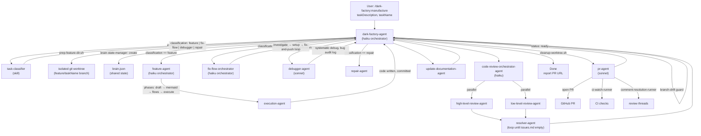

# manufacture

## Metadata

- System type: `flow`

## System Intent

- What this is: The `/dark-factory:manufacture` command is the top-level entry point for the dark-factory autonomous coding pipeline. It accepts a task description, classifies the work type, isolates it in a fresh git worktree, routes to the appropriate worker agent, runs code review, updates documentation, opens a PR, and cleans up — all without manual intervention.

## Mermaid Diagram



## Flows

### Flow: `manufacture.feature`

- Core files: `commands/manufacture.md`, `agents/dark-factory/agents/dark-factory-agent.md`, `agents/featurework/agents/feature-agent.md`

The feature route is a single-invocation human-in-the-loop planning flow. `dark-factory-agent` invokes `feature-agent` exactly once and waits for a terminal status. `feature-agent` runs at depth 2 and calls `AskUserQuestion` directly for all user interaction — it handles all approval loops internally (draft → mermaid diagram → individual flows → final execution) before calling `execution-agent` to write the code. `dark-factory-agent` does not implement a multi-turn loop for the feature route; it receives one of three terminal statuses: `done`, `hard-stop`, or `aborted`.

#### Paths

| path | input | output | path-type | notes |
| --- | --- | --- | --- | --- |
| `manufacture.feature.success` | `taskDescription` | PR URL | happy path | all planning phases approved, code written, review clean, PR opened |
| `manufacture.feature.hard-stop` | `taskDescription` | error + cleanup | error | execution-agent hits a hard stop; worktree cleaned up |
| `manufacture.feature.aborted` | `taskDescription` | aborted message | error | user selects Abort at final approval gate |

---

### Flow: `manufacture.fix-flow`

- Core files: `agents/fix-flow/agents/fix-flow-orchestrator.md`

Routes to `fix-flow-orchestrator`, which runs three phases in strict sequence: (1) investigation via `investigation-agent` to understand the broken flow, (2) script generation via `setup-wizard`, (3) an iterative fix-trigger-debug loop via `ralph-fix-and-push` until CI is green. All fixes accumulate on a single branch and are merged into one PR.

---

### Flow: `manufacture.debugger`

- Core files: `agents/debugger/agents/debugger-agent.md`

Routes to `debugger-agent`, which follows the systematic debug checklist: write a failing reproduction test, identify root cause from evidence, fix, verify, and write a bug audit log to `docs/bugs/`. No plan file is produced; `taskDescription` is passed as fallback to downstream agents.

---

### Flow: `manufacture.code-review`

- Core files: `agents/code-review/agents/code-review-orchestrator-agent.md`

Always runs after the worker agent, regardless of route. `code-review-orchestrator-agent` spawns a high-level and low-level reviewer in parallel, collects findings into `issues.md`, then loops a `resolver-agent` until all issues are resolved. Halts with error if the resolver runs more than 10 iterations without clearing all items.

---

### Flow: `manufacture.pr`

- Core files: `agents/pr/agents/pr-agent.md`

Always runs after code review. `pr-agent` opens the PR using `create-pr` skill, then delegates CI watching to `ci-watch-runner` (up to 5 retries) and review comment resolution to `comment-resolution-runner` (up to 5 retries). Stops at `status: ready` — does not merge.

## Logs

| Source | Location |
|--------|----------|
| metrics | `metrics.csv` in project root (written by `update-metrics.py` before cleanup) |
| brain state | `$WORK_DIR/brain.json` (deleted after cleanup) |
| bug audit logs | `docs/bugs/<date>-<slug>.md` (persisted) |

## Deployment

- Mechanism: `local only`
- Deploy command:
  ```bash
  /dark-factory:manufacture
  ```
- Notes: Invoked as a Claude Code slash command. Requires the dark-factory plugin installed. The worktree is created under the system temp directory and removed after the PR is opened.
