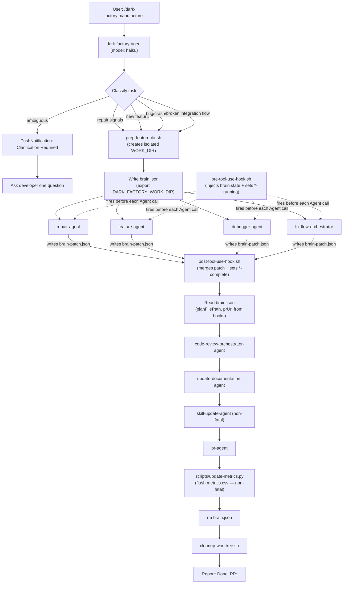

# manufacture

## Metadata

- System type: `flow`

## System Intent

- What this is: The top-level user-facing orchestration flow. Given a task description, classifies the request and routes to the correct worker agent (repair, feature, debugger, or fix-flow). All routes — including repair — create an isolated work directory, run code review, update documentation, update skills, open a PR, and clean up without manual intervention.

## Mermaid Diagram



## Flows

### Flow: `manufacture`

- Test files: `tests/`
- Core files: `agents/dark-factory/agents/dark-factory-agent.md`, `agents/dark-factory/scripts/prep-feature-dir.sh`, `commands/manufacture.md`

#### Types

```txt
ManufactureInput {
  taskDescription: string (required — verbatim user request)
  taskName: string (optional — short slug; derived from taskDescription if omitted)
}

ManufactureOutput {
  pr_url: string (URL of the opened PR)
  workDir: string (path that was cleaned up)
  skillsWritten: SkillFile[] (may be empty)
}

SkillFile {
  path: string (relative path within workDir, e.g. "skills/handle-git-conflicts/SKILL.md")
  action: "created" | "updated"
}

StandardError {
  message: string (human-readable description of what went wrong)
}
```

#### Paths

| path | input | output | path-type | notes |
| --- | --- | --- | --- | --- |
| `manufacture.repair` | `ManufactureInput` | `ManufactureOutput` | happy path | taskDescription signals repair (small change / tweak / rename / minor update / quick fix / adjust / alter); preps worktree, delegates to repair-agent, then runs full review, docs, skills, PR, and cleanup — same as all other routes |
| `manufacture.feature` | `ManufactureInput` | `ManufactureOutput` | happy path | taskDescription signals new feature; routes to feature-agent |
| `manufacture.debug` | `ManufactureInput` | `ManufactureOutput` | happy path | taskDescription signals bug/crash; routes to debugger-agent |
| `manufacture.fix-flow` | `ManufactureInput` | `ManufactureOutput` | happy path | taskDescription signals broken integration; routes to fix-flow-orchestrator |
| `manufacture.ambiguous` | `ManufactureInput` | paused | clarification | agent asks developer one question before routing |
| `manufacture.worker-error` | `ManufactureInput` | `StandardError` | error | worker agent returns hard-stop; WORK_DIR cleaned up |
| `manufacture.prep-fail` | `ManufactureInput` | `StandardError` | error | prep-feature-dir.sh fails; no cleanup (work dir never created) |
| `manufacture.metrics-flush` | brain.json with metrics section | metrics.csv upserted at `$PROJECT_DIR/metrics.csv` | happy path | runs before `rm -f brain.json`; non-fatal — `|| true` ensures failure never blocks cleanup |
| `manufacture.metrics-flush-error` | scripts/update-metrics.py error | error logged to stderr; manufacture continues | error | Non-fatal; metrics failure never blocks a PR or worktree cleanup |

#### Pseudocode

```
dark-factory-agent(taskDescription, taskName):

  # Step 1 — classify and route
  classify taskDescription (first match wins):
    - repair signals ("small change", "tweak", "rename", "minor update", "quick fix", "adjust", "alter") → will route to repair-agent (Step 3)
    - feature keywords ("add", "build", "create", "implement", "new feature") → will route to feature-agent (Step 3)
    - flow keywords ("broken flow", "integration failing", "end-to-end", "pipeline") → will route to fix-flow-orchestrator (Step 3)
    - bug keywords ("bug", "crash", "error", "fix", "broken", "not working", "debug") → will route to debugger-agent (Step 3)
    - ambiguous → PushNotification("Clarification Required"), ask developer one question, then route

  # Step 2 — prep work dir (all routes)
  bash agents/dark-factory/scripts/prep-feature-dir.sh <taskName>
  capture WORK_DIR from stdout
  if fail: report error, STOP

  # brain.create — write brain.json immediately after WORK_DIR is captured
  Write $WORK_DIR/brain.json with BrainState (taskDescription, taskName, workDir, classification,
    planFilePath=null, bugFiles=null, prUrl=null, docsWritten=null, skillsWritten=null,
    phases all false except prep-complete=true)
  export DARK_FACTORY_WORK_DIR=<WORK_DIR>
  # Hooks (pre-tool-use-hook.sh / post-tool-use-hook.sh) automatically inject brain context
  # into every Agent tool call and merge brain-patch.json outputs back into brain.json.
  # dark-factory-agent MUST NOT pass brain fields to sub-agents manually.

  # Step 3 — delegate to worker
  cd WORK_DIR
  invoke classified worker agent with taskDescription:
    - repair signals → repair-agent(taskDescription)
    - feature → feature-agent(taskDescription)
    - fix-flow → fix-flow-orchestrator(taskDescription)
    - debugger → debugger-agent(taskDescription)
  if worker errors: cleanup(WORK_DIR), STOP

  # brain.read-results — read brain.json to get planFilePath (hooks merged it from sub-agent patches)
  Read $WORK_DIR/brain.json
  planFilePath = brain.json.planFilePath  (null if worker produced no plan)

  # Step 4 — code review
  code-review-orchestrator-agent(planFilePath ?? "Task: <taskDescription>", WORK_DIR)
  if error: cleanup(WORK_DIR), STOP

  # Step 5 — update docs (must complete before PR)
  update-documentation-agent(planFilePath)

  # Step 5c — skill update (non-fatal)
  try: skill-update-agent(planFilePath, WORK_DIR, taskDescription)
  catch: warn and continue

  # Step 6 — open PR
  pr-agent(planFilePath ?? taskDescription)
  if error: cleanup(WORK_DIR), STOP

  # Read prUrl from brain.json (merged by post-hook after pr-agent wrote brain-patch.json)
  Read $WORK_DIR/brain.json
  prUrl = brain.json.prUrl

  # Step 7 — cleanup
  # metrics.flush — flush accumulated brain.json metrics to permanent CSV before deleting brain.json
  PROJECT_DIR = jq '.workDir' $WORK_DIR/brain.json
  python3 scripts/update-metrics.py --csv "$PROJECT_DIR/metrics.csv" --brain "$WORK_DIR/brain.json" || true
  # Non-fatal: metrics failure never blocks the PR or cleanup.

  # brain.delete — remove brain.json before cleaning the worktree
  rm -f $WORK_DIR/brain.json
  cleanup(WORK_DIR, taskName)
  report "Done. PR: <prUrl>. Worktree <WORK_DIR> removed."
```

## Logs

| Source | Location |
|--------|----------|
| dark-factory-agent output | Claude Code session transcript |
| prep-feature-dir.sh | stdout captured by dark-factory-agent |
| pre-tool-use-hook.sh | stderr only (errors and phase-running events); stdout is reserved for modified tool input |
| post-tool-use-hook.sh | stderr only (errors/warnings and phase-complete events) |
| brain.json | `$DARK_FACTORY_WORK_DIR/brain.json` — readable at any point during a run; deleted on cleanup |

## Deployment

- Mechanism: `local only` — runs inside Claude Code as a slash command
- Deploy command:
  ```bash
  # Invoked via Claude Code slash command
  /dark-factory:manufacture <task description>
  ```
- Notes: Requires Claude Code with the dark-factory plugin installed. All worker agents run in an isolated WORK_DIR cloned from the project root.
