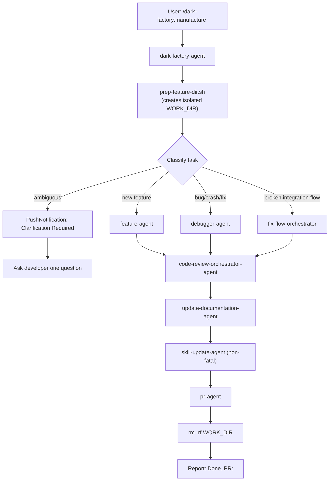

# manufacture

## Metadata

- System type: `flow`

## System Intent

- What this is: The top-level user-facing orchestration flow. Given a task description, routes to the correct worker agent (feature, debugger, or fix-flow), then runs code review, updates documentation, updates skills, opens a PR, and cleans up an isolated work directory — all without manual intervention.

## Mermaid Diagram



## Flows

### Flow: `manufacture`

- Test files: `tests/`
- Core files: `agents/dark-factory/agents/dark-factory-agent.md`, `agents/dark-factory/scripts/prep-feature-dir.sh`, `commands/manufacture.md`

#### Types

```txt
ManufactureInput {
  taskDescription: string (required — verbatim user request)
  taskName: string (optional — short slug; derived from taskDescription if omitted)
}

ManufactureOutput {
  pr_url: string (URL of the merged PR)
  workDir: string (path that was cleaned up)
  skillsWritten: SkillFile[] (may be empty)
}

SkillFile {
  path: string (relative path within workDir, e.g. "skills/handle-git-conflicts/SKILL.md")
  action: "created" | "updated"
}

StandardError {
  message: string (human-readable description of what went wrong)
}
```

#### Paths

| path | input | output | path-type | notes |
| --- | --- | --- | --- | --- |
| `manufacture.feature` | `ManufactureInput` | `ManufactureOutput` | happy path | taskDescription signals new feature; routes to feature-agent |
| `manufacture.debug` | `ManufactureInput` | `ManufactureOutput` | happy path | taskDescription signals bug/crash; routes to debugger-agent |
| `manufacture.fix-flow` | `ManufactureInput` | `ManufactureOutput` | happy path | taskDescription signals broken integration; routes to fix-flow-orchestrator |
| `manufacture.ambiguous` | `ManufactureInput` | paused | clarification | agent asks developer one question before routing |
| `manufacture.worker-error` | `ManufactureInput` | `StandardError` | error | worker agent returns hard-stop; WORK_DIR cleaned up |
| `manufacture.prep-fail` | `ManufactureInput` | `StandardError` | error | prep-feature-dir.sh fails; no cleanup (work dir never created) |

#### Pseudocode

```
dark-factory-agent(taskDescription, taskName):

  # Step 1 — prep work dir
  bash agents/dark-factory/scripts/prep-feature-dir.sh <taskName>
  capture WORK_DIR from stdout
  if fail: report error, STOP

  # Step 2 — classify and route
  cd WORK_DIR
  classify taskDescription:
    - feature keywords ("add", "build", "create", "implement") → feature-agent
    - bug keywords ("bug", "crash", "error", "fix", "broken") → debugger-agent
    - flow keywords ("broken flow", "integration failing", "pipeline") → fix-flow-orchestrator
    - ambiguous → PushNotification, ask developer one question, then route
  if worker errors: cleanup(WORK_DIR), STOP

  # Step 3 — code review
  code-review-orchestrator-agent(planFilePath, WORK_DIR)
  if error: cleanup(WORK_DIR), STOP

  # Step 4 — update docs (must complete before PR)
  update-documentation-agent(planFilePath)

  # Step 4c — skill update (non-fatal)
  try: skill-update-agent(planFilePath, WORK_DIR, taskDescription)
  catch: warn and continue

  # Step 5 — open PR
  pr-agent(planFilePath ?? taskDescription)
  if error: cleanup(WORK_DIR), STOP

  # Step 6 — cleanup
  rm -rf WORK_DIR
  report "Done. PR: <prUrl>. Skills written: <skillsWritten>."
```

## Logs

| Source | Location |
|--------|----------|
| dark-factory-agent output | Claude Code session transcript |
| prep-feature-dir.sh | stdout captured by dark-factory-agent |

## Deployment

- Mechanism: `local only` — runs inside Claude Code as a slash command
- Deploy command:
  ```bash
  # Invoked via Claude Code slash command
  /dark-factory:manufacture <task description>
  ```
- Notes: Requires Claude Code with the dark-factory plugin installed. All worker agents run in an isolated WORK_DIR cloned from the project root.
