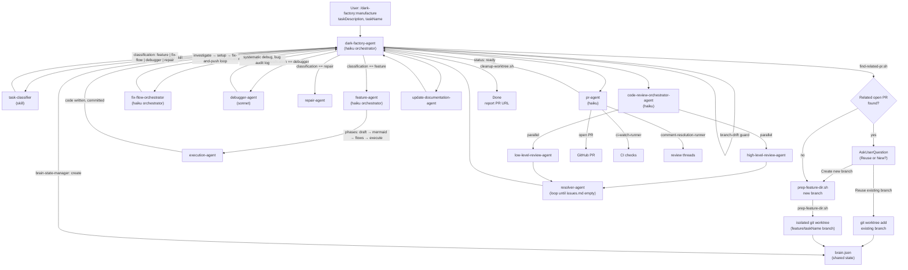

# manufacture

## Metadata

- System type: `flow`

## System Intent

- What this is: The `/dark-factory:manufacture` command is the top-level entry point for the dark-factory autonomous coding pipeline. It accepts a task description, classifies the work type, isolates it in a fresh git worktree, routes to the appropriate worker agent, runs code review, updates documentation, opens a PR, and cleans up — all without manual intervention.

## Mermaid Diagram



## Flows

### Flow: `manufacture.prReuseCheck`

- Core files: `commands/manufacture.md`, `agents/dark-factory/scripts/find-related-pr.sh`

Before creating a new branch, Step 2 of `dark-factory-agent` runs `find-related-pr.sh` with `taskDescription` as input. The script fuzzy-matches the description against all open PRs (title + branch name) via `gh pr list`. If a match is found (score >= 2 keyword hits, each keyword > 2 chars), the user is prompted via `AskUserQuestion` to reuse the existing branch or create a fresh one.

If the user selects "Reuse existing branch," `dark-factory-agent` computes the worktree path from the existing branch name (stripping any `<prefix>/` leading segment), then either attaches the existing worktree or creates a new one via `git worktree add`. It validates that if the worktree already exists, its checked-out branch matches `EXISTING_BRANCH`. The `taskName` is set to the slug portion of the existing branch for brain.json and cleanup. `pr-agent` Step 0b detects the existing PR automatically via branch presence, so no special pr-agent configuration is required.

If no match is found, or the `gh` CLI errors, or the user selects "Create new branch," the flow falls through to `prep-feature-dir.sh` unchanged.

#### Paths

| path | input | output | path-type | notes |
| --- | --- | --- | --- | --- |
| `manufacture.prReuseCheck.match-confirmed` | `taskDescription` | worktree on existing branch, WORK_DIR set | happy path | commits pushed to existing PR via pr-agent Step 0b |
| `manufacture.prReuseCheck.match-declined` | `taskDescription` | prep-feature-dir.sh runs, new branch | alternate | user saw match but chose "Create new branch" |
| `manufacture.prReuseCheck.no-match` | `taskDescription` | prep-feature-dir.sh runs, new branch | alternate | find-related-pr.sh returned empty |
| `manufacture.prReuseCheck.worktree-branch-mismatch` | `taskDescription` | error + STOP | error | existing worktree checked out on wrong branch |
| `manufacture.prReuseCheck.gh-unavailable` | `taskDescription` | prep-feature-dir.sh runs, new branch | alternate | gh CLI error silently treated as no-match |

---

### Flow: `manufacture.feature`

- Core files: `commands/manufacture.md`, `agents/dark-factory/agents/dark-factory-agent.md`, `agents/featurework/agents/feature-agent.md`

`commands/manufacture.md` is a thin dispatcher. It invokes `dark-factory-agent` exactly once as a sub-agent via the Agent tool, passing `taskDescription` and optional `taskName`, then returns the result unchanged. All orchestration logic (classification, worktree prep, routing, code review, docs, PR, cleanup) lives entirely in `dark-factory-agent` — `commands/manufacture.md` contains none of it.

The feature route is a single-invocation human-in-the-loop planning flow. `dark-factory-agent` invokes `feature-agent` exactly once and waits for a terminal status. `feature-agent` runs at depth 2 and calls `AskUserQuestion` directly for all user interaction — it handles all approval loops internally (draft → mermaid diagram → individual flows → final execution) before calling `execution-agent` to write the code. `dark-factory-agent` does not implement a multi-turn loop for the feature route; it receives one of three terminal statuses: `done`, `hard-stop`, or `aborted`.

#### Paths

| path | input | output | path-type | notes |
| --- | --- | --- | --- | --- |
| `manufacture.feature.success` | `taskDescription` | PR URL | happy path | all planning phases approved, code written, review clean, PR opened |
| `manufacture.feature.hard-stop` | `taskDescription` | error + cleanup | error | execution-agent hits a hard stop; worktree cleaned up |
| `manufacture.feature.aborted` | `taskDescription` | aborted message | error | user selects Abort at final approval gate |

---

### Flow: `manufacture.fix-flow`

- Core files: `agents/fix-flow/agents/fix-flow-orchestrator.md`

Routes to `fix-flow-orchestrator`, which runs three phases in strict sequence: (1) investigation via `investigation-agent` to understand the broken flow, (2) script generation via `setup-wizard`, (3) an iterative fix-trigger-debug loop via `ralph-fix-and-push` until CI is green. All fixes accumulate on a single branch and are merged into one PR.

---

### Flow: `manufacture.debugger`

- Core files: `agents/debugger/agents/debugger-agent.md`

Routes to `debugger-agent`, which follows the systematic debug checklist: write a failing reproduction test, identify root cause from evidence, fix, verify, and write a bug audit log to `docs/bugs/`. No plan file is produced; `taskDescription` is passed as fallback to downstream agents.

---

### Flow: `manufacture.code-review`

- Core files: `agents/code-review/agents/code-review-orchestrator-agent.md`

Always runs after the worker agent, regardless of route. `code-review-orchestrator-agent` spawns a high-level and low-level reviewer in parallel, collects findings into `issues.md`, then loops a `resolver-agent` until all issues are resolved. Halts with error if the resolver runs more than 10 iterations without clearing all items.

---

### Flow: `manufacture.pr`

- Core files: `agents/pr/agents/pr-agent.md`

Always runs after code review. `pr-agent` opens the PR using `create-pr` skill, then delegates CI watching to `ci-watch-runner` (up to 5 retries) and review comment resolution to `comment-resolution-runner` (up to 5 retries). Stops at `status: ready` — does not merge.

## Failure Points

Every named point below corresponds to a step or handoff in the pipeline where a fault causes the entire task to derail.

### F1: manufacture-command CWD mismatch
- `commands/manufacture.md` uses a relative path to `dark-factory-agent.md`. If the invoking agent's CWD differs from the plugin install root (e.g., nested agent session), the path fails to resolve and Claude cannot find the agent file.
- Effect: Claude either errors out or falls back to a different agent entirely.

### F2: PLUGIN_ROOT resolution failure (Step 2)
- `dark-factory-agent` resolves `PLUGIN_ROOT` at runtime from `~/.claude/plugins/installed_plugins.json` using the key `dark-factory@dark-factory`. If the plugin is not installed, the key does not exist, or the JSON is malformed, `PLUGIN_ROOT` is empty.
- Effect: `prep-feature-dir.sh` cannot be invoked; agent stops immediately before worktree creation.

### F3: Worktree creation failure (Step 2) — FIXED

Previously: `prep-feature-dir.sh` creates an isolated git worktree on a new branch. If the branch already exists, git is in a dirty state, or disk space is exhausted, the script fails.
- Effect: Agent stops (no cleanup needed since worktree never existed).

Now fixed (2026-05-08): When a previous manufacture run is interrupted, the feature branch may exist locally without a corresponding worktree. The script now:
1. Checks if `feature/<taskName>` branch exists before attempting worktree creation
2. Safely deletes the branch if it exists but is not checked out in any worktree
3. Returns a clear error if the branch is already checked out in a worktree (requires manual cleanup)
4. Proceeds normally with worktree creation

This allows manufacture to recover from interrupted runs by reusing task names without manual branch cleanup.

### F4: brain.json creation failure (Step 3)
- If `brain-state-manager` skill fails to write `brain.json` (permissions, disk, bad workDir), the state backbone for the entire task is missing.
- Effect: All downstream agents that read brain context via the pre-hook will have no state injected; agent stops.

### F5: Ambiguous classification with no user response (Step 1)
- If `task-classifier` returns `ambiguous: true` and the user never answers `AskUserQuestion`, the pipeline is blocked indefinitely.
- Effect: Entire pipeline stalls until user responds or session times out.

### F6: Wrong worker agent invoked (Step 4)
- If the caller bypasses `dark-factory-agent` and invokes a worker agent (e.g., `feature-agent`, `execution-agent`) directly, the worker runs without a brain.json, WORK_DIR, isolated worktree, or the pre-hook context injection. The worker will either fail silently or produce output that cannot be merged.
- Effect: Code may be written to the main branch without review, PR, or cleanup.

### F7: feature-agent invoked more than once (Step 4)
- `dark-factory-agent` invokes `feature-agent` exactly once and waits for a terminal status. If the orchestrating agent (or human operator) spawns additional `feature-agent` instances mid-task, each new instance starts with a fresh context and no memory of prior phases.
- Effect: The new instance presents Phase 1 again as if the task is new; all prior approval gates are lost.

### F8: feature-agent returns non-JSON output (Step 4)
- feature-agent must always return `{ status: "done" | "hard-stop" | "aborted" }`. If it returns conversational text, `dark-factory-agent` cannot parse the result and must treat it as an unexpected status.
- Effect: Cleanup runs, pipeline aborts.

### F9: SendMessage / resume not available
- Claude Code has no `SendMessage` tool to continue an already-running agent. If an orchestrating agent stops mid-task (session reset, context window exhaustion, tool failure), the only recovery is to spawn a new agent — which will have no knowledge of prior state unless explicitly passed.
- Effect: Spawning a new agent loses all in-progress phase state; the new agent starts from scratch.

### F10: AskUserQuestion approval answered in free text
- `feature-agent` uses structured option lists for approval gates. If the user types free text instead of selecting an option (or the option labels are not matched by the agent), the approval loop may not exit correctly.
- Effect: Approval gate loops indefinitely or interprets the response as "Request Changes."

### F11: Branch-drift guard failure (Step 5)
- After feature-agent returns, `dark-factory-agent` checks that the feature branch has commits ahead of main. If execution-agent wrote code but SubagentStop commit-hook failed (or the commit was to the wrong branch), the drift check fails.
- Effect: Cleanup runs, pipeline aborts even though code was written.

### F12: brain-patch.json not written by worker
- Workers (feature-agent, execution-agent, debugger-agent) write `brain-patch.json` to communicate `planFilePath` and other metadata back to `dark-factory-agent`. If a worker exits early, the patch file is never written, and `brain-state-manager` reads stale or empty values.
- Effect: Downstream agents (code-review, pr-agent) receive null `planFilePath` and fall back to `taskDescription`, which may produce lower-quality PR bodies and review context.

### F13: Code review resolver stuck in loop (Steps 7 / code-review-orchestrator)
- The resolver loop runs until `anyRemaining: false` or 10 iterations. If a review issue is unresolvable (e.g., requires human judgment or a non-trivial architectural change), the resolver returns `anyRemaining: true` on every iteration.
- Effect: After 10 iterations, code-review-orchestrator halts with error; cleanup runs.

### F14: update-documentation-agent writes to main repo instead of WORK_DIR (Step 8)
- `dark-factory-agent` passes `workDir: WORK_DIR` to ensure docs are written into the isolated worktree. If an agent ignores `workDir` or the env var `DARK_FACTORY_WORK_DIR` is not injected, the agent writes doc files into the main repo's working tree.
- Effect: Doc files appear as uncommitted changes in the main branch, not in the PR.

### F15: pr-agent SubagentStop fires before dark-factory-agent reads brain.json (Step 10/11)
- If pr-agent declared a SubagentStop cleanup hook that deleted `brain.json` or the worktree, that hook would fire as pr-agent exits — before dark-factory-agent regains control. Steps 11-12 (read prUrl, flush metrics) would then fail.
- Effect: prUrl is lost, metrics are not flushed. (This is guarded against by design — pr-agent intentionally has no SubagentStop cleanup hook.)

### F16: CI never stabilizes (Step 10 / pr-agent Step 3)
- `ci-watch-runner` polls CI up to 5 times. If CI is permanently yellow (queued but never starts), pr-agent returns failure after 5 iterations.
- Effect: pr-agent returns error; dark-factory-agent logs the PR URL and continues to cleanup (PR remains open).

### F17: Review comments unresolvable (Step 10 / pr-agent Step 4)
- `comment-resolution-runner` iterates up to 5 times. If reviewer comments require human judgment or code that the agent cannot produce, the runner cannot resolve all threads.
- Effect: pr-agent returns failure; dark-factory-agent continues to cleanup (PR remains open with unresolved threads).

### F21: PR reuse worktree branch mismatch (Step 2)
- When a user confirms PR reuse and an existing worktree already exists for the derived `WORKTREE_NAME`, `dark-factory-agent` checks that the worktree's checked-out branch matches `EXISTING_BRANCH`. If they differ (e.g., the worktree was previously used for a different task), the agent stops with an error requiring manual cleanup.
- Effect: Pipeline halts before brain.json is created; no worktree cleanup needed since it pre-existed.

### F22: find-related-pr.sh false positive (Step 2)
- The fuzzy matcher requires a score >= 2 keyword hits (each keyword > 2 chars). Short or generic task descriptions (e.g., "fix bug") may match unrelated PRs or fail to match related ones.
- Effect: User is shown a misleading reuse prompt; declining falls through to new-branch flow without harm. A false negative (no match shown) causes a duplicate branch to be created.

### F18: Metrics flush failure (Step 12)
- `update-metrics.py` and the subsequent `git commit/push` are non-fatal (`|| true`). However, if the metrics commit fails, the PR diff will not include updated metrics, and the local `metrics.csv` copy may also fail.
- Effect: Non-fatal; pipeline continues to cleanup. Metrics may be stale.

### F19: Manual edits to PLAN.md outside dark-factory
- If the orchestrating agent edits `docs/plans/*.md` directly (using Write, Edit, or Bash) rather than routing edits through `planning-agent`, the plan file is modified without going through the approval gate flow. Plan status, flow approval state, and diagram data may become inconsistent.
- Effect: Downstream consumers (execution-agent, pr-agent, update-documentation-agent) read a plan that was never formally approved. Execution may proceed with unapproved content.

### F20: Direct sub-agent invocation bypassing dark-factory-agent
- Any agent that invokes `execution-agent`, `feature-agent`, `skeleton-agent`, `testing-agent`, or `implementation-agent` directly (not via the manufacture pipeline) runs without an isolated worktree, brain.json, or pre-hook context injection.
- Effect: Code may be written to the wrong branch; no code review, docs update, or PR is opened.

---

## Transcript Failure Analysis

The following is a root cause analysis of each failure pattern observed in the referenced chat transcript.

### TF1: Spawning new dark-factory-agent instead of continuing existing one

**What happened**: After user approved the System Intent (answered "1"), the orchestrating agent spawned a new `dark-factory-agent` instead of letting the existing one continue its Phase 2 (Mermaid diagram) loop.

**Root cause**: Claude Code has no `SendMessage` or resume tool. Once an agent's turn ends (even mid-task), the only way to interact with it is to spawn a new instance. The orchestrating agent mistakenly treated the user's "1" response as an instruction to re-invoke the manufacture flow rather than understanding it as a response to the in-progress `AskUserQuestion` gate inside feature-agent. The new instance had no context of Phase 1 already being approved.

**Pipeline rule violated**: dark-factory-agent Step 4 — "Invoke feature-agent ONCE and wait for terminal status." There is NO multi-turn loop for feature-agent. feature-agent handles all approval gates internally via AskUserQuestion. dark-factory-agent must not re-invoke the manufacture command or spawn new instances in response to user answers.

**Prevention**: The manufacture command (`commands/manufacture.md`) must only be invoked once per task. The user's responses during planning phases are handled inside the already-running feature-agent session via AskUserQuestion — no re-invocation is needed or valid.

---

### TF2: Answering questions directly / doing work manually instead of routing to dark-factory agents

**What happened**: The orchestrating agent:
- Answered the user's question about Anthropic's MCP recommendation directly (instead of having dark-factory-agent handle it)
- Generated mermaid.ink URLs manually using raw string construction (instead of using the `create-mermaid-diagram` skill)
- Edited `PLAN.md` directly with Write/Edit tools (instead of routing to `planning-agent`)
- Manually marked stages as approved and removed WAITING lines in the plan file
- Manually updated plan status to "approved"

**Root cause**: The orchestrating agent (the top-level Claude session, not dark-factory-agent itself) was treating itself as a planner-collaborator rather than a thin dispatcher. It has tools (Write, Edit, Bash) and used them directly on task artifacts. The manufacture pipeline relies on ALL plan modifications going through `planning-agent` → `sub-planning-agent` so that plan state, flow approvals, and diagram content remain consistent.

**Pipeline rule violated**: 
- dark-factory-agent Rule: "Never write, edit, or scaffold code yourself — delegate entirely."
- feature-agent Rule 19: Manual PLAN.md edits bypass the approval gate (see Failure Point F19).
- manufacture-command Rule: "Never implement orchestration logic yourself."

**Prevention**: The top-level session (the one the user interacts with) should only invoke the manufacture command and relay results. Any plan modification must go through `planning-agent`. Any diagram generation must use the `create-mermaid-diagram` skill.

---

### TF3: Skipping the per-flow approval gates

**What happened**: After the user said "ok do that" (approve MCP-only), the agent spawned a new dark-factory-agent to regenerate a diagram rather than routing through the correct phase sequence inside feature-agent. Later, when flow approvals were needed, the agent spawned a `feature-agent` directly for each individual flow (TF4), and between flows kept spawning new instances.

**Root cause**: The orchestrating agent did not understand that feature-agent runs Phases 1 through 4 in a single uninterrupted session. The agent tried to decompose the phase gates into separate agent invocations, losing all accumulated state between each invocation.

**Pipeline rule violated**: feature-agent "Single invocation contract — dark-factory-agent invokes feature-agent exactly once. All approval loops are handled internally."

**Prevention**: feature-agent must be invoked once. All five phases (draft, mermaid, flows, final gate, execute) are handled in that single session. If changes are requested at any phase, feature-agent re-invokes planning-agent internally and re-presents via AskUserQuestion — all within the same running instance.

---

### TF4: Spawning new feature-agent for each flow approval

**What happened**: After the user approved the first flow, the agent spawned a new feature-agent to present the second flow. After approving the second flow, it spawned yet another new feature-agent for the third flow.

**Root cause**: Same as TF1 — no understanding that feature-agent handles all flow iterations internally. The agent treated each `AskUserQuestion` response as a signal to spawn a new instance.

**Pipeline rule violated**: feature-agent Phase 3 — "Iterates through all flows in the plan, one per AskUserQuestion call" — all within a single running instance.

**Prevention**: The flow iteration loop is internal to feature-agent. It calls `flow-state-manager` to track which flows are approved and advances through the list within the same session.

---

### TF5: Invoking execution-agent directly (bypassing dark-factory-agent)

**What happened**: After all three flows were approved, the agent spawned `execution-agent` directly instead of routing through `dark-factory-agent`. The execution-agent ran but found the plan status was still "draft" (because manual plan-file edits had not been applied through the proper planning-agent flow).

**Root cause**: The agent decomposed the pipeline manually, calling individual agents in the sequence it believed was correct, rather than respecting the hierarchy where dark-factory-agent owns the routing and feature-agent owns execution delegation.

**Pipeline rule violated**: dark-factory-agent Rule: "FORBIDDEN: Never invoke sub-planning-agent directly. Always route through feature-agent." By extension, execution-agent is also never invoked directly — it is always called by feature-agent as Phase 5.

**Prevention**: Execution is only triggered by feature-agent after the Phase 4 final approval gate. No external agent should ever invoke execution-agent. The plan must be in `status: approved` state before execution runs, which is set by the planning flow — not by manual edits.

---

### TF6: Code review, docs, PR invoked without completing the feature-agent session

**What happened**: After a late recovery (spawning dark-factory-agent for the remaining steps), the agent ran code review, opened a PR, and cleaned up. However, because the execution happened outside the standard pipeline (execution-agent invoked directly, plan status was manually patched), the brain.json state, flow approval state, and plan file coherence were all suspect.

**Root cause**: The pipeline was entered at Step 7 (code review) without having properly completed Steps 1-6 (classification, worktree prep, brain creation, feature-agent single session). The accumulated state from the ad-hoc execution path was inconsistent with what the pipeline expected.

**Pipeline rule violated**: dark-factory-agent Steps 5-12 are only valid after a successful Step 4 (worker agent returning `status: done`). Entering at Step 7 after direct execution-agent invocation skips the branch-drift guard, the brain.json planFilePath read, and validation that execution completed cleanly within the isolated worktree.

**Prevention**: The manufacture pipeline must always be entered from the beginning (`/dark-factory:manufacture`). Partial re-entry at a mid-pipeline step is not supported.

---

### TF7: Summary of root causes

| Failure | Root Cause Category |
|---|---|
| Spawning new agents mid-task | No SendMessage tool; misunderstanding of single-invocation contract |
| Manual plan file edits | Top-level session acting as planner instead of thin dispatcher |
| Manual URL generation | Not using create-mermaid-diagram skill |
| Per-flow agent spawning | Misunderstanding that feature-agent handles all flow iterations internally |
| Direct execution-agent invocation | Not routing through feature-agent as Phase 5 |
| Mid-pipeline re-entry | Assumption that Steps 7-12 can run independently of Steps 1-6 |

The single most prevalent root cause across all failures: **the top-level Claude session treated itself as an active participant in the pipeline** (editing files, answering questions, spawning sub-agents piecemeal) instead of invoking `/dark-factory:manufacture` once and letting the pipeline run uninterrupted from classification through cleanup.

---

## Logs

| Source | Location |
|--------|----------|
| metrics | `metrics.csv` in project root (written by `update-metrics.py` before cleanup) |
| brain state | `$WORK_DIR/brain.json` (deleted after cleanup) |
| bug audit logs | `docs/bugs/<date>-<slug>.md` (persisted) |

## Deployment

- Mechanism: `local only`
- Deploy command:
  ```bash
  /dark-factory:manufacture
  ```
- Notes: Invoked as a Claude Code slash command. Requires the dark-factory plugin installed. The worktree is created under the system temp directory and removed after the PR is opened.
