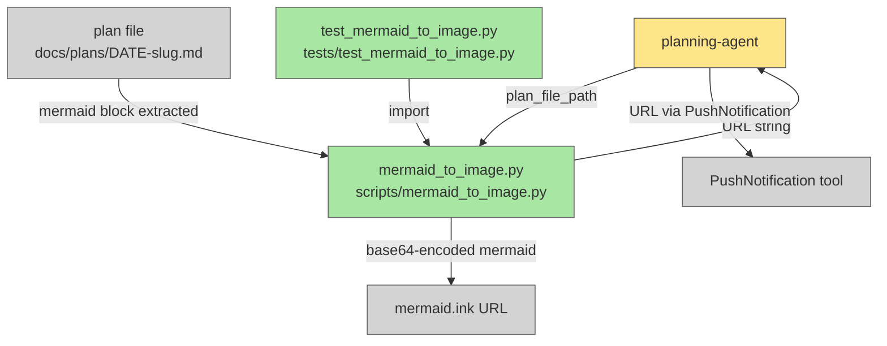

# mermaid-to-image

## Metadata

- System type: `library`

## System Intent

- What this is: A Python script (`scripts/mermaid_to_image.py`) that extracts a Mermaid fenced code block from a plan `.md` file by 1-indexed position (defaulting to the first), base64-encodes it, and returns a `mermaid.ink` URL. The planning-agent calls this script after writing a plan and pushes the URL to the developer's phone via PushNotification so they can tap to see the rendered diagram. No HTTP requests are made locally — the URL is a static `mermaid.ink` link that the phone browser renders.
- Primary consumer(s): `planning-agent` — calls the script after writing each plan and pushes the URL to the developer's phone.
- Boundary: `mermaid.ink` (external rendering service — treated as a black box). `PushNotification` tool (Claude Code built-in — treated as a black box).

## Mermaid Diagram



## Flows

### Global Types

```txt
StandardError {
  message: string (human-readable description of what went wrong)
}
```

---

### Flow: `extractMermaidFromPlan`

- Test files: `tests/test_mermaid_to_image.py`
- Core files: `scripts/mermaid_to_image.py`

#### Types

```txt
ExtractInput {
  plan_file_path: string   (absolute path to a docs/plans/*.md file)
  block_index: int         (1-indexed position of the mermaid block to extract; default 1)
}

ExtractOutput {
  mermaid_string: string   (the mermaid diagram text at position block_index, between fences, exclusive)
}
```

#### Paths

| path | input | output | path-type | notes |
| --- | --- | --- | --- | --- |
| `extractMermaidFromPlan.success-block-1` | `ExtractInput{block_index=1}` (or omitted) | `ExtractOutput` | `happy path` | first ` ```mermaid...``` ` block extracted and returned |
| `extractMermaidFromPlan.success-block-2` | `ExtractInput{block_index=2}` | `ExtractOutput` | `happy path` | second ` ```mermaid...``` ` block extracted and returned |
| `extractMermaidFromPlan.not-found` | `ExtractInput` (no mermaid block) | `StandardError` | `error` | raises ValueError: "No mermaid block found in \<path\>" |
| `extractMermaidFromPlan.index-out-of-range` | `ExtractInput{block_index=N}` where N > number of blocks | `StandardError` | `error` | raises ValueError: "Block index \<N\> out of range: only \<count\> mermaid block(s) found in \<path\>" |
| `extractMermaidFromPlan.file-missing` | `ExtractInput` (bad path) | `StandardError` | `error` | raises FileNotFoundError |

#### Pseudocode

```
extract_mermaid_from_plan(plan_file_path: str, block_index: int = 1) -> str:
  read file at plan_file_path
  collect all occurrences of ```mermaid\n...\n``` patterns via regex into a list
  if list is empty: raise ValueError("No mermaid block found in <plan_file_path>")
  if block_index > len(list): raise ValueError("Block index <block_index> out of range: only <len(list)> mermaid block(s) found in <plan_file_path>")
  return the block content at list[block_index - 1] (between the fences, exclusive)
```

---

### Flow: `generateMermaidInkUrl`

- Test files: `tests/test_mermaid_to_image.py`
- Core files: `scripts/mermaid_to_image.py`

#### Types

```txt
UrlInput {
  mermaid_string: string   (raw Mermaid diagram text extracted from a plan file)
}

UrlOutput {
  url: string              (fully-qualified mermaid.ink URL: https://mermaid.ink/img/<base64>)
}
```

#### Paths

| path | input | output | path-type | notes |
| --- | --- | --- | --- | --- |
| `generateMermaidInkUrl.success` | `UrlInput` | `UrlOutput` | `happy path` | mermaid string base64-encoded (urlsafe); URL returned |
| `generateMermaidInkUrl.empty-input` | `UrlInput{mermaid_string=""}` | `StandardError` | `error` | raises ValueError: "empty mermaid input" |

#### Pseudocode

```
generate_mermaid_ink_url(mermaid_string: str) -> str:
  if mermaid_string.strip() == "": raise ValueError("empty mermaid input")
  encoded = base64.urlsafe_b64encode(mermaid_string.encode("utf-8")).decode("utf-8")
  return f"https://mermaid.ink/img/{encoded}"
```

---

### Flow: `validateMermaidSyntax`

- Test files: `N/A`
- Core files: `scripts/mermaid_to_image.py`

#### Types

```txt
ValidateInput {
  mermaid_string: string   (raw Mermaid diagram text)
}

ValidateOutput {
  is_valid: bool
  error: string            (empty string on success; error message from mmdc on failure)
}
```

#### Paths

| path | input | output | path-type | notes |
| --- | --- | --- | --- | --- |
| `validateMermaidSyntax.valid` | `ValidateInput` (syntactically correct mermaid) | `ValidateOutput{is_valid=true, error=""}` | `happy path` | mmdc exits 0; diagram is valid |
| `validateMermaidSyntax.invalid` | `ValidateInput` (bad mermaid syntax) | `ValidateOutput{is_valid=false, error=<mmdc stderr>}` | `error` | mmdc exits non-zero; error contains mmdc stderr/stdout |
| `validateMermaidSyntax.timeout` | `ValidateInput` (mmdc hangs >60s) | `ValidateOutput{is_valid=false, error="mmdc timed out"}` | `error` | subprocess timeout |
| `validateMermaidSyntax.npx-missing` | mmdc/npx not installed | `ValidateOutput{is_valid=false, error="npx not found — cannot validate mermaid syntax"}` | `error` | FileNotFoundError from subprocess |

#### Pseudocode

```
validate_mermaid_syntax(mermaid_string: str) -> (bool, str):
  write mermaid_string to tmp .mmd file
  write puppeteer config json to tmp .json file
  run: npx --yes @mermaid-js/mermaid-cli -i <tmp_in> -o <tmp_out> -p <tmp_cfg> --quiet (timeout=60s)
  if returncode != 0: return False, stderr or stdout
  return True, ""
  # always clean up tmp files in finally block
```

#### Notes

This flow is only invoked by `cliEntryPoint` when the `MERMAID_SKIP_VALIDATE` environment variable is not set. When `MERMAID_SKIP_VALIDATE=1` is set, this flow is bypassed entirely and the URL is always generated from the extracted mermaid block.

---

### Flow: `cliEntryPoint`

- Test files: `tests/test_mermaid_to_image.py`
- Core files: `scripts/mermaid_to_image.py`

#### Types

```txt
CliInput {
  plan_file_path: string   (positional CLI argument — path to the plan .md file)
  block_index: int         (optional --block flag; 1-indexed; default 1)
}

CliOutput {
  url: string              (printed to stdout: the mermaid.ink URL)
}
```

#### Paths

| path | input | output | path-type | notes |
| --- | --- | --- | --- | --- |
| `cliEntryPoint.success-default` | valid plan file path, no `--block` arg | URL printed to stdout, exit 0 | `happy path` | defaults to block 1; extract + URL generation succeed; validation skipped if `MERMAID_SKIP_VALIDATE=1` |
| `cliEntryPoint.success-block-n` | valid plan file path, `--block N` | URL printed to stdout, exit 0 | `happy path` | extracts Nth block; URL printed |
| `cliEntryPoint.skip-validate` | valid plan file path, `MERMAID_SKIP_VALIDATE=1` set | URL printed to stdout, exit 0 | `happy path` | mmdc validation step is bypassed entirely; URL always generated if mermaid block exists |
| `cliEntryPoint.no-block` | plan file with no mermaid block | error message to stderr, exit 1 | `error` | ValueError from extractMermaidFromPlan |
| `cliEntryPoint.index-out-of-range` | plan file, block_index > number of blocks | error message to stderr, exit 1 | `error` | ValueError from extractMermaidFromPlan |
| `cliEntryPoint.file-missing` | non-existent file path | error message to stderr, exit 1 | `error` | FileNotFoundError from extractMermaidFromPlan |
| `cliEntryPoint.validation-failure` | valid plan file, mermaid syntax invalid, `MERMAID_SKIP_VALIDATE` not set | error message to stderr, exit 1 | `error` | mmdc validation reports failure; URL not generated |

#### Pseudocode

```
cli (argparse):
  arg: plan_file_path (positional, required)
  arg: --block (type=int; default=1)
  try:
    mermaid_string = extract_mermaid_from_plan(plan_file_path, block_index)
    if not MERMAID_SKIP_VALIDATE env var:
      valid, err = validate_mermaid_syntax(mermaid_string)
      if not valid:
        print(f"Error: mermaid diagram failed validation: {err}", file=sys.stderr)
        sys.exit(1)
    url = generate_mermaid_ink_url(mermaid_string)
    print(url)
    sys.exit(0)
  except (FileNotFoundError, ValueError) as e:
    print(f"Error: {e}", file=sys.stderr)
    sys.exit(1)
```

---

### Flow: `planningAgentPushesUrl`

- Test files: `N/A`
- Core files: `agents/featurework/planning/agents/planning-agent.md`

#### Types

```txt
PlanningAgentUrlStep {
  plan_file_path: string     (absolute path to the written plan file)
  url: string                (mermaid.ink URL returned by the script)
}
```

#### Paths

| path | input | output | path-type | notes |
| --- | --- | --- | --- | --- |
| `planningAgentPushesUrl.success` | plan written with mermaid block | PushNotification with tappable URL sent | `happy path` | sub-planning-agent calls script with `MERMAID_SKIP_VALIDATE=1`; URL always generated if mermaid block exists; pushed to phone |
| `planningAgentPushesUrl.inline-fallback` | script exits non-zero but mermaid block exists | PushNotification with inline-generated URL sent | `happy path` | sub-planning-agent generates URL via inline Python base64 fallback; URL pushed to phone |
| `planningAgentPushesUrl.no-mermaid` | plan has no mermaid block and fallback also fails | skip URL step, continue | `branch` | url = null; does not block plan approval gate |

#### Pseudocode

```
sub-planning-agent (mermaid phase — URL generation):
  run: MERMAID_SKIP_VALIDATE=1 python3 scripts/mermaid_to_image.py <plan_file_path>
  capture stdout as url
  if exit_code != 0 or url is empty/whitespace:
    # inline Python fallback
    extract mermaid_string from plan file
    if mermaid_string found:
      encoded = base64.urlsafe_b64encode(mermaid_string.encode("utf-8")).decode("utf-8")
      url = f"https://mermaid.ink/img/{encoded}"
    else:
      url = null
  return url in SubPlanningAgentOutput
  # orchestrator (planning-agent) pushes url via PushNotification if url is non-null
```

---

## Logs

| Source | Location |
|--------|----------|
| mermaid_to_image.py | stderr (extraction/encoding errors); stdout (URL on success) |

## Deployment

- Mechanism: `local only`
- Deploy command:
  ```bash
  # No deployment step. Script is called directly by the planning-agent.
  # Requires: Python 3 standard library only (base64, argparse, re, sys).
  # No external dependencies or CLI tools needed.
  ```
- Notes: `mermaid.ink` is an external rendering service. The script only generates the URL — no HTTP requests are made locally. The developer's phone browser renders the diagram when they tap the link.
