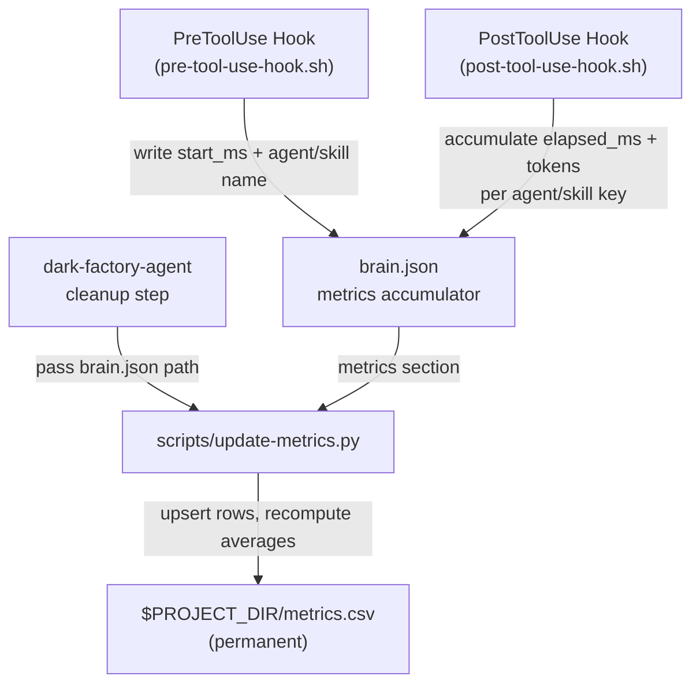

# Metrics CSV Tracking

## Metadata

- System type: `flow`

## System Intent

- What this is: A persistent, append-and-aggregate CSV file that records AI agent/skill performance metrics (runtime, token usage, run count) across manufacture runs. Hooks accumulate metrics into brain.json during a manufacture run; at the end of manufacture the dark-factory-agent calls `scripts/update-metrics.py` once to flush brain.json metrics into the permanent CSV.
- Primary consumer(s): Developers reviewing system performance over time.
- Boundary: `agents/dark-factory/scripts/pre-tool-use-hook.sh` and `agents/dark-factory/scripts/post-tool-use-hook.sh` capture start/elapsed/token metrics into brain.json (pure bash, no Claude API calls). `scripts/update-metrics.py` reads brain.json and upserts rows in `$PROJECT_DIR/metrics.csv`. The CSV write happens exactly once per manufacture run in the dark-factory-agent cleanup step.

## Mermaid Diagram



## Flows

### Flow: `preHookCapturesStart`

Fires on every PreToolUse event for `Agent` or `Skill` tool calls.

- Core files: `agents/dark-factory/scripts/pre-tool-use-hook.sh`
- Test files: `tests/test_hooks.py`

#### Types

```txt
MetricsKey {
  value: string  (agent name for Agent tools; skill name for Skill tools; e.g. "feature-agent" or "planning-skill")
}

StartCapture {
  key:      MetricsKey
  start_ms: int  (unix epoch milliseconds — from `date +%s%3N`)
}
```

#### Paths

| path | input | output | path-type | notes |
| --- | --- | --- | --- | --- |
| `preHookCapturesStart.agent-tool` | tool_name = "Agent" | brain.json metrics[key].start_ms written | happy path | key = agent name extracted from subagent_type or prompt |
| `preHookCapturesStart.skill-tool` | tool_name = "Skill" | brain.json metrics[key].start_ms written | happy path | key = skill field from tool input |
| `preHookCapturesStart.other-tool` | tool_name = anything else | no-op | happy path | hook exits 0 immediately after standard brain inject |
| `preHookCapturesStart.no-brain` | DARK_FACTORY_WORK_DIR unset or brain.json missing | no-op, log to stderr | happy path | metrics disabled gracefully |

#### Pseudocode

```
# pre-tool-use-hook.sh metrics addition (after standard brain inject):
HOOK_INPUT = read stdin
TOOL_NAME  = jq '.tool_name' <<< HOOK_INPUT

if TOOL_NAME not in ["Agent", "Skill"]: exit 0
if DARK_FACTORY_WORK_DIR unset or brain.json missing: exit 0

if TOOL_NAME == "Agent":
  KEY = jq '.tool_input.subagent_type // "unknown"' <<< HOOK_INPUT
  # fallback: grep agents/*.md path from prompt, take basename without .md
if TOOL_NAME == "Skill":
  KEY = jq '.tool_input.skill // "unknown"' <<< HOOK_INPUT

NOW_MS = $(date +%s%3N)

jq --arg key "$KEY" --argjson now $NOW_MS \
  '.metrics[$key].start_ms = $now' brain.json > brain.tmp && mv brain.tmp brain.json
```

---

### Flow: `postHookAccumulatesMetrics`

Fires on every PostToolUse event for `Agent` or `Skill` tool calls.

- Core files: `agents/dark-factory/scripts/post-tool-use-hook.sh`
- Test files: `tests/test_hooks.py`

#### Types

```txt
InternalAccumulatorRow {
  agent:        string
  skill:        string
  sum_runtime:  float   (running total of elapsed_ms values)
  sum_tokens:   float   (running total of token counts)
  runs:         int
}
```

#### Paths

| path | input | output | path-type | notes |
| --- | --- | --- | --- | --- |
| `postHookAccumulatesMetrics.success` | tool completed, brain.json has start_ms for key | brain.json metrics[key] updated: elapsed_ms += delta, tokens += n, runs += 1; start_ms deleted | happy path | |
| `postHookAccumulatesMetrics.missing-start` | start_ms absent for key | elapsed_ms = 0, still accumulates tokens + runs | happy path | Handles out-of-order or first-run edge case |
| `postHookAccumulatesMetrics.no-usage` | tool_response has no usage field | tokens defaults to 0 | happy path | |
| `postHookAccumulatesMetrics.other-tool` | tool_name not Agent or Skill | no-op | happy path | |

#### Pseudocode

```
# post-tool-use-hook.sh metrics addition (after existing brain merge):
TOOL_INPUT = stdin (already consumed — same copy used for merge)
TOOL_NAME  = jq '.tool_name' <<< TOOL_INPUT

if TOOL_NAME not in ["Agent", "Skill"]: exit 0
if DARK_FACTORY_WORK_DIR unset or brain.json missing: exit 0

KEY = extract_key(TOOL_INPUT, TOOL_NAME)

NOW_MS    = $(date +%s%3N)
START_MS  = jq --arg k "$KEY" '.metrics[$k].start_ms // 0' brain.json
ELAPSED   = $((NOW_MS - START_MS))

TOKENS = jq '(.tool_response.usage.input_tokens // 0) + (.tool_response.usage.output_tokens // 0)' <<< TOOL_INPUT

jq --arg key "$KEY" --argjson elapsed $ELAPSED --argjson tokens $TOKENS '
  .metrics[$key].elapsed_ms = ((.metrics[$key].elapsed_ms // 0) + $elapsed) |
  .metrics[$key].tokens     = ((.metrics[$key].tokens     // 0) + $tokens)  |
  .metrics[$key].runs       = ((.metrics[$key].runs       // 0) + 1)        |
  del(.metrics[$key].start_ms)
' brain.json > brain.tmp && mv brain.tmp brain.json
```

---

### Flow: `orchestratorFlushesCSV`

Fires once at the end of manufacture, in dark-factory-agent before `rm -f brain.json`.

- Core files: `scripts/update-metrics.py`, `agents/dark-factory/agents/dark-factory-agent.md`
- Test files: `tests/test_update_metrics.py`

#### Types

```txt
UpdateMetricsInput {
  csv_path:   string  (absolute path — $PROJECT_DIR/metrics.csv)
  brain_path: string  (absolute path to brain.json)
}

UpdateMetricsOutput {
  rows_written: int
}

MetricsRow {
  agent:        string
  skill:        string
  avg_runtime:  float   (milliseconds — computed: sum_runtime / runs)
  avg_tokens:   float   (tokens — computed: sum_tokens / runs)
  runs:         int
  sum_runtime:  float   (stored to keep averages correct across multiple runs)
  sum_tokens:   float
}
```

#### Paths

| path | input | output | path-type | notes |
| --- | --- | --- | --- | --- |
| `orchestratorFlushesCSV.success` | brain.json has metrics section | CSV upserted, averages recomputed | happy path | |
| `orchestratorFlushesCSV.no-metrics` | brain.json has no metrics key | no-op, CSV unchanged | happy path | |
| `orchestratorFlushesCSV.csv-new` | csv_path does not exist | CSV created with headers + rows | happy path | |
| `orchestratorFlushesCSV.script-error` | any exception in update-metrics.py | error logged to stderr, manufacture continues | error | Non-fatal — `|| true` in dark-factory-agent; metrics failure never blocks a PR |

#### Pseudocode

```
# dark-factory-agent — before rm -f brain.json:
PROJECT_DIR = jq '.workDir' brain.json
METRICS_CSV = "$PROJECT_DIR/metrics.csv"
python3 scripts/update-metrics.py --csv "$METRICS_CSV" --brain "$WORK_DIR/brain.json" || true

# scripts/update-metrics.py:
def main(csv_path, brain_path):
  brain = json.load(brain_path)
  metrics = brain.get("metrics", {})
  if not metrics: return

  rows = read_csv(csv_path)   # [] if file absent
  for key, data in metrics.items():
    agent, _, skill = key.partition("/")   # key format: "agent/skill" or just "agent"
    elapsed = data.get("elapsed_ms", 0)
    tokens  = data.get("tokens", 0)
    runs    = data.get("runs", 1)
    upsert(rows, agent, skill, elapsed, tokens, runs)

  write_csv(csv_path, rows)   # recomputes avg_runtime, avg_tokens from sums

def upsert(rows, agent, skill, elapsed_ms, tokens, runs):
  existing = find(rows, agent, skill)
  if existing:
    existing["sum_runtime"] += elapsed_ms
    existing["sum_tokens"]  += tokens
    existing["runs"]        += runs
  else:
    rows.append({"agent": agent, "skill": skill,
                 "sum_runtime": elapsed_ms, "sum_tokens": tokens, "runs": runs})
  for row in rows:
    row["avg_runtime"] = row["sum_runtime"] / row["runs"]
    row["avg_tokens"]  = row["sum_tokens"]  / row["runs"]
```

#### CSV file format

```
agent,skill,avg_runtime,avg_tokens,runs,sum_runtime,sum_tokens
feature-agent,planning-agent,4523.1,12400.0,3,13569.3,37200.0
```

`sum_runtime` and `sum_tokens` are stored so averages stay correct across multiple runs without raw history.

---

### Flow: `csvInitialization`

- Core files: `scripts/update-metrics.py`
- Test files: `tests/test_update_metrics.py`

#### Paths

| path | input | output | path-type | notes |
| --- | --- | --- | --- | --- |
| `csvInitialization.new-file` | csv_path does not exist | CSV created with header row and data rows | happy path | Script creates parent dirs if needed |
| `csvInitialization.existing-file` | csv_path exists | CSV read, rows upserted, file rewritten | happy path | |

## Testing

| Test file | Flow covered |
|---|---|
| `tests/test_hooks.py` | `preHookCapturesStart.*`, `postHookAccumulatesMetrics.*` — subprocess tests on the actual shell scripts |
| `tests/test_update_metrics.py` | `orchestratorFlushesCSV.*`, `csvInitialization.*` — pytest unit tests on `scripts/update-metrics.py` |

Run all metrics-related tests with:

```bash
pytest tests/test_hooks.py tests/test_update_metrics.py -v
```

## Logs

| Source | Location |
|--------|----------|
| pre-tool-use-hook.sh metrics writes | stderr — `pre-tool-use-hook \| metrics-capture \| key=feature-agent start_ms=1234567890` |
| post-tool-use-hook.sh metrics writes | stderr — `post-tool-use-hook \| metrics-accumulate \| key=feature-agent elapsed_ms=4523 tokens=12400 runs=1` |
| update-metrics.py flush | stderr — `update-metrics \| flush \| rows=3 csv=/path/metrics.csv` |
| update-metrics.py errors | stderr — non-fatal, manufacture continues |

## Deployment

- Mechanism: `local only` — scripts are bash/python, no build step required.
- Deploy command: N/A (hooks are always-on via `.claude/settings.json`)
- Notes: `metrics.csv` persists at `$PROJECT_DIR/metrics.csv` across sessions. Do not `.gitignore` it — it is the permanent running total. `sum_runtime` and `sum_tokens` columns are stored in the CSV so averages remain accurate when new runs are appended.
