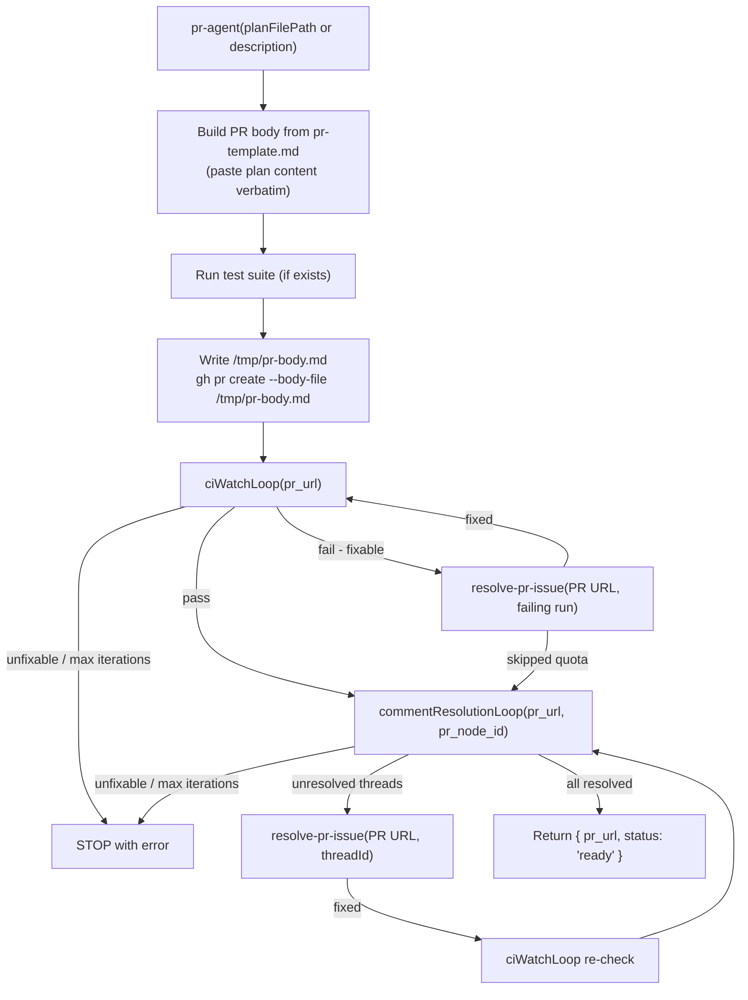

# open-pr

## Metadata

- System type: `flow`

## System Intent

- What this is: The PR preparation flow. Takes already-applied code changes, stages everything, opens a PR from a plan or description, runs a CI watch loop, resolves CI failures and review threads in explicit named loops, then returns the PR URL with status `"ready"` for the caller to merge. Merging is not performed by pr-agent.

## Mermaid Diagram



## Flows

### Flow: `openPR`

- Core files: `agents/pr/agents/pr-agent.md`, `agents/pr/skills/create-pr/SKILL.md`, `agents/pr/templates/pr-template.md`, `agents/pr/agents/resolve-pr-issue.md`

#### Types

```txt
OpenPRInput {
  planFilePathOrDescription: string (required — either an absolute path to a plan/bug file, or a description string)
}

OpenPROutput {
  pr_url: string
  status: "ready"
}

StandardError {
  message: string (human-readable description of what went wrong)
}
```

#### Paths

| path | input | output | path-type | notes |
| --- | --- | --- | --- | --- |
| `openPR.success` | `OpenPRInput` | `OpenPROutput` | happy path | CI passes, no unresolved threads, returns ready |
| `openPR.ci-fixed` | `OpenPRInput` | `OpenPROutput` | happy path | CI failed, ciWatchLoop resolved it, returns ready |
| `openPR.comments-resolved` | `OpenPRInput` | `OpenPROutput` | happy path | Review threads resolved, CI re-checked, returns ready |
| `openPR.ci-unfixable` | `OpenPRInput` | `StandardError` | error | ciWatchLoop aborted with unfixable error or max iterations exceeded |
| `openPR.comment-unfixable` | `OpenPRInput` | `StandardError` | error | commentResolutionLoop aborted with unfixable thread or max iterations exceeded |

### Flow: `ciWatchLoop`

- Core files: `agents/pr/agents/pr-agent.md`

#### Types

```txt
CIWatchLoopInput {
  pr_url: string
}

CIWatchLoopOutput {
  status: "pass"
}

CIWatchLoopError {
  message: string   (reason loop was aborted — unfixable failure or max iterations)
}
```

#### Paths

| path | input | output | path-type | notes |
| --- | --- | --- | --- | --- |
| `ciWatchLoop.pass` | `CIWatchLoopInput` | `CIWatchLoopOutput` | happy path | All CI checks pass on first watch |
| `ciWatchLoop.fail-fixed` | `CIWatchLoopInput` | `CIWatchLoopOutput` | happy path | CI failed, resolve-pr-issue fixed it, loop re-runs and passes |
| `ciWatchLoop.quota-skip` | `CIWatchLoopInput` | `CIWatchLoopOutput` | happy path | CI failure is quota exhaustion; treated as pass |
| `ciWatchLoop.unfixable` | `CIWatchLoopInput` | `CIWatchLoopError` | error | resolve-pr-issue returns fixed: false; loop aborts |
| `ciWatchLoop.max-iterations` | `CIWatchLoopInput` | `CIWatchLoopError` | error | CI keeps failing after MAX_CI_ITERATIONS (5) fix attempts |

#### Pseudocode

```
MAX_CI_ITERATIONS = 5

ciWatchLoop(pr_url):
  iterations = 0

  LOOP:
    if iterations >= MAX_CI_ITERATIONS:
      STOP with error "CI watch loop exceeded MAX_CI_ITERATIONS without passing"

    result = gh pr checks <pr_url> --watch
    // --watch blocks until all checks complete or one fails

    if all checks passed:
      RETURN { status: "pass" }

    failedRuns = gh pr checks <pr_url> --fail-fast  // get failing run IDs

    for each run in failedRuns:
      fixResult = spawn resolve-pr-issue(pr_url, { type: "ci", runId: run.runId, failedChecks: [run.checkName] })

      if fixResult.skipped == true:
        RETURN { status: "pass" }  // quota exhaustion — treat as pass

      if fixResult.fixed == false:
        STOP with error "CI failure unfixable: " + fixResult.reason

      BREAK  // fix pushed — re-watch CI (remaining runs may already be fixed)

    iterations += 1
    CONTINUE LOOP
```

### Flow: `commentResolutionLoop`

- Core files: `agents/pr/agents/pr-agent.md`

#### Types

```txt
CommentResolutionLoopInput {
  pr_url: string
  pr_node_id: string
}

CommentResolutionLoopOutput {
  status: "all-resolved"
}

CommentResolutionLoopError {
  message: string   (reason loop was aborted — unfixable thread or max iterations)
}
```

#### Paths

| path | input | output | path-type | notes |
| --- | --- | --- | --- | --- |
| `commentResolutionLoop.no-threads` | `CommentResolutionLoopInput` | `CommentResolutionLoopOutput` | happy path | No unresolved threads; returns immediately |
| `commentResolutionLoop.threads-resolved` | `CommentResolutionLoopInput` | `CommentResolutionLoopOutput` | happy path | All threads resolved by resolve-pr-issue; CI re-checked and passes |
| `commentResolutionLoop.unfixable` | `CommentResolutionLoopInput` | `CommentResolutionLoopError` | error | resolve-pr-issue returns fixed: false for a thread; loop aborts |
| `commentResolutionLoop.max-iterations` | `CommentResolutionLoopInput` | `CommentResolutionLoopError` | error | Threads keep appearing after MAX_COMMENT_ITERATIONS (5) rounds |

#### Pseudocode

```
MAX_COMMENT_ITERATIONS = 5

commentResolutionLoop(pr_url, pr_node_id):
  iterations = 0

  LOOP:
    if iterations >= MAX_COMMENT_ITERATIONS:
      STOP with error "Comment resolution loop exceeded MAX_COMMENT_ITERATIONS"

    unresolvedThreads = gh api graphql list-review-threads(pr_node_id)
      // filter to isResolved == false

    if unresolvedThreads is empty:
      RETURN { status: "all-resolved" }

    for each thread in unresolvedThreads:
      fixResult = spawn resolve-pr-issue(pr_url, { type: "review", threadId: thread.threadId, comments: thread.comments })

      if fixResult.fixed == false:
        STOP with error "Review thread unfixable: " + fixResult.reason

      // fixResult.fixed == true — fix pushed and thread resolved via GraphQL

    // After resolving all threads in this round, re-check CI before checking for more threads
    ciResult = ciWatchLoop(pr_url)
    if ciResult is error:
      STOP with error ciResult.message

    iterations += 1
    CONTINUE LOOP  // check for any newly added threads
```

### Flow: `resolvePRIssue`

- Core files: `agents/pr/agents/resolve-pr-issue.md`

#### Types

```txt
ResolvePRIssueInput {
  pr_url: string (required)
  issue: CIFailure | ReviewThread
}

CIFailure {
  type: "ci"
  runId: string
  failedChecks: string[]
}

ReviewThread {
  type: "review"
  threadId: string
  comments: string[]
}

ResolvePRIssueOutput {
  fixed: boolean
  type: "ci" | "review"
  threadId: string (only for review threads)
  skipped: boolean (only when CI failure is quota exhaustion)
  reason: string (only when fixed: false)
}
```

#### Paths

| path | input | output | path-type | notes |
| --- | --- | --- | --- | --- |
| `resolvePRIssue.ci-fixed` | `ResolvePRIssueInput (CIFailure)` | `{ fixed: true, type: "ci" }` | happy path | fix applied, committed, pushed |
| `resolvePRIssue.ci-quota` | `ResolvePRIssueInput (CIFailure)` | `{ fixed: true, type: "ci", skipped: true }` | happy path | failure is quota exhaustion; no fix applied |
| `resolvePRIssue.review-fixed` | `ResolvePRIssueInput (ReviewThread)` | `{ fixed: true, type: "review", threadId }` | happy path | fix applied, pushed, thread resolved via GraphQL |
| `resolvePRIssue.unfixable` | `ResolvePRIssueInput` | `{ fixed: false, reason }` | error | agent cannot safely determine a fix |

## Logs

| Source | Location |
|--------|----------|
| CI check output | `gh run view <run-id> --log-failed` |
| PR body | `/tmp/pr-body.md` (ephemeral) |
| Review thread comments | GraphQL `reviewThreads` query on PR node ID |

## Deployment

- Mechanism: `local only` — invoked as a sub-agent by dark-factory-agent and ralph-fix-and-push
- Notes: Always stages with `git add --all` before committing — never stages individual files. Always writes PR body to `/tmp/pr-body.md` and uses `--body-file` (never `--body` inline) to avoid "Parser aborted" interactive prompt on large bodies.
