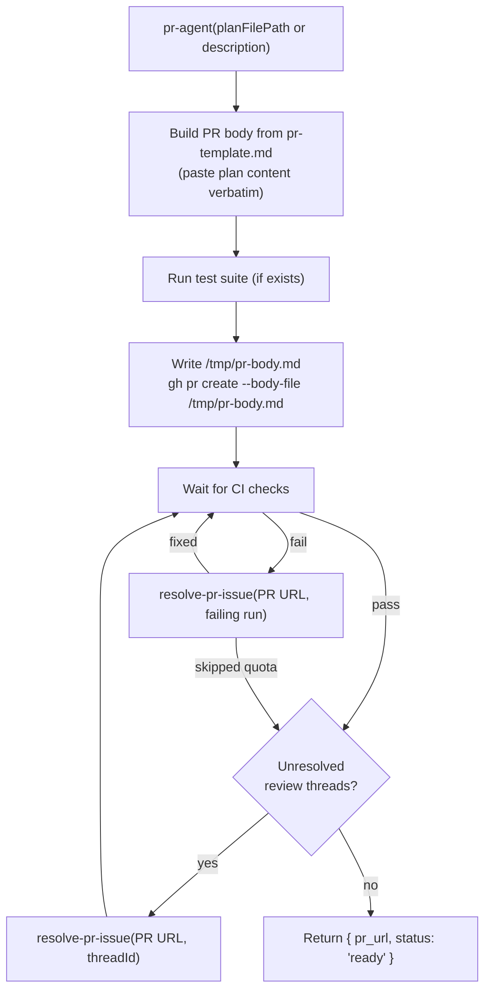

# open-pr

## Metadata

- System type: `flow`

## System Intent

- What this is: The PR lifecycle flow. Takes already-applied code changes, stages everything, opens a PR from a plan or description, waits for CI, resolves CI failures and review threads in a loop, and stops once CI is green and all threads are resolved. Does not merge.

## Mermaid Diagram



## Flows

### Flow: `openAndWatchPR`

- Core files: `agents/pr/agents/pr-agent.md`, `agents/pr/skills/create-pr/SKILL.md`, `agents/pr/templates/pr-template.md`, `agents/pr/agents/resolve-pr-issue.md`

#### Types

```txt
OpenPRInput {
  planFilePathOrDescription: string (required — either an absolute path to a plan/bug file, or a description string)
}

OpenPROutput {
  pr_url: string
  status: "ready"
}

StandardError {
  message: string (human-readable description of what went wrong)
}
```

#### Paths

| path | input | output | path-type | notes |
| --- | --- | --- | --- | --- |
| `openAndWatchPR.success` | `OpenPRInput` | `OpenPROutput` | happy path | CI passes, no unresolved threads, PR left open for manual merge |
| `openAndWatchPR.ci-failure-resolved` | `OpenPRInput` | `OpenPROutput` | happy path | CI failed, resolve-pr-issue fixed it, CI re-ran and passed |
| `openAndWatchPR.review-thread-resolved` | `OpenPRInput` | `OpenPROutput` | happy path | reviewer left comments, resolve-pr-issue addressed them |
| `openAndWatchPR.quota-skip` | `OpenPRInput` | `OpenPROutput` | happy path | CI failure is credits/quota exhaustion; treated as pass |
| `openAndWatchPR.unfixable` | `OpenPRInput` | `StandardError` | error | resolve-pr-issue returns fixed: false; pr-agent reports error |

### Flow: `resolvePRIssue`

- Core files: `agents/pr/agents/resolve-pr-issue.md`

#### Types

```txt
ResolvePRIssueInput {
  pr_url: string (required)
  issue: CIFailure | ReviewThread
}

CIFailure {
  type: "ci"
  runId: string
  failedChecks: string[]
}

ReviewThread {
  type: "review"
  threadId: string
  comments: string[]
}

ResolvePRIssueOutput {
  fixed: boolean
  type: "ci" | "review"
  threadId: string (only for review threads)
  skipped: boolean (only when CI failure is quota exhaustion)
  reason: string (only when fixed: false)
}
```

#### Paths

| path | input | output | path-type | notes |
| --- | --- | --- | --- | --- |
| `resolvePRIssue.ci-fixed` | `ResolvePRIssueInput (CIFailure)` | `{ fixed: true, type: "ci" }` | happy path | fix applied, committed, pushed |
| `resolvePRIssue.ci-quota` | `ResolvePRIssueInput (CIFailure)` | `{ fixed: true, type: "ci", skipped: true }` | happy path | failure is quota exhaustion; no fix applied |
| `resolvePRIssue.review-fixed` | `ResolvePRIssueInput (ReviewThread)` | `{ fixed: true, type: "review", threadId }` | happy path | fix applied, pushed, thread resolved via GraphQL |
| `resolvePRIssue.unfixable` | `ResolvePRIssueInput` | `{ fixed: false, reason }` | error | agent cannot safely determine a fix |

## Logs

| Source | Location |
|--------|----------|
| CI check output | `gh run view <run-id> --log-failed` |
| PR body | `/tmp/pr-body.md` (ephemeral) |
| Review thread comments | `gh pr view <pr-url> --json reviewDecision,reviewThreads` |

## Deployment

- Mechanism: `local only` — invoked as a sub-agent by dark-factory-agent and ralph-fix-and-push
- Notes: Always stages with `git add --all` before committing — never stages individual files. Always writes PR body to `/tmp/pr-body.md` and uses `--body-file` (never `--body` inline) to avoid "Parser aborted" interactive prompt on large bodies.
