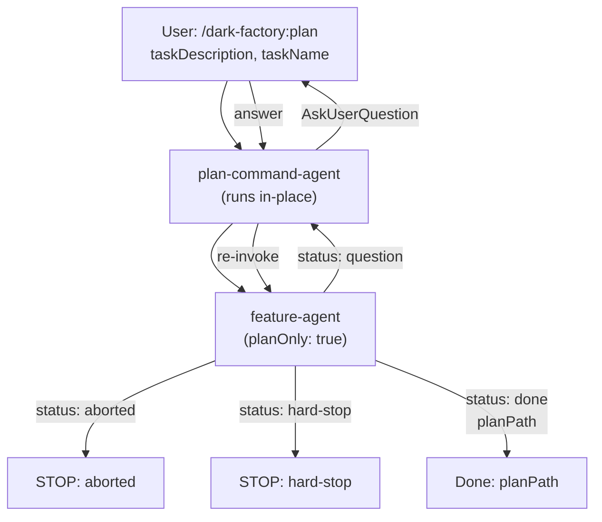

# plan-command-agent

## Metadata

- System type: `flow`

## System Intent

- What this is: The `plan-command-agent` backs the `/dark-factory:plan` slash command. It runs in-place in whatever working directory (worktree) it is invoked from — worktree setup is handled by `gotoworktree-command-agent` separately. It drives `feature-agent` through all planning phases (draft → mermaid → flows → final approval) with `planOnly: true` to skip execution and returns the approved plan path. State is passed directly between steps as local variables — no `brain.json` is created.

## Mermaid Diagram



## Flows

### Flow: `planCommand`

- Test files: `N/A`
- Core files: `commands/plan.md`, `agents/dark-factory/agents/plan-command-agent.md`, `agents/featurework/agents/feature-agent.md`

#### Types

```txt
PlanCommandInput {
  taskDescription: string (required)
  taskName:        string (optional — derived from taskDescription if absent)
}

PlanCommandOutput {
  planPath: string (absolute path to approved plan file)
}

StandardError {
  message: string (human-readable description of what went wrong)
}
```

#### Paths

| path | input | output | path-type | notes |
| --- | --- | --- | --- | --- |
| `planCommand.success` | `PlanCommandInput` | `PlanCommandOutput` | happy path | plan fully approved, planPath returned |
| `planCommand.aborted` | `PlanCommandInput` | `StandardError` | error | user aborted at final approval gate |
| `planCommand.hard-stop` | `PlanCommandInput` | `StandardError` | error | feature-agent returned hard-stop |

#### Pseudocode

```
plan-command-agent(taskDescription, taskName):

  # Step 1 — derive taskName slug if not provided
  if taskName is empty:
    taskName = slugify(taskDescription)   # lowercase, hyphens, ≤30 chars

  PROJECT_DIR = bash("git rev-parse --show-toplevel")

  # Step 2 — drive feature-agent through planning phases ONLY (planOnly: true)
  result = invoke feature-agent({ taskDescription, answer: null, planPath: null, planOnly: true })
  LOOP until result.status == "done":
    if result.status == "aborted":
      report "Aborted: " + result.reason
      STOP
    if result.status == "hard-stop":
      report "Hard stop: " + result.reason
      STOP
    if result.status == "question":
      PushNotification("Question", result.question)
      answer = AskUserQuestion(header: result.phase, question: result.question, options: result.options)
      result = invoke feature-agent({ answer, planPath: result.planPath, taskDescription: null, planOnly: true })

  planFilePath = result.planPath

  Report: "Plan approved. File: " + planFilePath
  STOP
```

## Logs

| Source | Location |
|--------|----------|
| command agent stdout | Plan path reported directly on completion |
| bug audit logs | N/A (planning only — no code executed) |

## Deployment

- Mechanism: `local only`
- Deploy command:
  ```bash
  /dark-factory:plan
  ```
- Notes: Invoked as a Claude Code slash command. Requires the dark-factory plugin installed. The agent runs in-place in the current directory — use `/dark-factory:gotoworktree` first to land in the correct worktree. Passes `planOnly: true` to `feature-agent` so execution-agent is never called.
