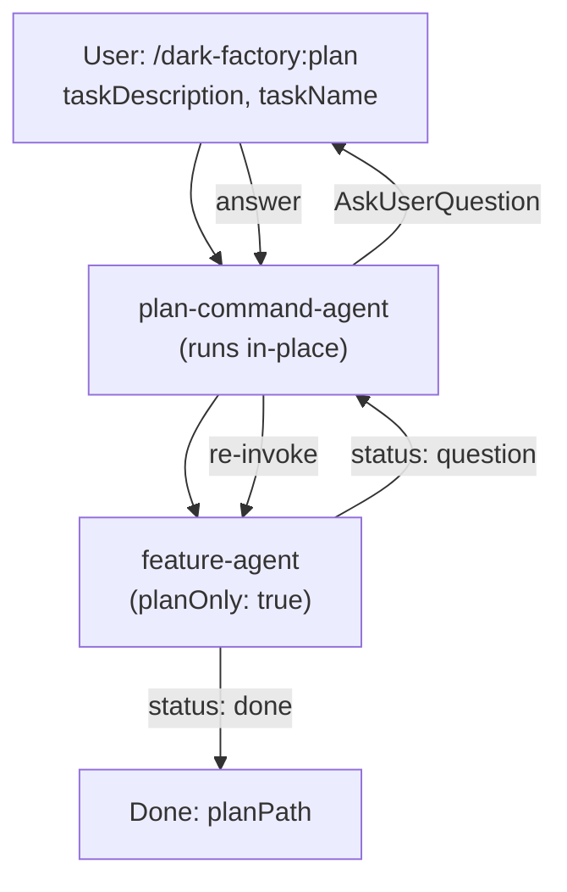

# /dark-factory:plan

Plans a feature end-to-end — walks through system intent, architecture diagram, and per-flow approval gates, then saves the approved plan (no code yet).

## Flow

## See also

- feature-agent — executes planning phases
- plan-template.md — plan structure and approval gates
