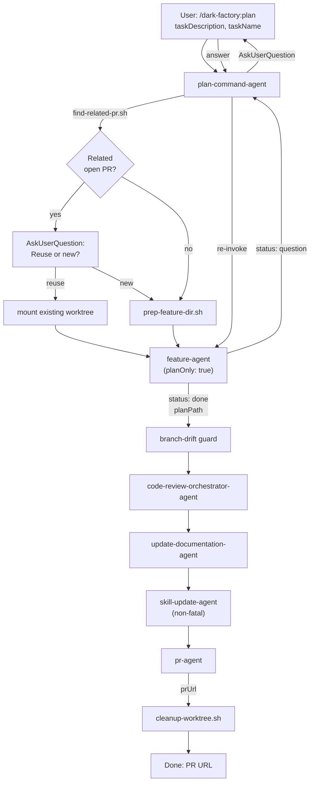

# plan-command-agent

## Metadata

- System type: `flow`

## System Intent

- What this is: The `plan-command-agent` backs the `/dark-factory:plan` slash command. It orchestrates feature planning end-to-end: checks for related open PRs, creates or reuses a git worktree, drives `feature-agent` through all planning phases (draft → mermaid → flows → final approval) with `planOnly: true` to skip execution, then runs the full post-execution pipeline (code review → docs → skills → PR → cleanup). State is passed directly between steps as local variables — no `brain.json` is created.

## Mermaid Diagram



## Flows

### Flow: `planCommand`

- Test files: `N/A`
- Core files: `commands/plan.md`, `agents/dark-factory/agents/plan-command-agent.md`, `agents/featurework/agents/feature-agent.md`

#### Types

```txt
PlanCommandInput {
  taskDescription: string (required)
  taskName:        string (optional — derived from taskDescription if absent)
}

PlanCommandOutput {
  planPath: string (absolute path to approved plan file)
  prUrl:    string (URL of opened PR)
}

StandardError {
  message: string (human-readable description of what went wrong)
}
```

#### Paths

| path | input | output | path-type | notes |
| --- | --- | --- | --- | --- |
| `planCommand.success` | `PlanCommandInput` | `PlanCommandOutput` | happy path | plan fully approved, committed, PR opened |
| `planCommand.aborted` | `PlanCommandInput` | `StandardError` | error | user aborted at final approval gate |
| `planCommand.hard-stop` | `PlanCommandInput` | `StandardError` | error | feature-agent returned hard-stop |
| `planCommand.prep-failure` | `PlanCommandInput` | `StandardError` | error | prep-feature-dir.sh failed; no cleanup needed |
| `planCommand.drift-guard-failure` | `PlanCommandInput` | `StandardError` | error | branch has no commits ahead of main after planning |

#### Pseudocode

```
plan-command-agent(taskDescription, taskName):

  # Step 1 — derive taskName slug if not provided
  if taskName is empty:
    taskName = slugify(taskDescription)   # lowercase, hyphens, ≤30 chars

  # Step 2 — check for related open PR (PR reuse)
  PROJECT_DIR = bash("git rev-parse --show-toplevel")
  relatedPrOutput = bash("bash \"${CLAUDE_PLUGIN_ROOT}/agents/dark-factory/scripts/find-related-pr.sh\" \"$taskDescription\"") || ""
  EXISTING_BRANCH = extract BRANCH= from relatedPrOutput

  if EXISTING_BRANCH is not empty:
    answer = AskUserQuestion("Reuse existing branch" or "Create new branch")
    USE_EXISTING = (answer == "Reuse existing branch")
  else:
    USE_EXISTING = false

  # Step 3 — prep worktree
  if USE_EXISTING:
    WORK_DIR = PROJECT_DIR + "/../" + basename(PROJECT_DIR) + "-" + existingTaskName
    mount or create worktree from EXISTING_BRANCH
  else:
    prepOutput = bash("prep-feature-dir.sh taskName")
    WORK_DIR = extract WORK_DIR from prepOutput
    branchRef = "feature/" + taskName

  # Step 4 — drive feature-agent through planning phases ONLY (planOnly: true)
  result = invoke feature-agent({ taskDescription, answer: null, planPath: null, planOnly: true })
  LOOP until result.status == "done":
    relay questions to user via AskUserQuestion
    re-invoke feature-agent with answer and planOnly: true

  # Step 5 — branch drift guard
  if no commits ahead of main: cleanup + STOP

  planFilePath = result.planPath

  # Steps 6-9 — post-execution pipeline
  invoke code-review-orchestrator-agent({ planFilePath, codePath: WORK_DIR })
  invoke update-documentation-agent({ planFilePath, workDir: WORK_DIR })
  try: invoke skill-update-agent({ planFilePath, workDir: WORK_DIR, taskSummary: taskDescription })
  prResult = invoke pr-agent({ planFilePath })

  bash("cleanup-worktree.sh WORK_DIR taskName")
  Report: "Plan approved and committed. PR: " + prResult.prUrl
  STOP
```

## Logs

| Source | Location |
|--------|----------|
| command agent stdout | PR URL reported directly on completion |
| bug audit logs | N/A (planning only — no code executed) |

## Deployment

- Mechanism: `local only`
- Deploy command:
  ```bash
  /dark-factory:plan
  ```
- Notes: Invoked as a Claude Code slash command. Requires the dark-factory plugin installed. Passes `planOnly: true` to `feature-agent` so execution-agent is never called. The worktree is cleaned up after the PR is opened.
