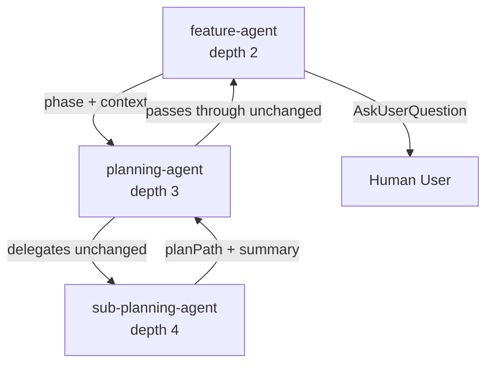

# planning-agent

## Metadata

- System type: `flow`

## System Intent

- What this is: A lightweight Haiku-model phase-delegator that sits between feature-agent and sub-planning-agent. It receives a planning phase request (draft_plan, mermaid, or flows) from feature-agent, forwards it to sub-planning-agent, and passes the structured output back unchanged. It has no user interaction responsibility — all approval gates (AskUserQuestion) are owned exclusively by feature-agent.

### Why planning-agent never calls AskUserQuestion

`AskUserQuestion` only reaches a human when called from depth ≤ 2 in the Claude Code agent tree. The invocation chain is:

```
dark-factory-agent (depth 1)
  └── feature-agent (depth 2)   ← AskUserQuestion works here
        └── planning-agent (depth 3)   ← AskUserQuestion does NOT reach humans here
              └── sub-planning-agent (depth 4)
```

Because planning-agent runs at depth 3, any `AskUserQuestion` call it made would not reach the user. This is not a bug — it is intentional architecture. The design assigns all approval gates to feature-agent (depth 2), which is the deepest level where user interaction is guaranteed to work. planning-agent is a pure delegator: it does content work (via sub-planning-agent) and returns results; feature-agent does all gating.

## Mermaid Diagram



## Flows

### Flow: `delegate`

- Core files: `agents/featurework/planning/agents/planning-agent.md`

#### Types

```txt
PlanningAgentInput {
  phase: "draft_plan" | "mermaid" | "flows"
  planPath: string | null   (null for draft_plan phase)
  feedback: string          (initial description or revision feedback; "none" if no feedback for mermaid)
  flowName: string | null   (only for flows phase)
}

PlanningAgentOutput (draft_plan) {
  planPath: string
  summary: string
}

PlanningAgentOutput (mermaid) {
  planPath: string
  url: string | null
  summary: string
}

PlanningAgentOutput (flows) {
  planPath: string
  summary: string
}

PlanningAgentError {
  message: string
}
```

#### Paths

| path | input | output | path-type | notes |
| --- | --- | --- | --- | --- |
| `delegate.success` | `PlanningAgentInput` | `PlanningAgentOutput` | `happy path` | Passes sub-planning-agent output through unchanged |
| `delegate.error` | `PlanningAgentInput` | `PlanningAgentError` | `error` | sub-planning-agent errors or returns no planPath |

#### Pseudocode

```
1. Spawn sub-planning-agent with { phase, planPath, feedback, flowName }
2. If sub-planning-agent returns error or no planPath:
     return { message: "<error description>" } to feature-agent
3. Return sub-planning-agent output directly to feature-agent (no transformation)
```

## Logs

| Source | Location |
|--------|----------|
| Agent invocations | Claude Code session output |
| Plan files written | `docs/plans/<YYYY-MM-DD>-<slug>.md` (written by sub-planning-agent) |

## Deployment

- Mechanism: `local only` — spawned by feature-agent as a sub-agent
- Notes: One invocation per planning phase. feature-agent calls planning-agent once per phase (up to 5 times per planning session if the user requests changes). Never called directly by the user.
