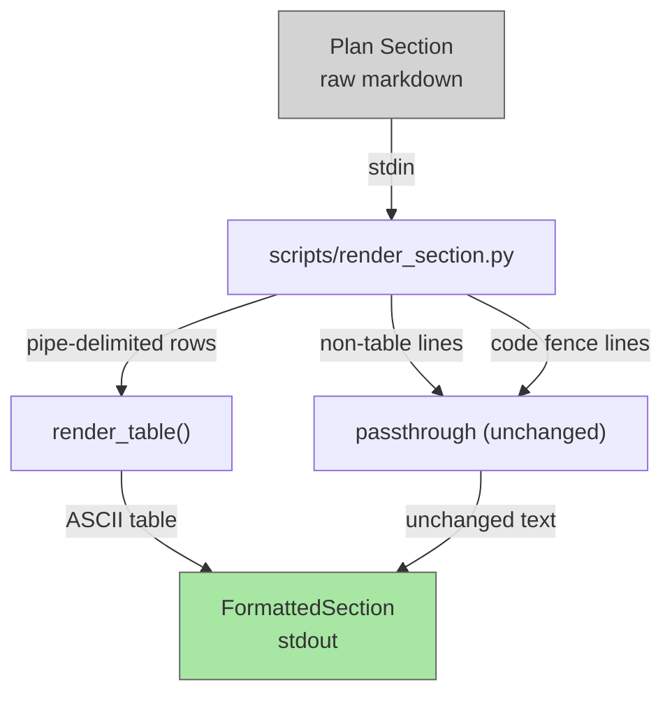

# render-section

## Metadata

- System type: `library`

## System Intent

- What this is: A Python script (`scripts/render_section.py`) that converts raw markdown text containing pipe-delimited tables into human-friendly ASCII tables with proper column alignment and borders. Non-table content (headers, plain text, code fences) passes through unchanged. feature-agent pipes plan sections through this script before embedding them in AskUserQuestion calls so users see formatted output instead of raw markdown.
- Primary consumer(s): feature-agent (invokes via bash stdin pipe when displaying plan sections during planning gate)
- Boundary: Output rendering only — plan files on disk are never modified; only the in-memory text displayed to users is formatted

## Mermaid Diagram



## Flows

### Flow: `renderTable`

- Test files: `tests/test_render_section.py`
- Core files: `scripts/render_section.py`

#### Types

```txt
MarkdownSection: string
  Raw markdown text extracted from plan file (may contain pipe-delimited tables, code blocks, headers)

FormattedSection: string
  Rendered text with ASCII tables replacing pipe-delimited markdown tables
  Other content (headers, code blocks, text) passes through unchanged

TableInput {
  rows: list[string]
    Raw markdown table rows (each starts with "|")
}

TableOutput {
  lines: list[string]
    Formatted ASCII table lines with padded columns and +-+- borders
}
```

#### Paths

| path | input | output | path-type | notes |
| --- | --- | --- | --- | --- |
| `renderTable.markdown` | `MarkdownSection` with pipe-delimited rows | `FormattedSection` with padded ASCII table | happy path | Detects contiguous pipe rows, skips separator rows (`| --- |`), computes column widths, renders table with borders |
| `renderTable.singleRow` | `MarkdownSection` with header row only | `FormattedSection` with header row and borders | happy path | Even with no data rows, renders table structure with top border, header, and bottom border |

#### Pseudocode

```
def render_table(rows: list[str]) -> list[str]:
    cells = [parse_pipe_row(r) for r in rows]
    data_cells = [c for c in cells if not is_separator_row(c)]
    if not data_cells: return []

    ncols = len(data_cells[0])
    widths = [max(len(row[i]) for row in data_cells) for i in range(ncols)]

    border = '+' + '+'.join('-' * (w + 2) for w in widths) + '+'
    result = [border]
    for i, row in enumerate(data_cells):
        result.append('| ' + ' | '.join(cell.ljust(widths[j]) ...) + ' |')
        if i == 0:  # after header
            result.append(border)
    result.append(border)
    return result
```

### Flow: `passthroughContent`

- Test files: `tests/test_render_section.py`
- Core files: `scripts/render_section.py`

#### Types

```txt
NonTableInput {
  content: string
    Markdown text without pipe-delimited table rows (headers, code blocks, plain text)
}
```

#### Paths

| path | input | output | path-type | notes |
| --- | --- | --- | --- | --- |
| `passthroughContent.text` | `MarkdownSection` with headers/plain text | `FormattedSection` identical to input | happy path | Non-table lines pass through unchanged |
| `passthroughContent.codeBlock` | `MarkdownSection` with ` ``` ` fenced code blocks | `FormattedSection` identical to input | happy path | Content inside code fences is never treated as tables; passes through unchanged |

#### Pseudocode

```
def is_in_code_fence(line_index: int, lines: list[str]) -> bool:
    in_fence = False
    for i in range(line_index):
        if lines[i].startswith('```') or lines[i].startswith('~~~'):
            in_fence = not in_fence
    return in_fence

def render_markdown_to_ascii(content: str) -> str:
    lines = content.split('\n')
    result = []
    i = 0
    while i < len(lines):
        if is_in_code_fence(i, lines):
            result.append(lines[i])   # passthrough
            i += 1
        elif lines[i].startswith('|'):
            # collect contiguous table rows, render, extend result
            ...
        else:
            result.append(lines[i])   # passthrough
            i += 1
    return '\n'.join(result)
```

## Logs

| Source | Location |
|--------|----------|
| render_section.py | stderr (table parsing errors, column width issues) |

## Deployment

- Mechanism: `local only`
- Deploy command: N/A
- Notes: Script is invoked by feature-agent via bash stdin pipe (`python3 scripts/render_section.py`). No external deployment required. If the script fails (non-zero exit code), feature-agent falls back to raw unformatted content.
