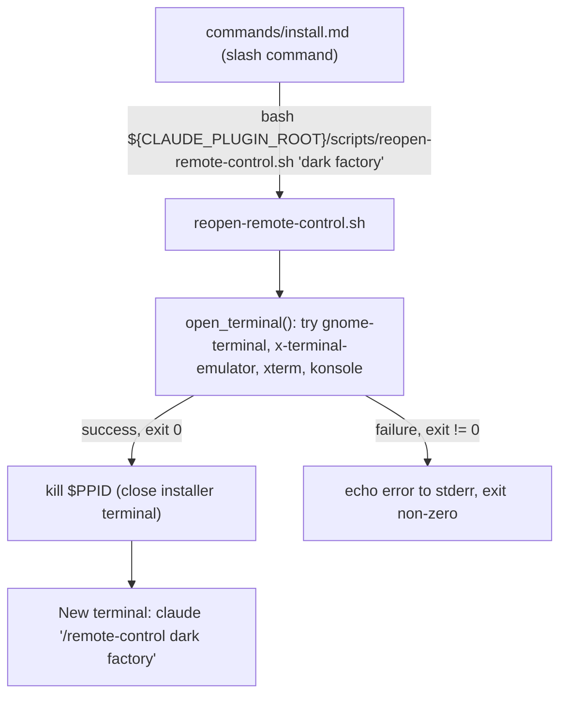

# reopen-remote-control

## Metadata

- System type: `flow`
- Owner: dark-factory plugin
- Source file: `scripts/reopen-remote-control.sh`

## System Intent

- What this is: A shell script invoked at the end of the `/dark-factory:install` command. It opens a new terminal window running Claude in remote-control mode (`claude "/remote-control <name>"`), then closes the installer terminal by killing its parent process (`kill $PPID`). This ensures the developer ends up in a clean Claude remote-control session without the stale installer terminal lingering.
- Primary consumer(s): The `commands/install.md` slash command; called as `bash "${CLAUDE_PLUGIN_ROOT}/scripts/reopen-remote-control.sh" "dark factory"`.
- Boundary: Responsible only for terminal lifecycle management — launching the new Claude terminal and cleaning up the installer terminal. All plugin installation logic runs before this script is called.

## Mermaid Diagram



## Flows

### Flow: `reopen-remote-control`

- Core files: `scripts/reopen-remote-control.sh`

#### Types

```txt
ReopenInput {
  name: string (optional, default: "dark factory" — remote-control session name passed as $1)
}

ReopenOutput {
  void (side effects: new terminal opened, installer terminal closed)
}

StandardError {
  message: string (written to stderr; e.g. "No terminal emulator found" or "Failed to open terminal")
}
```

#### Paths

| path | input | output | path-type | notes |
| --- | --- | --- | --- | --- |
| `reopen-remote-control.success` | `ReopenInput` | `ReopenOutput` | `happy path` | Terminal opens successfully (exit 0); installer terminal closed via `kill $PPID` |
| `reopen-remote-control.kill-warning` | `ReopenInput` | `ReopenOutput` | `degraded` | Terminal opened but `kill $PPID` fails (e.g. no permission); warning written to stderr, new terminal still running |
| `reopen-remote-control.no-emulator` | `ReopenInput` | `StandardError` | `error` | No supported terminal emulator found (gnome-terminal, x-terminal-emulator, xterm, konsole all absent); exits non-zero |
| `reopen-remote-control.open-failed` | `ReopenInput` | `StandardError` | `error` | Terminal emulator found but returned non-zero exit code; installer terminal is NOT closed |

#### Pseudocode

```
NAME = argv[1] ?? "dark factory"
cmd  = "claude \"/remote-control $NAME\""
cwd  = pwd

open_terminal():
  try gnome-terminal --working-directory=$cwd -- bash -c "$cmd"  → return
  try x-terminal-emulator -e bash -c "$cmd"                      → return
  try xterm -e bash -c "$cmd"                                     → return
  try konsole --workdir $cwd -e bash -c "$cmd"                    → return
  echo error; return 1

TERMINAL_EXIT = open_terminal()

if TERMINAL_EXIT == 0 and PPID > 0:
    kill $PPID   # close installer terminal; warn on failure
else if TERMINAL_EXIT != 0:
    echo error; exit TERMINAL_EXIT
```

## Logs

| Source | Location |
|--------|----------|
| script stderr | terminal session running the install command |

## Deployment

- Mechanism: `local only`
- Deploy command:
  ```bash
  # Called automatically by the /dark-factory:install slash command.
  # Can also be invoked directly (from a Claude Code session where CLAUDE_PLUGIN_ROOT is set):
  bash "${CLAUDE_PLUGIN_ROOT}/scripts/reopen-remote-control.sh" "dark factory"
  ```
- Notes: Must be run from the repo root or any directory where `pwd` resolves to the desired working directory for the new Claude session. The script requires at least one of: gnome-terminal, x-terminal-emulator, xterm, or konsole.
