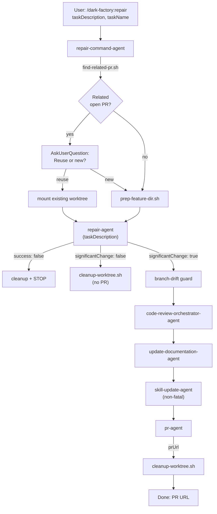

# repair-command-agent

## Metadata

- System type: `flow`

## System Intent

- What this is: The `repair-command-agent` backs the `/dark-factory:repair` slash command. It orchestrates targeted repairs: checks for related open PRs, creates or reuses a git worktree, delegates to `repair-agent` to apply changes, then conditionally runs the post-execution pipeline depending on whether the repair was significant. Insignificant repairs skip code review and PR — cleanup happens immediately. State is passed directly between steps as local variables — no `brain.json` is created.

## Mermaid Diagram



## Flows

### Flow: `repairCommand`

- Test files: `N/A`
- Core files: `commands/repair.md`, `agents/dark-factory/agents/repair-command-agent.md`, `agents/repair/agents/repair-agent.md`

#### Types

```txt
RepairCommandInput {
  taskDescription: string (required — description of targeted change)
  taskName:        string (optional — derived if absent)
}

RepairCommandOutput {
  prUrl:             string
  significantChange: boolean
}

StandardError {
  message: string (human-readable description of what went wrong)
}
```

#### Paths

| path | input | output | path-type | notes |
| --- | --- | --- | --- | --- |
| `repairCommand.success` | `RepairCommandInput` | `RepairCommandOutput` | happy path | repair applied, tests passing, PR opened (for significant changes) |
| `repairCommand.insignificant` | `RepairCommandInput` | `{ significantChange: false }` | happy path | repair applied but no PR opened (fast path) |
| `repairCommand.test-failure` | `RepairCommandInput` | `StandardError` | error | repair-agent could not fix new test failures within 5 iterations |
| `repairCommand.prep-failure` | `RepairCommandInput` | `StandardError` | error | worktree prep failed |
| `repairCommand.drift-guard-failure` | `RepairCommandInput` | `StandardError` | error | repair made no commits (for significant changes) |

#### Pseudocode

```
repair-command-agent(taskDescription, taskName):

  # Step 1 — derive taskName slug
  if taskName is empty:
    taskName = "repair-" + slugify(taskDescription)

  # Step 2 — PR reuse check + worktree prep
  PROJECT_DIR = bash("git rev-parse --show-toplevel")
  relatedPrOutput = bash("find-related-pr.sh taskDescription") || ""
  EXISTING_BRANCH = extract BRANCH= from relatedPrOutput
  ... (PR reuse + worktree prep, same pattern as plan-command-agent) ...
  branchRef = USE_EXISTING ? EXISTING_BRANCH : "feature/" + taskName

  # Step 3 — invoke repair-agent (no brain.json created)
  result = invoke repair-agent({ taskDescription })

  if result.success == false:
    run cleanup(WORK_DIR, taskName)
    report error: "Repair failed after 5 iterations: " + result.error.message
    STOP

  # Step 4 — fast path for insignificant changes
  if result.significantChange == false:
    bash("cleanup-worktree.sh WORK_DIR taskName")
    Report: "Repair applied (insignificant change — no PR opened)."
    STOP

  # Step 5 — branch drift guard (only for significant changes)
  if no commits ahead of main: cleanup + STOP

  # Steps 6-9 — post-execution pipeline
  invoke code-review-orchestrator-agent({
    planFilePath: "Task: " + taskDescription,
    codePath: WORK_DIR
  })
  invoke update-documentation-agent({ planFilePath: null, workDir: WORK_DIR })
  try: invoke skill-update-agent({ planFilePath: null, workDir: WORK_DIR, taskSummary: taskDescription })
  prResult = invoke pr-agent({ taskDescription })

  bash("cleanup-worktree.sh WORK_DIR taskName")
  Report: "Repair complete. PR: " + prResult.prUrl
  STOP
```

## Logs

| Source | Location |
|--------|----------|
| command agent stdout | PR URL reported directly on completion (or "insignificant change" notice) |

## Deployment

- Mechanism: `local only`
- Deploy command:
  ```bash
  /dark-factory:repair
  ```
- Notes: Invoked as a Claude Code slash command. Requires the dark-factory plugin installed. Insignificant repairs (as determined by repair-agent's `significantChange` flag) skip code review and PR opening entirely. The worktree is cleaned up in all cases.
