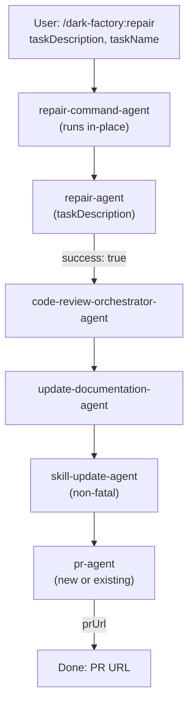

# /dark-factory:repair

Applies a small targeted change — no plan required, runs tests in a loop until green, opens a PR.

## Flow

## See also

- [repair-agent](repair-agent.md) — applies targeted fixes with iterative testing
- [code-review-orchestrator-agent](code-review-orchestrator-agent.md) — reviews code changes
- pr-agent — opens/updates PR
