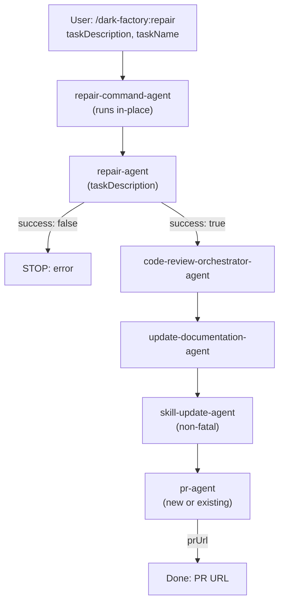

# repair-command-agent

## Metadata

- System type: `flow`

## System Intent

- What this is: The `repair-command-agent` backs the `/dark-factory:repair` slash command. It runs in-place in whatever working directory (worktree) it is invoked from — worktree setup is handled by `gotoworktree-command-agent` separately. It delegates to `repair-agent` to apply targeted changes, then always runs the post-execution pipeline (code review → docs → skills → PR). The pr-agent naturally handles both new PR creation and reuse of existing PRs on the branch. State is passed directly between steps as local variables — no `brain.json` is created.

## Mermaid Diagram



## Flows

### Flow: `repairCommand`

- Test files: `N/A`
- Core files: `commands/repair.md`, `agents/dark-factory/agents/repair-command-agent.md`, `agents/repair/agents/repair-agent.md`

#### Types

```txt
RepairCommandInput {
  taskDescription: string (required — description of targeted change)
  taskName:        string (optional — derived if absent)
}

RepairCommandOutput {
  prUrl: string
}

StandardError {
  message: string (human-readable description of what went wrong)
}
```

#### Paths

| path | input | output | path-type | notes |
| --- | --- | --- | --- | --- |
| `repairCommand.success` | `RepairCommandInput` | `RepairCommandOutput` | happy path | repair applied, tests passing, PR opened (new or existing) |
| `repairCommand.test-failure` | `RepairCommandInput` | `StandardError` | error | repair-agent could not fix new test failures within 5 iterations |

#### Pseudocode

```
repair-command-agent(taskDescription, taskName):

  # Step 1 — derive taskName slug
  if taskName is empty:
    taskName = "repair-" + slugify(taskDescription)

  PROJECT_DIR = bash("git rev-parse --show-toplevel")

  # Step 2 — invoke repair-agent (no brain.json created)
  result = invoke repair-agent({ taskDescription })

  if result.success == false:
    report error: "Repair failed after 5 iterations: " + result.error.message
    STOP

  # Steps 3-6 — post-execution pipeline
  invoke code-review-orchestrator-agent({
    planFilePath: "Task: " + taskDescription,
    codePath: PROJECT_DIR
  })
  invoke update-documentation-agent({ planFilePath: null, workDir: PROJECT_DIR })
  try: invoke skill-update-agent({ planFilePath: null, workDir: PROJECT_DIR, taskSummary: taskDescription })
  prResult = invoke pr-agent({ planFilePath: taskDescription, workDir: PROJECT_DIR })

  Report: "Repair complete. PR: " + prResult.prUrl
  STOP
```

## Logs

| Source | Location |
|--------|----------|
| command agent stdout | PR URL reported directly on completion (or "insignificant change" notice) |

## Deployment

- Mechanism: `local only`
- Deploy command:
  ```bash
  /dark-factory:repair
  ```
- Notes: Invoked as a Claude Code slash command. Requires the dark-factory plugin installed. The agent runs in-place in the current directory — use `/dark-factory:gotoworktree` first to land in the correct worktree. All repairs go through the full post-execution pipeline (code review, docs, skills, PR). The pr-agent handles both new PR creation and reuse of existing PRs on the branch via `gh pr view`.
