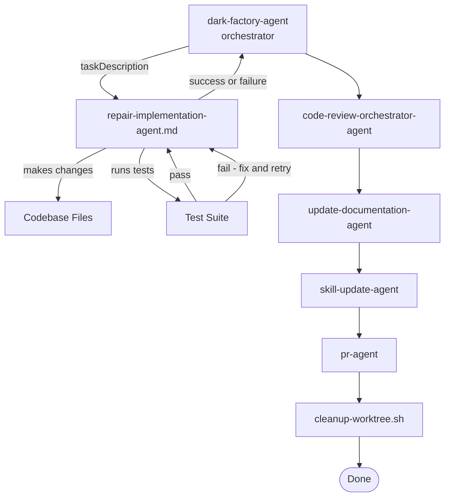

# repair

## Metadata

- System type: `flow`

## System Intent

- What this is: A lightweight repair worker. Given a task description, it delegates implementation directly to `repair-implementation-agent` (no planning phase) and returns. Worktree prep, code review, documentation update, skills update, PR, and cleanup are all handled by the `dark-factory-agent` orchestrator. It is designed for quick targeted fixes where the change is already clear and no design phase is needed.

## Mermaid Diagram



## Flows

### Flow: `repairWorker`

- Core files: `agents/repair/agents/repair-implementation-agent.md`

#### Types

```txt
RepairWorkerInput {
  taskDescription: string (verbatim user request — what to fix or change)
}

RepairWorkerOutput {
  success: boolean
}

StandardError {
  message: string (human-readable description of what went wrong)
}
```

#### Paths

| path | input | output | path-type | notes |
| --- | --- | --- | --- | --- |
| `repairWorker.success` | `RepairWorkerInput` | `RepairWorkerOutput{success: true}` | `happy path` | change applied, tests pass; orchestrator continues to code review, docs, PR, cleanup |
| `repairWorker.implementation-failure` | `RepairWorkerInput` | `StandardError` | `error` | repair-implementation-agent returns success=false after 5 retries; orchestrator runs cleanup |

#### Pseudocode

```
repair-implementation-agent(taskDescription):

  # Already inside the isolated worktree when invoked — no prep needed.

  # Step 1 — implement directly (no planning, no routing)
  Apply the targeted change. Stay minimal — do not refactor or expand scope.

  If result.success == false:
    report result.error.message and STOP

  Return: success
  # Orchestrator (dark-factory-agent) handles code review, docs, skills, PR, and cleanup.
```

---

### Flow: `repairImplementation`

- Core files: `agents/repair/agents/repair-implementation-agent.md`

#### Types

```txt
RepairImplementationInput {
  taskDescription: string
}

RepairImplementationOutput {
  success: boolean
  significantChange: boolean  -- true if change touches public API, agent instructions, skills, or user-facing commands
  error?: StandardError       -- present only when success=false
}
```

#### Paths

| path | input | output | path-type | notes |
| --- | --- | --- | --- | --- |
| `repairImplementation.success` | `RepairImplementationInput` | `RepairImplementationOutput{success: true}` | `happy path` | changes applied, all tests pass |
| `repairImplementation.no-tests` | `RepairImplementationInput` | `RepairImplementationOutput{success: true}` | `happy path` | no test suite found; changes applied and success returned without test verification |
| `repairImplementation.test-failure-retry` | `RepairImplementationInput` | loop | `loop` | tests fail; diagnose, fix, re-run — up to 5 iterations |
| `repairImplementation.test-failure-exhausted` | `RepairImplementationInput` | `RepairImplementationOutput{success: false}` | `error` | retry limit (5) reached with tests still failing |

#### Pseudocode

```
repair-implementation-agent(taskDescription):

  # Step 1 — understand what needs to change
  Read relevant files. Identify the minimal set of files that need modification.

  # Step 2 — apply the change
  Make the targeted change. Stay minimal — do not refactor or expand scope.
  Track which files were modified.

  # Step 3 — detect significance
  significantChange = false
  If any modified file is:
    - An agent instruction file (*.md in agents/)
    - A skill definition (SKILL.md)
    - A user-facing command (inside commands/)
    - A public API or interface boundary
  Then: significantChange = true

  # Step 4 — run tests
  Detect test runner by checking for: pytest, npm test, go test, etc.
  If no test suite found:
    return { success: true, significantChange }

  MAX_RETRIES = 5
  retries = 0
  LOOP:
    Run full test suite
    If all tests pass:
      return { success: true, significantChange }
    retries += 1
    If retries >= MAX_RETRIES:
      return { success: false, significantChange,
               error: { message: "Tests still failing after <retries> fix attempts: <last failure summary>" } }
    Read test output, identify root cause, apply targeted fix
    CONTINUE LOOP
```

## Logs

| Source | Location |
|--------|----------|
| repair-implementation-agent | stdout / Claude Code conversation |

## Deployment

- Mechanism: `local only`
- Deploy command:
  ```bash
  # No deployment needed — agent and skill .md files are used directly by Claude Code.
  # After adding files, update the locally installed plugin:
  claude plugin marketplace add "$(pwd)"
  claude plugin update dark-factory
  claude plugin list   # confirm repair skill appears
  ```
- Notes: Changes take effect immediately when files are added. No changes to `plugin.json` are required because `"./skills/"` already covers `skills/repair/SKILL.md`.
