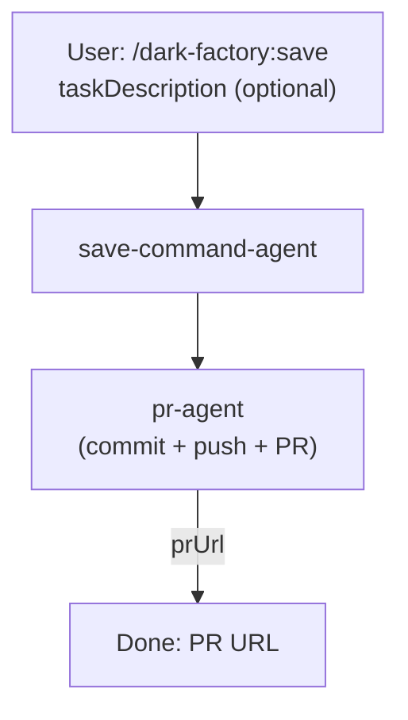

# /dark-factory:save

Commits current changes and opens (or updates) a PR — lightweight shortcut that skips code review, docs, and skills pipeline.

## Flow

## See also

- pr-agent — commits, pushes, and opens/updates PR
- [/dark-factory:repair](repair-command-agent.md) — for targeted changes that need review and testing
