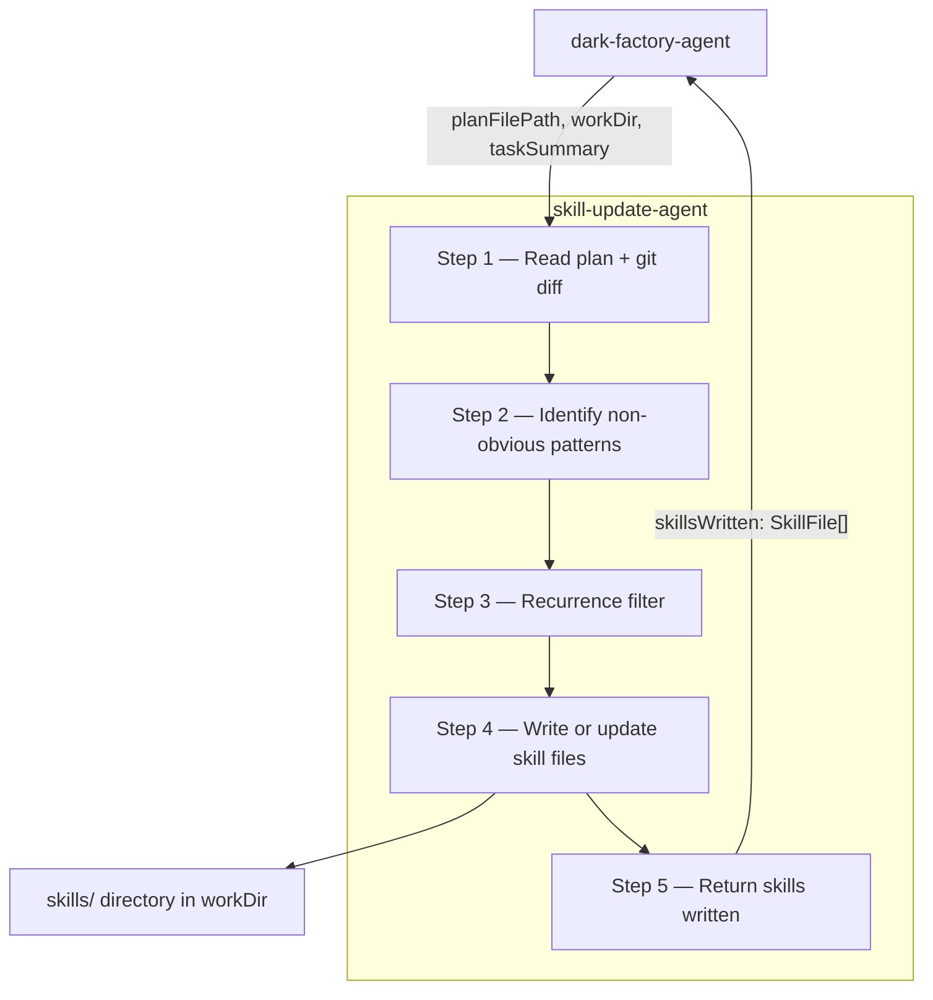

# skill-update-agent

## Metadata

- System type: `agent`

## System Intent

- What this is: An agent that runs near the end of the `dark-factory-agent` manufacture loop (after code review and doc updates, before the PR step). It reviews the work that was just completed, identifies non-obvious patterns or workarounds encountered during the task, and — only when those patterns are likely to recur — writes or updates skill files in the target project's `skills/` directory so future manufacture runs benefit from that knowledge. It is non-fatal: if it errors, the manufacture loop continues to the PR step.

## Mermaid Diagram



## Flows

### Flow: `skillUpdateAgent`

- Test files: N/A (agent instruction file, no automated tests)
- Core files:
  - `agents/skill-update/agents/skill-update-agent.md` (agent instruction file)

#### Types

```txt
SkillUpdateInput {
  planFilePath:  string | null  (path to the approved plan file, or null)
  workDir:       string         (absolute path to the isolated work dir)
  taskSummary:   string         (brief human-readable description of what was accomplished)
}

SkillUpdateOutput {
  skillsWritten: SkillFile[]   (may be empty — agent wrote zero skills if nothing qualified)
}

SkillFile {
  path:    string  (relative path within workDir, e.g. "skills/handle-git-conflicts/SKILL.md")
  action:  "created" | "updated"
}

StandardError {
  message: string (human-readable description of what went wrong)
}
```

#### Paths

| path | input | output | path-type | notes |
| --- | --- | --- | --- | --- |
| `skillUpdateAgent.noSkillsNeeded` | `SkillUpdateInput` | `SkillUpdateOutput { skillsWritten: [] }` | happy path | Agent determines no non-obvious recurring patterns exist; returns empty list |
| `skillUpdateAgent.skillsWritten` | `SkillUpdateInput` | `SkillUpdateOutput` | happy path | One or more skill files written/updated in `skills/`; list returned |
| `skillUpdateAgent.readError` | `SkillUpdateInput` | `StandardError` | error | Cannot read plan file or git diff; agent reports error; caller logs a warning and continues to PR (non-fatal) |

#### Pseudocode

```
skill-update-agent(planFilePath, workDir, taskSummary):

  # Step 1 — gather context
  if planFilePath is not null:
    read planFilePath to understand what flows were built and why
  run git diff HEAD~1 or git log --oneline -5 in workDir to see what changed

  # Step 2 — identify candidate patterns
  For each non-obvious thing encountered during the task
  (detected by: comments like "NOTE", "WORKAROUND", "HACK", "non-obvious",
   repeated lookups in the plan pseudocode, deviations that were resolved,
   things the agent had to figure out that aren't documented anywhere):
    add to candidatePatterns list

  # Step 3 — recurrence filter
  For each candidate in candidatePatterns:
    Ask: "Is this specific to this one task, or would a future agent hit the same wall?"
    If task-specific only (e.g. a one-off data migration quirk): discard
    If general and likely to recur (e.g. "how to do X in this codebase"): keep

  if filteredPatterns is empty:
    return { skillsWritten: [] }

  # Step 4 — write/update skill files
  For each pattern in filteredPatterns:
    slug = kebab-case name for the pattern
    skillPath = "skills/<slug>/SKILL.md"

    if skillPath already exists in workDir:
      read existing skill, merge new knowledge, write updated file
      record { path: skillPath, action: "updated" }
    else:
      write new SKILL.md using the skill template
      record { path: skillPath, action: "created" }

  # Step 5 — return
  return { skillsWritten: [recorded SkillFile entries] }
```

## Logs

| Source | Location |
|--------|----------|
| skill-update-agent stdout | terminal / caller stdout |

## Deployment

- Mechanism: `local only`
- Deploy command:
  ```bash
  # No deployment step — agent is a markdown file checked into the repo.
  # Invoked automatically by dark-factory-agent as Step 4c.
  ```
- Notes: Non-fatal. If it errors, `dark-factory-agent` logs a warning and continues to the PR step. The manufacture loop is never blocked by skill-writing failures.
