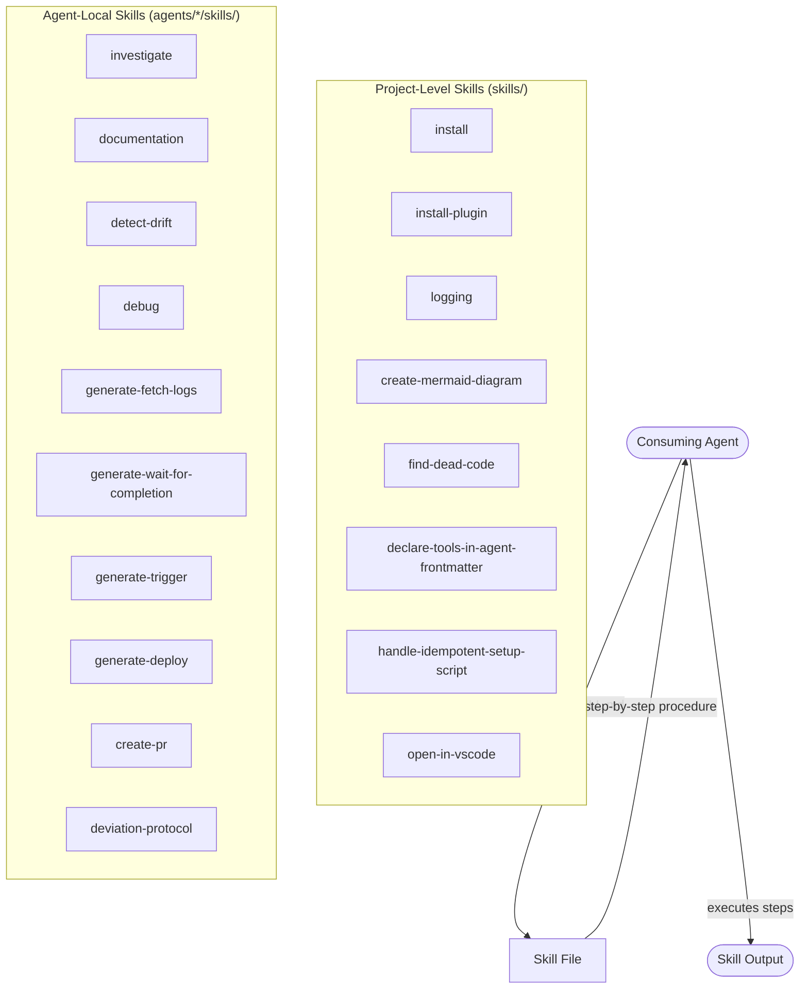

# Skills

## Metadata

- System type: `library`
- Owner: dark-factory plugin
- Source directories: `skills/` (project-level), `agents/*/skills/` (agent-local)
- Skill count: 8 project-level + 10 agent-local = 18 skills total

## System Intent

- What this is: Skills are markdown procedure files (`SKILL.md`) that agents read and follow during execution. They are not agents — they have no invocation lifecycle of their own. An agent reads a skill file and executes its steps. Skills encode non-obvious, reusable procedures that would otherwise be duplicated across agents.
- Primary consumer(s): Dark Factory agents (referenced in agent front-matter `skills:` field). Some skills are also user-invocable as slash commands.
- Boundary: Skill files are read-only inputs to agents. Skills do not write files, call tools, or produce outputs directly — the consuming agent does.

## Mermaid Diagram



## Flows

### Flow: `projectLevelSkills`

- Core files: `skills/install/SKILL.md`, `skills/install-plugin/SKILL.md`, `skills/logging/SKILL.md`, `skills/create-mermaid-diagram/SKILL.md`, `skills/find-dead-code/SKILL.md`, `skills/declare-tools-in-agent-frontmatter/SKILL.md`, `skills/handle-idempotent-setup-script/SKILL.md`, `skills/open-in-vscode/SKILL.md`

#### Types

```txt
SkillInput {
  agentContext: string (the task description or file path provided by the consuming agent)
}

SkillOutput {
  result: string (what the consuming agent produces after following skill steps)
}

StandardError {
  message: string (human-readable description of what went wrong)
}
```

#### Paths

| path | input | output | path-type | notes |
| --- | --- | --- | --- | --- |
| `install.pluginMarketplace` | `SkillInput{marketplace install}` | `SkillOutput` | `happy path` | Installs via `claude plugin marketplace add` then `claude plugin install dark-factory` |
| `install-plugin.localPath` | `SkillInput{local plugin path}` | `SkillOutput` | `happy path` | Installs a Claude Code plugin from a local directory path |
| `logging.instrumentFlow` | `SkillInput{plan/bug/doc path}` | `SkillOutput{logging-checklist checked}` | `happy path` | Extracts flows, adds structured log statements at entry/branch/error/exit |
| `create-mermaid-diagram.fromPlan` | `SkillInput{plan or codebase}` | `SkillOutput{mermaid diagram}` | `happy path` | Produces a Mermaid flowchart from a plan file or codebase exploration |
| `find-dead-code.scan` | `SkillInput{codebase}` | `SkillOutput{dead code report}` | `happy path` | Finds exported symbols with no callers, unreachable branches, unused imports |
| `declare-tools-in-agent-frontmatter.fix` | `SkillInput{agent file}` | `SkillOutput{front-matter updated}` | `happy path` | Adds missing tool declarations to agent YAML front-matter |
| `handle-idempotent-setup-script.guard` | `SkillInput{setup script}` | `SkillOutput{script is idempotent}` | `happy path` | Adds existence checks so script is safe to run more than once |
| `open-in-vscode.open` | `SkillInput{file/dir path}` | `SkillOutput{VS Code opened}` | `happy path` | Opens a file or directory in VS Code from an agent context |

---

### Flow: `documentationSkills`

- Core files: `agents/documentation/skills/investigate/SKILL.md`, `agents/documentation/skills/documentation/SKILL.md`, `agents/documentation/skills/detect-drift/SKILL.md`

#### Types

```txt
InvestigateInput {
  systemName: string (name of system to document)
}

DocumentationInput {
  systemName: string
  findings: object (from investigate skill)
}

DriftInput {
  docPath: string (docs/docs/ file to audit)
}
```

#### Paths

| path | input | output | path-type | notes |
| --- | --- | --- | --- | --- |
| `investigate.success` | `InvestigateInput` | system intent, flows, logs, deployment findings | `happy path` | Explores codebase via grep/glob to fill documentation template sections |
| `documentation.write` | `DocumentationInput` | `docs/docs/<system>.md` written | `happy path` | Writes or updates a docs/docs/ file using the documentation template |
| `detect-drift.audit` | `DriftInput` | drift report with stale/missing items | `happy path` | Audits parity between docs/docs/ and actual implementation |
| `detect-drift.fixInPlace` | `DriftInput` | `docs/docs/<system>.md` updated | `branch` | Fixes straightforward drift without escalating |

---

### Flow: `debuggerSkills`

- Core files: `agents/debugger/skills/debug/SKILL.md`

#### Types

```txt
DebugInput {
  bugDescription: string
  logPath: string | null
}

DebugOutput {
  bugFilePath: string (docs/bugs/<date>-<slug>.md)
  rootCauseConfirmed: boolean
}
```

#### Paths

| path | input | output | path-type | notes |
| --- | --- | --- | --- | --- |
| `debug.systematicDebugging` | `DebugInput` | `DebugOutput` | `happy path` | Follows Lewibs bug template: failing test → root cause → fix → confirm pass |

---

### Flow: `fixFlowSkills`

- Core files: `agents/fix-flow/skills/generate-fetch-logs/SKILL.md`, `agents/fix-flow/skills/generate-wait-for-completion/SKILL.md`, `agents/fix-flow/skills/generate-trigger/SKILL.md`, `agents/fix-flow/skills/generate-deploy/SKILL.md`

#### Types

```txt
ScriptGenInput {
  systemDiagramPath: string (docs/plans/system-diagram.md)
}

ScriptOutput {
  scriptPath: string (path to generated .sh file)
}
```

#### Paths

| path | input | output | path-type | notes |
| --- | --- | --- | --- | --- |
| `generate-trigger.create` | `ScriptGenInput` | `ScriptOutput{trigger.sh}` | `happy path` | Generates a script to fire the integration flow |
| `generate-wait-for-completion.create` | `ScriptGenInput` | `ScriptOutput{wait-for-completion.sh}` | `happy path` | Generates a polling script that waits for flow to reach terminal state |
| `generate-fetch-logs.create` | `ScriptGenInput` | `ScriptOutput{fetch-logs.sh}` | `happy path` | Generates a script to pull all relevant logs |
| `generate-deploy.create` | `ScriptGenInput` | `ScriptOutput{deploy.sh}` | `branch` | Optional; only generated when fixes cannot be tested locally |

---

### Flow: `prSkills`

- Core files: `agents/pr/skills/create-pr/SKILL.md`

#### Types

```txt
PRSkillInput {
  branchName: string
  prBodyPath: string
}

PRSkillOutput {
  prUrl: string
  merged: boolean
}
```

#### Paths

| path | input | output | path-type | notes |
| --- | --- | --- | --- | --- |
| `create-pr.open` | `PRSkillInput` | `PRSkillOutput` | `happy path` | Opens PR via `gh pr create`, watches CI, resolves comments, squash-merges |

---

### Flow: `deviationProtocol`

- Core files: `agents/featurework/execution/skills/deviation-protocol/SKILL.md`

#### Types

```txt
DeviationInput {
  conflictDescription: string (what in the plan cannot be resolved)
}

DeviationOutput {
  action: "course-correct" | "hard-stop"
  instructions: string | null
}
```

#### Paths

| path | input | output | path-type | notes |
| --- | --- | --- | --- | --- |
| `deviation-protocol.courseCorrect` | `DeviationInput` | `DeviationOutput{action=course-correct}` | `happy path` | Developer provides updated instructions; implementation-agent resumes |
| `deviation-protocol.hardStop` | `DeviationInput` | `DeviationOutput{action=hard-stop}` | `error` | Developer cannot resolve conflict; implementation halts |

## Logs

| Source | Location |
|--------|----------|
| N/A | Skills are markdown procedure files; they produce no structured runtime log output. The consuming agent's session text is the only observable output. |

## Deployment

- Mechanism: `local only`
- Deploy command:
  ```bash
  # Skills are bundled with the plugin and loaded by agents at runtime.
  # No deployment step — install the plugin with:
  claude plugin install dark-factory
  ```
- Notes: Skills live in the plugin repository. They are read by agents during Claude Code sessions on the developer's local machine. There is no remote runtime.

## Skill File Format

```
---
name: <slug>
description: "<one sentence: what this skill does and when to use it>"
user-invocable: false
---
## When to use
<condition>

## Steps
<numbered steps>

## Notes
<caveats or gotchas>
```

Skills written by `skill-update-agent` follow this template exactly. Existing skills are merged (never overwritten) when the agent identifies the same pattern recurs.
