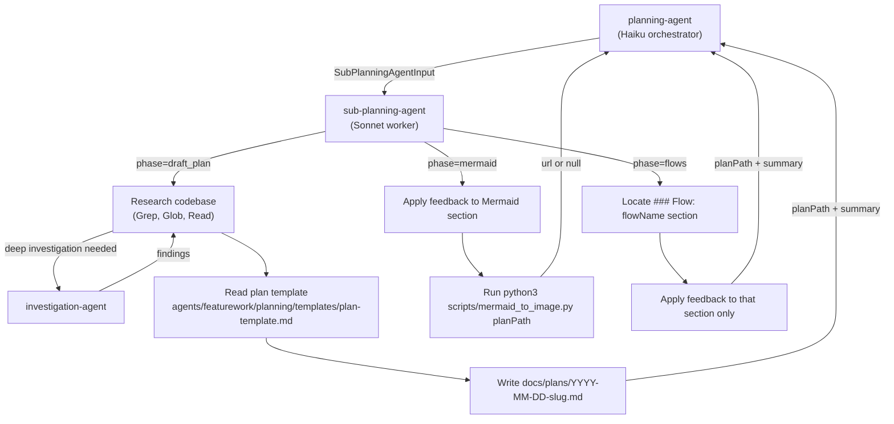

# sub-planning-agent

## Metadata

- System type: `flow`
- Owner: dark-factory plugin
- Source directory: `agents/featurework/planning/agents/`

## System Intent

- What this is: The sub-planning-agent is the worker in the two-agent planning system. It handles all heavy reasoning — researching the codebase, writing plan files, updating mermaid diagrams, and refining flow sections. It is spawned by the planning-agent orchestrator for each planning phase and returns structured output.
- Primary consumer(s): planning-agent (Haiku orchestrator) — spawns sub-planning-agent for each of the three planning phases.
- Boundary: Accepts a `SubPlanningAgentInput` with a `phase` field; writes or updates plan files; runs mermaid scripts; returns `SubPlanningAgentOutput`. Never interacts with the developer directly.

## Mermaid Diagram



## Flows

### Flow: `draftPlan`

- Test files: `N/A`
- Core files: `agents/featurework/planning/agents/sub-planning-agent.md`, `agents/featurework/planning/templates/plan-template.md`

#### Types

```txt
SubPlanningAgentInput {
  phase: "draft_plan"
  planPath: null
  feedback: string  (the feature description from feature-agent, passed through planning-agent)
  flowName: null
}

SubPlanningAgentOutput {
  planPath: string  (absolute path to newly created plan file)
  url: null
  summary: string
}

StandardError {
  message: string (human-readable description of what went wrong)
}
```

#### Paths

| path | input | output | path-type | notes |
| --- | --- | --- | --- | --- |
| `draftPlan.success` | `SubPlanningAgentInput (phase=draft_plan)` | `SubPlanningAgentOutput` | happy path | researches codebase via Grep/Glob/Read; optionally spawns investigation-agent for deep investigation; reads plan template; creates `docs/plans/<YYYY-MM-DD>-<slug>.md`; fills in System Intent, Stage Gate Tracker, placeholder Mermaid Diagram |
| `draftPlan.investigationError` | `SubPlanningAgentInput (phase=draft_plan)` | `SubPlanningAgentOutput` | graceful degradation | investigation-agent returns error; error is logged as comment in System Intent section; plan creation continues |
| `draftPlan.error` | `SubPlanningAgentInput (phase=draft_plan)` | `StandardError` | error | sub-planning-agent cannot create the plan file |

#### Pseudocode

```
sub-planning-agent (phase=draft_plan):
  treat feedback as the feature description
  research codebase: Grep, Glob, Read relevant files
  if deep investigation needed:
    spawn investigation-agent(topic)
    on error: log as comment in System Intent, continue
  read agents/featurework/planning/templates/plan-template.md
  create docs/plans/<YYYY-MM-DD>-<slug>.md (date = today, slug from description)
  fill in: System Intent, Stage Gate Tracker, placeholder Mermaid Diagram
  return { planPath, url: null, summary }
```

---

### Flow: `mermaidPhase`

- Test files: `N/A`
- Core files: `agents/featurework/planning/agents/sub-planning-agent.md`, `scripts/mermaid_to_image.py`

#### Types

```txt
SubPlanningAgentInput {
  phase: "mermaid"
  planPath: string
  feedback: string  ("none" if no changes requested)
  flowName: null
}

SubPlanningAgentOutput {
  planPath: string
  url: string | null  (mermaid.ink URL; null if script fails or produces no output)
  summary: string
}
```

#### Paths

| path | input | output | path-type | notes |
| --- | --- | --- | --- | --- |
| `mermaidPhase.success` | `SubPlanningAgentInput (phase=mermaid)` | `SubPlanningAgentOutput (url=non-null)` | happy path | applies feedback to Mermaid Diagram section if feedback != "none"; runs script with `MERMAID_SKIP_VALIDATE=1`; captures stdout as url; falls back to inline base64 Python if script fails |
| `mermaidPhase.noUrl` | `SubPlanningAgentInput (phase=mermaid)` | `SubPlanningAgentOutput (url=null)` | graceful degradation | both script and inline fallback fail (e.g., no mermaid block in plan); url = null |
| `mermaidPhase.noFeedback` | `SubPlanningAgentInput (feedback="none")` | `SubPlanningAgentOutput` | happy path | skips diagram edit, only runs script and returns url |

#### Pseudocode

```
sub-planning-agent (phase=mermaid):
  read planPath
  if feedback != "none":
    apply feedback changes to ## Mermaid Diagram section
    write updated plan file
  run: MERMAID_SKIP_VALIDATE=1 python3 scripts/mermaid_to_image.py <planPath>
  capture stdout as url
  if exit_code != 0 or url is empty/whitespace:
    # inline Python fallback
    extract mermaid_string from plan file (content between ```mermaid and ```)
    if mermaid_string found:
      encoded = base64.urlsafe_b64encode(mermaid_string.encode("utf-8")).decode("utf-8")
      url = f"https://mermaid.ink/img/{encoded}"
    else:
      url = null
  return { planPath, url, summary }
```

---

### Flow: `flowsPhase`

- Test files: `N/A`
- Core files: `agents/featurework/planning/agents/sub-planning-agent.md`

#### Types

```txt
SubPlanningAgentInput {
  phase: "flows"
  planPath: string
  feedback: string  (developer's requested changes for this flow section)
  flowName: string  (the ### Flow: name to update)
}

SubPlanningAgentOutput {
  planPath: string
  url: null
  summary: string
}
```

#### Paths

| path | input | output | path-type | notes |
| --- | --- | --- | --- | --- |
| `flowsPhase.success` | `SubPlanningAgentInput (phase=flows)` | `SubPlanningAgentOutput` | happy path | locates `### Flow: <flowName>` section in plan; applies feedback changes to types, paths table, and/or pseudocode; writes updated plan file; leaves all other sections untouched |
| `flowsPhase.error` | `SubPlanningAgentInput (phase=flows)` | `StandardError` | error | flowName section not found or write fails |

#### Pseudocode

```
sub-planning-agent (phase=flows):
  read planPath
  locate ### Flow: <flowName> section
  apply feedback changes to that section only (types, paths, pseudocode)
  write updated plan file (Edit tool — surgical edit)
  return { planPath, url: null, summary }
```

## Logs

| Source | Location |
|--------|----------|
| sub-planning-agent output | Claude Code session transcript |
| plan files | `docs/plans/<YYYY-MM-DD>-<slug>.md` |
| mermaid URL | returned in SubPlanningAgentOutput.url; orchestrator pushes via PushNotification |

## Deployment

- Mechanism: `local only` — spawned as a sub-agent by planning-agent inside Claude Code
- Deploy command:
  ```bash
  # No deploy needed — agent .md file is used directly by Claude Code
  ```
- Notes: Changes to sub-planning-agent.md take effect immediately on next invocation. Model is `sonnet` — all heavy reasoning runs here, not in the Haiku orchestrator.
