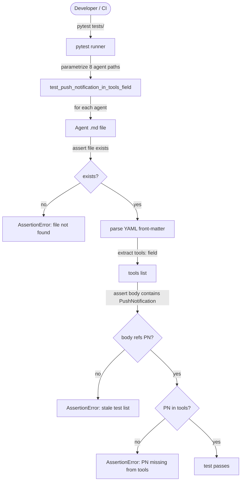

# Tests

## Metadata

- System type: `library`
- Owner: dark-factory plugin
- Source directory: `tests/`
- Test framework: `pytest`
- Test file count: 2

## System Intent

- What this is: The `tests/` directory contains regression tests that guard against known failure modes discovered during development. Tests are written in Python and run with `pytest`. Currently one test file guards against a silent runtime failure mode where agents omit `PushNotification` from their front-matter `tools:` field.
- Primary consumer(s): CI systems and developers running `pytest tests/` locally before merging.
- Boundary: Tests are read-only validators; they do not modify agent files.

## Mermaid Diagram



## Flows

### Flow: `pushNotificationDeclared`

- Test files: `tests/test_push_notification_declared.py`
- Core files: 8 agent `.md` files (see parametrize list below)

#### Types

```txt
AgentFilePath {
  path: string (relative path from project root, e.g. "agents/featurework/agents/feature-agent.md")
}

FrontMatter {
  tools: string[] (comma-separated tool names parsed from YAML --- block)
}

TestResult {
  passed: boolean
  failedCases: string[] (agent paths that failed any assertion)
}
```

#### Paths

| path | input | output | path-type | notes |
| --- | --- | --- | --- | --- |
| `pushNotificationDeclared.pass` | `AgentFilePath` | `TestResult{passed=true}` | `happy path` | File exists, body references PushNotification, tools: field includes PushNotification |
| `pushNotificationDeclared.fileNotFound` | `AgentFilePath` | `TestResult{passed=false}` | `error` | Agent file missing from disk; assertion fails with "Agent file not found" |
| `pushNotificationDeclared.staleTestList` | `AgentFilePath` | `TestResult{passed=false}` | `error` | Agent body no longer references PushNotification; test list may be outdated |
| `pushNotificationDeclared.missingFromTools` | `AgentFilePath` | `TestResult{passed=false}` | `error` | Agent calls PushNotification in body but front-matter tools: field does not list it |

#### Pseudocode

```
For each agent_path in AGENTS_USING_PUSH_NOTIFICATION:
  abs_path = PROJECT_ROOT / agent_path
  assert os.path.exists(abs_path)

  content = read(abs_path)

  # Strip front-matter so tools: declaration does not satisfy body check
  fm_end = content.find("\n---", 4)
  body = content[fm_end + 4:]
  assert "PushNotification" in body  # guards against stale test list

  tools = parse_front_matter_tools(content)
  assert "PushNotification" in tools
```

**Parametrized agent paths (8 total):**

- `agents/featurework/agents/feature-agent.md`
- `agents/featurework/planning/agents/planning-agent.md`
- `agents/featurework/execution/agents/execution-agent.md`
- `agents/fix-flow/agents/fix-flow-orchestrator.md`
- `agents/fix-flow/agents/ralph-fix-and-push.md`
- `agents/dark-factory/agents/dark-factory-agent.md`
- `agents/documentation/agents/detect-drift-agent.md`
- `agents/documentation/agents/update-documentation-agent.md`

---

### Flow: `docsTemplateCompliance`

- Test files: `tests/test_docs_template_compliance.py`
- Core files: `docs/docs/agents.md`, `docs/docs/commands.md`, `docs/docs/skills.md`, `docs/docs/tests.md`

#### Types

```txt
DocFilePath {
  path: string (absolute path to a docs/docs/ markdown file)
}

TemplateComplianceResult {
  passed: boolean
  failedDocs: string[] (paths of docs/docs/ files missing required sections)
}
```

#### Paths

| path | input | output | path-type | notes |
| --- | --- | --- | --- | --- |
| `docsTemplateCompliance.pass` | `DocFilePath` | `TemplateComplianceResult{passed=true}` | `happy path` | All required sections (Metadata, Mermaid Diagram, Flows, Logs, Deployment) present; Mermaid block exists; Types+Paths subsections present; Logs has Source table; Deployment has Mechanism field |
| `docsTemplateCompliance.missingSection` | `DocFilePath` | `TemplateComplianceResult{passed=false}` | `error` | One or more of the 5 required top-level sections is absent |
| `docsTemplateCompliance.missingMermaid` | `DocFilePath` | `TemplateComplianceResult{passed=false}` | `error` | Mermaid Diagram section lacks a ```mermaid code block |
| `docsTemplateCompliance.missingFlowSubsections` | `DocFilePath` | `TemplateComplianceResult{passed=false}` | `error` | Flows section missing #### Types or #### Paths subsection |
| `docsTemplateCompliance.missingLogsTable` | `DocFilePath` | `TemplateComplianceResult{passed=false}` | `error` | Logs section has no markdown table with a Source column |
| `docsTemplateCompliance.missingMechanism` | `DocFilePath` | `TemplateComplianceResult{passed=false}` | `error` | Deployment section does not declare `- Mechanism:` |

#### Pseudocode

```
DOCS_ROOT = os.path.dirname(os.path.dirname(os.path.abspath(__file__))) + "/docs/docs"

DOC_FILES = [agents.md, commands.md, skills.md, tests.md]

REQUIRED_SECTIONS = [
  "## Metadata", "## Mermaid Diagram", "## Flows", "## Logs", "## Deployment"
]

For each doc_path in DOC_FILES:
  content = read(doc_path)
  assert all REQUIRED_SECTIONS present in content
  assert "System type:" in content
  assert "```mermaid" in content
  assert "#### Types" in content
  assert "#### Paths" in content
  assert "| Source |" in content
  assert "- Mechanism:" in content
```

**Parametrized doc paths (4 total):**

- `docs/docs/agents.md`
- `docs/docs/commands.md`
- `docs/docs/skills.md`
- `docs/docs/tests.md`

## Logs

| Source | Location |
|--------|----------|
| N/A | pytest writes test results to stdout only. No structured log destinations. Run with `-v` flag for verbose output per test case. |

## Deployment

- Mechanism: `local only`
- Deploy command:
  ```bash
  pytest tests/
  # or verbose:
  pytest tests/test_push_notification_declared.py -v
  ```
- Notes: Tests run locally against the plugin source files on disk. No external services or network calls required. All assertions operate on local file reads.

## Background

These tests were added after the bug documented in `docs/bugs/2026-04-25-push-notification-missing-from-tools.md`, where `PushNotification` calls were silently dropped because agents did not declare the tool in their front-matter. The Claude Code runtime does not raise an error for undeclared tools — it simply skips them, making this failure mode invisible without explicit testing.
