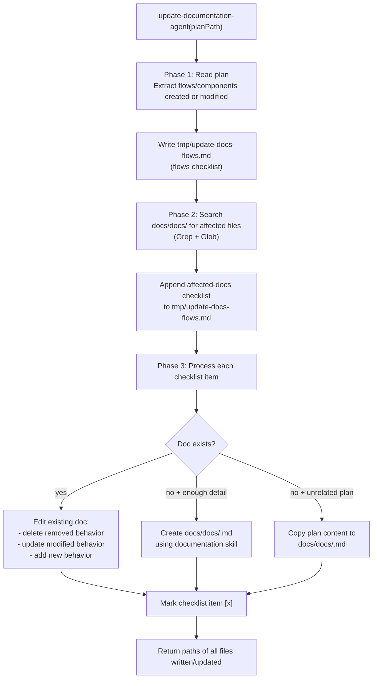

# update-documentation

## Metadata

- System type: `flow`

## System Intent

- What this is: The post-implementation documentation maintenance flow. Given an implemented plan path, identifies every flow/component that was created or modified, locates affected docs in `docs/docs/`, and updates them (or creates new ones) to reflect the changes. Runs after code review and before the PR is opened.

## Mermaid Diagram



## Flows

### Flow: `updateDocumentation`

- Core files: `agents/documentation/agents/update-documentation-agent.md`, `agents/documentation/skills/documentation/SKILL.md`, `agents/documentation/skills/documentation/templates/documentation-template.md`, `skills/create-mermaid-diagram/SKILL.md`

#### Types

```txt
UpdateDocumentationInput {
  planPath: string (required — absolute path to the implemented plan file in docs/plans/)
  brainPath: string (optional — absolute path to brain.json; passed by dark-factory-agent)
}

UpdateDocumentationOutput {
  filesWritten: string[] (paths of all docs/docs/ files written or updated)
}

StandardError {
  message: string (human-readable description of what went wrong)
}
```

#### Paths

| path | input | output | path-type | notes |
| --- | --- | --- | --- | --- |
| `updateDocumentation.success` | `UpdateDocumentationInput` | `UpdateDocumentationOutput` | happy path | all affected docs updated; all new docs created |
| `updateDocumentation.no-existing-doc` | `UpdateDocumentationInput` | `UpdateDocumentationOutput` | happy path | plan references a new flow with no prior doc; new doc created from documentation-template |
| `updateDocumentation.unrelated-plan` | `UpdateDocumentationInput` | `UpdateDocumentationOutput` | happy path | plan is unrelated to any existing system; plan content copied verbatim to new doc |

#### Pseudocode

```
update-documentation-agent(planPath):

  # Phase 1 — identify flows
  read planPath
  extract all flows/services/components created or modified
  write tmp/update-docs-flows.md:
    # Flows Checklist
    - [ ] <flow-name> — created/modified

  # Phase 2 — identify affected docs
  for each flow in flows checklist:
    grep docs/docs/ for files referencing that flow
    if found: append "- [ ] docs/docs/<file>.md — touches <flow-name>"
    if not found: append "- [ ] NEW — <flow-name> has no existing doc"

  # Phase 3 — update docs
  for each checklist item:
    if existing doc:
      edit file: delete removed sections, update modified sections, add new sections
    if new flow + plan has enough detail:
      create docs/docs/<flow-name>.md from documentation-template
      # documentation-template instructs use of skills/create-mermaid-diagram/SKILL.md for diagrams
    if new flow + plan is unrelated:
      copy plan content to docs/docs/<plan-name>.md
    mark item [x]

  return { filesWritten: [...] }
```

## Logs

| Source | Location |
|--------|----------|
| flows checklist | `tmp/update-docs-flows.md` (persisted after run) |
| updated docs | `docs/docs/<flow-name>.md` |

## Deployment

- Mechanism: `local only` — invoked as a sub-agent by dark-factory-agent in Step 4, after code review and before the PR is opened
- Notes: Documentation MUST fully complete before pr-agent is invoked, because pr-agent uses `git add --all` which picks up any docs written here. Passing `null` as planPath is handled gracefully — agent asks for it via PushNotification. dark-factory-agent passes `brainPath`; on entry update-documentation-agent sets `brain.phase = "docs-running"` and on exit writes the list of updated file paths to `brain.docsWritten` and sets `brain.phase = "docs-complete"`. If `brainPath` is not provided or unreadable, brain.json reads/writes are skipped (non-fatal).
