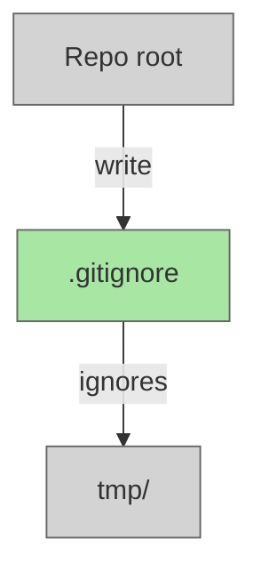

# Add .gitignore to Exclude tmp/

## Plan Metadata

- Plan type: `plan`
- Parent plan: N/A
- Depends on: N/A
- Status: `approved`

## System Intent

- What is being built: A root-level `.gitignore` file that prevents the `tmp/` directory from being committed to the repository.
- Primary consumer(s): All contributors and CI runs on this repo — the `tmp/` directory holds ephemeral agent scratch files that must not appear in version control.
- Boundary (black-box scope only): Only the root `.gitignore` file is touched. No source code, CI config, or other files are modified.

## Stage Gate Tracker

- [x] Stage 1 Mermaid approved
- [x] Stage 2 Flows approved
- [x] Stage 3 Logs + Deployment approved or skipped

## Mermaid Diagram



## Flows

### Global Types

```txt
StandardError {
  message: string (human-readable description of what went wrong)
}
```

### Flow: `addGitignore`

- Test files: N/A
- Core files: `.gitignore`

#### Types

```txt
N/A — pure file creation, no runtime types.
```

#### Paths

| path | input | output | path-type | notes | updated |
| --- | --- | --- | --- | --- | --- |
| `addGitignore.create` | repo root (no .gitignore) | `.gitignore` containing `tmp/` | happy path | file is created fresh | |

#### Pseudocode

```
Create /.gitignore at repo root with the single entry:
  tmp/
```

## Logs

| Source | Location |
|--------|----------|
| N/A | — |

## Deployment

- Mechanism: `local only`
- Deploy command:
  ```bash
  # No deploy step — committing the file is sufficient.
  ```
- Notes: Change takes effect for all contributors once merged to main.
