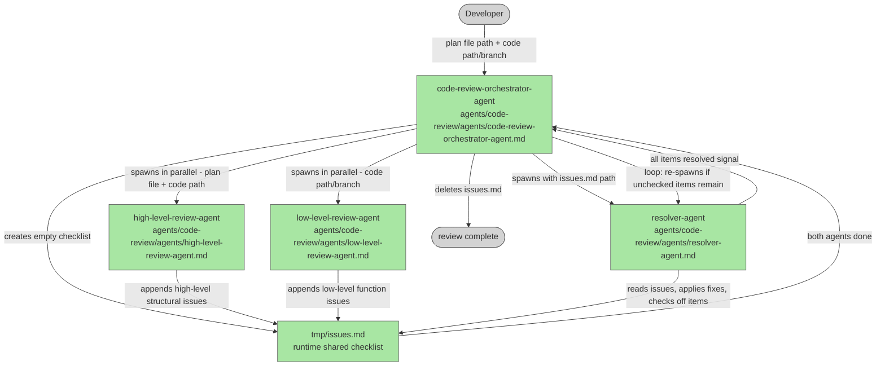

# code-review-orchestrator

## Plan Metadata

- Plan type: `plan`
- Parent plan: N/A
- Depends on: N/A
- Status: `approved`

Status semantics:
- `draft`: Plan is being created or updated and is not final.
- `approved`: Plan is approved but not yet applied in code.
- `documentation`: Code currently exists and matches the plan contract.

Update rule:
- When an existing plan is edited, set status to `draft` until re-approved.

## System Intent

- What is being built: A `code-review` agent group (`agents/code-review/`) consisting of four agents — an orchestrator entry point, two parallel reviewers (high-level and low-level), and a resolver that works through discovered issues and applies fixes.
- Primary consumer(s): Developers who want automated plan-conformance and code-quality review applied to a branch or code path before merging.
- Boundary (black-box scope only): The agent group owns the orchestration loop, the two review agents, and the resolver. The code being reviewed and the plan file it references are external inputs. CI/CD, PR tooling, and the git remote are out of scope.

## Stage Gate Tracker

- [x] Stage 1 Mermaid approved
- [x] Stage 2 Flows approved
- [x] Stage 3 Logs + Deployment approved or skipped

## Mermaid Diagram

> Use the `create-mermaid-diagram` skill to generate this diagram.



## Flows

- Flow naming rule: ``### Flow: `<flowname>` ``
- `N/A` for test files means explicit no-test-required waiver (not a missing mapping).

### Global Types

```txt
StandardError {
  message: string (human-readable description of what went wrong)
}

IssueItem {
  level: "high-level" | "low-level"
  description: string
  filePath: string (file the issue applies to)
  checked: boolean (true once the resolver has applied a fix)
}
```

---

### Flow: `orchestrateReview`
- Test files: N/A
- Core files: `agents/code-review/agents/code-review-orchestrator-agent.md`

#### Types

```txt
OrchestrateReviewInput {
  planFilePath: string (required — absolute path to the approved plan file)
  codePath:     string (required — directory path or branch name containing the code to review)
}

OrchestrateReviewOutput {
  status: "complete" (all issues resolved; issues.md deleted)
}
```

#### Paths

| path | input | output | path-type | notes | updated |
| --- | --- | --- | --- | --- | --- |
| `orchestrateReview.success` | `OrchestrateReviewInput` | `OrchestrateReviewOutput` | happy path | both reviewers complete, resolver loop exits with zero unchecked items, issues.md deleted | |
| `orchestrateReview.no-issues` | `OrchestrateReviewInput` | `OrchestrateReviewOutput` | happy path | both reviewers append nothing; resolver sees empty checklist and no-ops; issues.md deleted | |
| `orchestrateReview.resolver-loop-error` | `OrchestrateReviewInput` | `StandardError` | error | resolver exits with an error on a given iteration; orchestrator surfaces the error and halts | |
| `orchestrateReview.reviewer-error` | `OrchestrateReviewInput` | `StandardError` | error | one or both parallel reviewer agents fail; orchestrator surfaces the error without starting the resolver | |

#### Pseudocode

```
create tmp/issues.md with header "## Issues\n"

spawn in parallel:
  highLevelReview(planFilePath, codePath)
  lowLevelReview(codePath)
wait for both to complete — on any error surface it and halt

loop:
  resolveIssues(tmp/issues.md)         // returns { anyRemaining: boolean }
  if not anyRemaining: break
  // safety: if resolver ran but anyRemaining is still true, re-enter loop

delete tmp/issues.md
return { status: "complete" }
```

---

### Flow: `highLevelReview`
- Test files: N/A
- Core files: `agents/code-review/agents/high-level-review-agent.md`

#### Types

```txt
HighLevelReviewInput {
  planFilePath: string (required — absolute path to the approved plan file)
  codePath:     string (required — directory path or branch containing the code)
}

HighLevelReviewOutput {
  issuesAppended: number (count of IssueItems written to issues.md; 0 if none)
}
```

#### Paths

| path | input | output | path-type | notes | updated |
| --- | --- | --- | --- | --- | --- |
| `highLevelReview.issues-found` | `HighLevelReviewInput` | `HighLevelReviewOutput` | happy path | agent reads plan + code, finds structural/architectural divergences, appends each as an unchecked `IssueItem` (level="high-level") to tmp/issues.md | |
| `highLevelReview.no-issues` | `HighLevelReviewInput` | `HighLevelReviewOutput` | happy path | plan and code are fully aligned; nothing appended; `issuesAppended: 0` | |
| `highLevelReview.plan-not-found` | `HighLevelReviewInput` | `StandardError` | error | planFilePath does not exist or is unreadable | |
| `highLevelReview.code-not-found` | `HighLevelReviewInput` | `StandardError` | error | codePath does not exist or yields no readable files | |

#### Pseudocode

```
read planFilePath → planContent
read all source files under codePath → codeFiles[]

for each architectural/structural concern:
  does the code's module structure match the plan's agent/file layout?
  are the I/O contracts from the plan honoured at call sites?
  are cross-cutting concerns (error handling strategy, shared types) consistent?
  are any plan-mandated flows missing entirely?

for each concern found:
  append to tmp/issues.md:
    "- [ ] [high-level] <description> (<filePath>)"

return { issuesAppended: <count> }
```

---

### Flow: `lowLevelReview`
- Test files: N/A
- Core files: `agents/code-review/agents/low-level-review-agent.md`

#### Types

```txt
LowLevelReviewInput {
  codePath: string (required — directory path or branch containing the code)
}

LowLevelReviewOutput {
  issuesAppended: number (count of IssueItems written to issues.md; 0 if none)
}
```

#### Paths

| path | input | output | path-type | notes | updated |
| --- | --- | --- | --- | --- | --- |
| `lowLevelReview.issues-found` | `LowLevelReviewInput` | `LowLevelReviewOutput` | happy path | agent reads code files, finds function-level issues, appends each as an unchecked `IssueItem` (level="low-level") to tmp/issues.md | |
| `lowLevelReview.no-issues` | `LowLevelReviewInput` | `LowLevelReviewOutput` | happy path | no function-level issues found; nothing appended; `issuesAppended: 0` | |
| `lowLevelReview.code-not-found` | `LowLevelReviewInput` | `StandardError` | error | codePath does not exist or yields no readable files | |

#### Issue categories the agent checks

- Bugs: incorrect logic, off-by-one errors, wrong condition
- Untested / unreachable paths: code paths with no coverage or dead branches
- Inter-agent conflicts: two agents mutating the same resource without coordination
- Refactor opportunities: duplicated logic, over-complex functions, naming clarity

#### Pseudocode

```
read all source files under codePath → codeFiles[]

for each file:
  for each function / block:
    check for bugs (logic errors, wrong conditions, off-by-ones)
    check for untested or unreachable paths
    check for conflicts with other agents (e.g. concurrent writes to shared state)
    check for refactor opportunities (duplication, complexity, naming)

for each issue found:
  append to tmp/issues.md:
    "- [ ] [low-level] <description> (<filePath>)"

return { issuesAppended: <count> }
```

---

### Flow: `resolveIssues`
- Test files: N/A
- Core files: `agents/code-review/agents/resolver-agent.md`

#### Types

```txt
ResolveIssuesInput {
  issuesFilePath: string (required — absolute path to tmp/issues.md)
}

ResolveIssuesOutput {
  anyRemaining: boolean (true if one or more unchecked items could not be resolved in this pass)
}
```

#### Paths

| path | input | output | path-type | notes | updated |
| --- | --- | --- | --- | --- | --- |
| `resolveIssues.all-resolved` | `ResolveIssuesInput` | `ResolveIssuesOutput { anyRemaining: false }` | happy path | every unchecked item in issues.md is fixed and checked off in this pass | |
| `resolveIssues.partial` | `ResolveIssuesInput` | `ResolveIssuesOutput { anyRemaining: true }` | happy path | some items are resolved this pass; at least one remains unchecked (orchestrator will re-invoke) | |
| `resolveIssues.no-items` | `ResolveIssuesInput` | `ResolveIssuesOutput { anyRemaining: false }` | happy path | issues.md contains no unchecked items; resolver no-ops and returns false | |
| `resolveIssues.fix-error` | `ResolveIssuesInput` | `StandardError` | error | applying a fix causes an unrecoverable error (e.g. file write failure, parse error); resolver surfaces the error and halts | |

#### Pseudocode

```
read issuesFilePath → issueLines[]

uncheckedItems = [line for line in issueLines where line starts with "- [ ]"]

if uncheckedItems is empty:
  return { anyRemaining: false }

for each item in uncheckedItems:
  parse filePath and description from item
  apply fix to filePath
  on success: rewrite item in issues.md as "- [x] ..."
  on error: surface StandardError and halt

anyRemaining = issues.md still contains at least one "- [ ]" line
return { anyRemaining }
```

ONCE YOU GET APPROVAL FROM THE DEVELOPER, DELETE THIS LINE AND UPDATE THE STAGE GATE TRACKER

## Logs

| Source | Location |
|--------|----------|
| code-review-orchestrator-agent | local agent stdout |
| high-level-review-agent | local agent stdout |
| low-level-review-agent | local agent stdout |
| resolver-agent | local agent stdout |

## Deployment

- Mechanism: `local only`
- Deploy command:
  ```bash
  # No deployment — agents are invoked directly via Claude Code
  ```
- Notes: All four agents are markdown instruction files under `agents/code-review/agents/`. No build step required.

ONCE YOU GET APPROVAL FROM THE DEVELOPER, DELETE THIS LINE AND UPDATE THE STAGE GATE TRACKER

## Handoff to Related Plan Reconciliation

After all stages are approved, apply `.agent/skills/reconcile-plans/SKILL.md` to propagate contract updates across linked plans.
