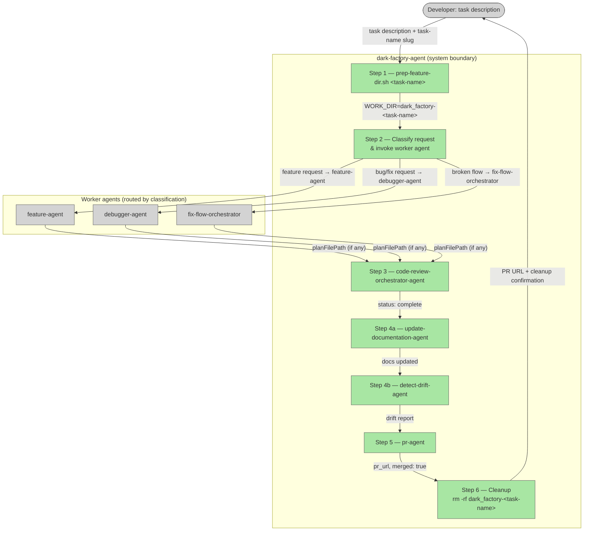

# dark-factory-agent

## Plan Metadata

- Plan type: `plan`
- Parent plan: N/A
- Depends on: N/A
- Status: `approved`

Status semantics:
- `draft`: Plan is being created or updated and is not final.
- `approved`: Plan is approved but not yet applied in code.
- `documentation`: Code currently exists and matches the plan contract.

Update rule:
- When an existing plan is edited, set status to `draft` until re-approved.

## System Intent

- What is being built: A top-level dark-factory orchestration agent (`dark-factory-agent`) and companion script (`prep-feature-dir.sh`). The agent isolates each unit of work into its own copy of the repository, routes to the right worker agent, runs code review and documentation housekeeping, opens a PR, then deletes the work dir.
- Primary consumer(s): Developers invoking dark-factory to perform feature work, debugging, or flow repairs without polluting the main checkout.
- Boundary (black-box scope only): Accepts a natural-language task description. Returns a merged PR URL and confirmation that the work dir has been cleaned up. All cloning, routing, reviewing, doc updating, and PR work happens inside this agent.

## Stage Gate Tracker

- [ ] Stage 1 Mermaid approved
- [ ] Stage 2 Flows approved
- [ ] Stage 3 Logs + Deployment approved or skipped

## Mermaid Diagram



## Flows

- Flow naming rule: `### Flow: <flowname>`
- `N/A` for test files means explicit no-test-required waiver (not a missing mapping).

### Global Types

```txt
StandardError {
  message: string (human-readable description of what went wrong)
}

WorkerResult {
  planFilePath: string | null  (absolute path to the plan the worker wrote, or null if no plan was produced)
}
```

### Flow: `prepFeatureDir`

- Test files: N/A (shell script, no automated tests)
- Core files: `agents/dark-factory/scripts/prep-feature-dir.sh`

#### Types

```txt
PrepFeatureDirInput {
  taskName: string (required — short slug, e.g. "add-oauth")
}

PrepFeatureDirOutput {
  workDir: string  (absolute path to dark_factory-<taskName> copy, printed as WORK_DIR=dark_factory-<taskName>)
}
```

#### Paths

| path | input | output | path-type | notes | updated |
| --- | --- | --- | --- | --- | --- |
| `prepFeatureDir.success` | `PrepFeatureDirInput` | `PrepFeatureDirOutput` | happy path | git pull succeeds, cp succeeds, WORK_DIR printed | |
| `prepFeatureDir.git-pull-failure` | `PrepFeatureDirInput` | `StandardError` | error | git pull exits non-zero; script exits 1 with message | |
| `prepFeatureDir.copy-failure` | `PrepFeatureDirInput` | `StandardError` | error | cp -r fails (disk space, permissions); script exits 1 | |

#### Pseudocode

```
prep-feature-dir.sh <task-name>:
  INNER_DIR = "dark_factory/dark_factory"
  OUTER_DIR = "dark_factory"
  WORK_DIR  = "dark_factory-<task-name>"

  cd INNER_DIR
  git pull origin main   || exit 1 with error
  cd ../..               # back to outer wrapper parent

  cd OUTER_DIR
  cp -r dark_factory WORK_DIR   || exit 1 with error
  echo "WORK_DIR=WORK_DIR"
  exit 0
```

---

### Flow: `routeToWorker`

- Test files: N/A (agent classification logic)
- Core files: `agents/dark-factory/agents/dark-factory-agent.md`

#### Types

```txt
RouteInput {
  taskDescription: string  (verbatim user request)
  workDir:         string  (path returned by prep-feature-dir.sh)
}

RouteOutput {
  planFilePath: string | null
  workerAgent:  "feature-agent" | "debugger-agent" | "fix-flow-orchestrator"
}
```

#### Paths

| path | input | output | path-type | notes | updated |
| --- | --- | --- | --- | --- | --- |
| `routeToWorker.feature` | `RouteInput` | `RouteOutput` | happy path | task classified as new feature → feature-agent invoked | |
| `routeToWorker.debug` | `RouteInput` | `RouteOutput` | happy path | task classified as bug/fix → debugger-agent invoked | |
| `routeToWorker.fixFlow` | `RouteInput` | `RouteOutput` | happy path | task classified as broken integration flow → fix-flow-orchestrator invoked | |
| `routeToWorker.workerError` | `RouteInput` | `StandardError` | error | worker agent returns error or hard-stop; orchestrator surfaces error and halts (cleanup still runs) | |

#### Pseudocode

```
routeToWorker(taskDescription, workDir):
  cd workDir

  # Classify
  if taskDescription signals a new feature / capability:
    invoke feature-agent with taskDescription
  else if taskDescription signals a broken integration flow / end-to-end failure:
    invoke fix-flow-orchestrator with taskDescription
  else:
    invoke debugger-agent with taskDescription

  if worker returns error OR hard-stop:
    run cleanup(workDir)
    STOP with StandardError

  return { planFilePath: worker.planFilePath, workerAgent: chosen }
```

---

### Flow: `codeReview`

- Test files: N/A (delegates to code-review-orchestrator-agent)
- Core files: `agents/dark-factory/agents/dark-factory-agent.md`

#### Types

```txt
CodeReviewInput {
  planFilePath: string | null
  workDir:      string
}

CodeReviewOutput {
  status: "complete"
}
```

#### Paths

| path | input | output | path-type | notes | updated |
| --- | --- | --- | --- | --- | --- |
| `codeReview.success` | `CodeReviewInput` | `CodeReviewOutput` | happy path | all issues resolved | |
| `codeReview.noPlan` | `CodeReviewInput` | `CodeReviewOutput` | happy path | planFilePath is null; pass taskDescription string as planFilePath substitute | |
| `codeReview.reviewerError` | `CodeReviewInput` | `StandardError` | error | code-review-orchestrator-agent halts with error; orchestrator surfaces and halts | |

#### Pseudocode

```
codeReview(planFilePath, workDir):
  planArg = planFilePath ?? "Task: <taskDescription>"

  invoke code-review-orchestrator-agent with:
    planFilePath = planArg
    codePath     = workDir

  if error:
    STOP with StandardError

  return { status: "complete" }
```

---

### Flow: `updateDocsAndDrift`

- Test files: N/A (delegates to documentation agents)
- Core files: `agents/dark-factory/agents/dark-factory-agent.md`

#### Types

```txt
UpdateDocsInput {
  planFilePath: string | null
  workDir:      string
}

UpdateDocsOutput {
  docsUpdated:   string[]   (paths of docs written/updated)
  driftFindings: string     (summary from detect-drift-agent)
}
```

#### Paths

| path | input | output | path-type | notes | updated |
| --- | --- | --- | --- | --- | --- |
| `updateDocsAndDrift.success` | `UpdateDocsInput` | `UpdateDocsOutput` | happy path | docs updated, drift report clean or auto-fixed | |
| `updateDocsAndDrift.noPlan` | `UpdateDocsInput` | `UpdateDocsOutput` | happy path | planFilePath null; update-documentation-agent may no-op or use git diff | |
| `updateDocsAndDrift.driftUnresolved` | `UpdateDocsInput` | `StandardError` | error | detect-drift-agent finds `wrong` items requiring developer input; orchestrator surfaces and halts before PR | |

#### Pseudocode

```
updateDocsAndDrift(planFilePath, workDir):
  # Step 4a
  invoke update-documentation-agent with planFilePath (or null — agent handles gracefully)

  # Step 4b
  invoke detect-drift-agent (scoped to workDir/docs/docs/)

  if detect-drift-agent reports unresolvable wrong items:
    STOP with StandardError (list unresolved items)

  return { docsUpdated, driftFindings }
```

---

### Flow: `openPR`

- Test files: N/A (delegates to pr-agent)
- Core files: `agents/dark-factory/agents/dark-factory-agent.md`

#### Types

```txt
OpenPRInput {
  planFilePath: string | null
  taskDescription: string
}

OpenPROutput {
  prUrl:  string
  merged: true
}
```

#### Paths

| path | input | output | path-type | notes | updated |
| --- | --- | --- | --- | --- | --- |
| `openPR.success` | `OpenPRInput` | `OpenPROutput` | happy path | PR opened, CI passes, merged | |
| `openPR.noPlan` | `OpenPRInput` | `OpenPROutput` | happy path | planFilePath null; taskDescription string passed to pr-agent as description | |
| `openPR.ciFailure` | `OpenPRInput` | `StandardError` | error | pr-agent cannot resolve CI failures; orchestrator surfaces and halts | |

#### Pseudocode

```
openPR(planFilePath, taskDescription):
  prInput = planFilePath ?? taskDescription

  invoke pr-agent with prInput

  if error:
    STOP with StandardError

  return { prUrl, merged: true }
```

---

### Flow: `cleanup`

- Test files: N/A
- Core files: `agents/dark-factory/agents/dark-factory-agent.md`

#### Types

```txt
CleanupInput {
  workDir: string  (path to dark_factory-<task-name>)
}

CleanupOutput {
  removed: true
}
```

#### Paths

| path | input | output | path-type | notes | updated |
| --- | --- | --- | --- | --- | --- |
| `cleanup.success` | `CleanupInput` | `CleanupOutput` | happy path | rm -rf succeeds | |
| `cleanup.removeFailure` | `CleanupInput` | `StandardError` | error | rm -rf exits non-zero (permissions); report to developer but do not halt overall flow | |

#### Pseudocode

```
cleanup(workDir):
  cd dark_factory/  # back to outer wrapper
  rm -rf workDir    # e.g. rm -rf dark_factory-add-oauth

  if rm fails:
    warn developer; continue (non-fatal)

  return { removed: true }
```

---

### Flow: `darkFactoryAgent` (top-level happy path)

- Test files: N/A
- Core files: `agents/dark-factory/agents/dark-factory-agent.md`

#### Types

```txt
DarkFactoryInput {
  taskDescription: string  (verbatim user request)
  taskName:        string  (short slug for the work dir, e.g. "add-oauth")
}

DarkFactoryOutput {
  prUrl:   string
  merged:  true
  workDir: string  (already deleted; reported for auditability)
}
```

#### Paths

| path | input | output | path-type | notes | updated |
| --- | --- | --- | --- | --- | --- |
| `darkFactoryAgent.success` | `DarkFactoryInput` | `DarkFactoryOutput` | happy path | all 6 steps complete, PR merged, work dir removed | |
| `darkFactoryAgent.prepFailure` | `DarkFactoryInput` | `StandardError` | error | prep-feature-dir.sh fails; no work dir exists, nothing to clean up | |
| `darkFactoryAgent.workerFailure` | `DarkFactoryInput` | `StandardError` | error | worker agent hard-stops or errors; cleanup runs, then halt | |
| `darkFactoryAgent.reviewFailure` | `DarkFactoryInput` | `StandardError` | error | code-review-orchestrator-agent halts; cleanup runs, then halt | |
| `darkFactoryAgent.driftFailure` | `DarkFactoryInput` | `StandardError` | error | detect-drift-agent surfaces unresolvable items; cleanup runs, then halt | |
| `darkFactoryAgent.prFailure` | `DarkFactoryInput` | `StandardError` | error | pr-agent cannot merge; cleanup runs, then halt | |

#### Pseudocode

```
dark-factory-agent(taskDescription, taskName):

  # Step 1 — prep work dir
  result = run prep-feature-dir.sh taskName
  if error: STOP

  workDir = result.workDir  # e.g. dark_factory-<taskName>

  # Step 2 — route to worker
  workerResult = routeToWorker(taskDescription, workDir)
  if error: cleanup(workDir); STOP

  planFilePath = workerResult.planFilePath

  # Step 3 — code review
  reviewResult = codeReview(planFilePath, workDir)
  if error: cleanup(workDir); STOP

  # Step 4 — update docs + detect drift
  docsResult = updateDocsAndDrift(planFilePath, workDir)
  if error: cleanup(workDir); STOP

  # Step 5 — open PR
  prResult = openPR(planFilePath, taskDescription)
  if error: cleanup(workDir); STOP

  # Step 6 — cleanup
  cleanup(workDir)

  return { prUrl: prResult.prUrl, merged: true, workDir }
```

## Logs

| Source | Location |
|--------|----------|
| prep-feature-dir.sh stdout | terminal / caller stdout |
| Worker agent output | terminal / caller stdout |
| code-review-orchestrator-agent | terminal / caller stdout |
| update-documentation-agent | terminal / caller stdout |
| detect-drift-agent | terminal / caller stdout |
| pr-agent | terminal / caller stdout |

## Deployment

- Mechanism: `local only`
- Deploy command:
  ```bash
  # No deployment step — agent and script are markdown/shell files checked into the repo.
  # Invoke via Claude Code:
  # /dark-factory-agent <task-name> "<task description>"
  ```
- Notes: The script `prep-feature-dir.sh` must be run from the outer wrapper directory (`dark_factory/`). The agent must be invoked from the same outer wrapper so that relative paths resolve correctly.

## Handoff to Related Plan Reconciliation

After all stages are approved, apply `.agent/skills/reconcile-plans/SKILL.md` to propagate contract updates across linked plans.
